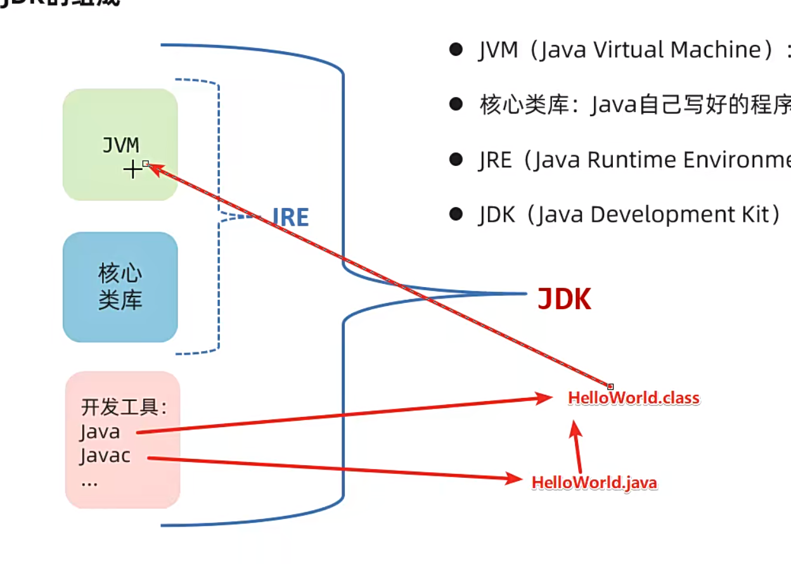

# Java 介绍

高级编程语言

面向对象程序设计语言

## 所属公司

Oracle、Sun

## Java能做什么

多功能，互联网系统开发

## Java技术体系

- java SE：标准版

- java EE：企业版

- java ME：小型版

# Java 安装

## JDK 

java开发者工具包

产品历史：

LTS：8.0	11.0	17.0

### 如何获取jdk

oracle官网——下载jdk——jdk17

企业很多使用jdk8

验证安装成功：

java -version 查看版本

## Javac 和 Java

javac 编译工具

java 执行工具

# Java入门程序


## 三个步骤

编写代码——编译代码——运行代码

1. 新建文件编写代码

```java
public class HelloWorld{
    public static void main(String[] args){
        System.out.println("Hello World!");
    }
}
```

驼峰法命名

文件名必须与公共类名称一致

HelloWorld.java

2. 使用javac编译

```
javac Helloworld.java
```

HelloWorld.class

3. 使用Java运行

```
java Helloworld
```

## 常见问题

文件扩展名

忘记保存

文件名不等于公共类名

关键词大小写

大括号完整

main是静态类

java11开始支持java直接运行源代码

# Java程序执行原理

机器指令 01

机器语言——汇编语言——高级语言

Bug Debug

# JDK的组成、跨平台原理


## JVM

java vitual machine ：JAVA虚拟机、运行程序的地方

核心类库：写好的程序，调用

JRE：Java运行环境

JDK：Java开发工具包



## 跨平台

原理：每个操作系统都有编译好的JVM

开发一次，各平台运行

# Java_home，Path环境变量

操作系统的环境变量

Path：记住程序路径，在任意目录启动

JAVA_HOME：JDK的根目录

安装jdk时需要自己配置环境变量

