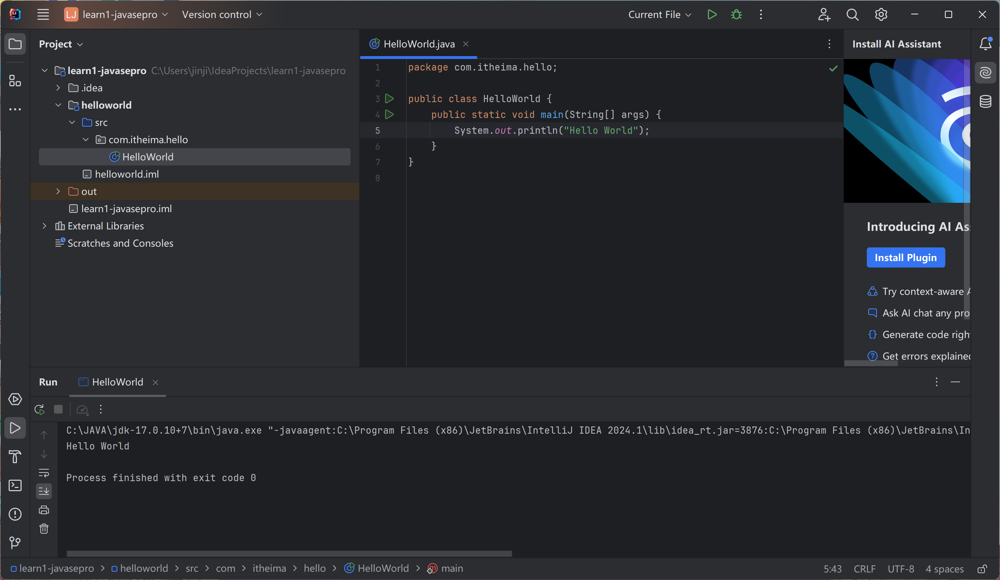

# IDEA开发工具

文本开发工具：记事本、Notepad++、Sublime等

集成开发环境：eclipse、IDEA

## 下载、安装

IntelliJ 官网——下载——windows

社区版：开源

企业版：付费、30天试用

## 开发Java程序

1. 创建工程（project）
2. 创建模块（module）
3. 创建包（package）
4. 创建类（class）
5. 编写代码并启动

编译后自动放在工程的out目录

## IDEA设置

File——Settings

设置背景颜色、字体

## IDEA快捷键

- main/psvmm/sout：快速插入
- Ctrl+D：复制到下一行
- Ctrl+Y：删除所在行
- Ctrl+X：剪切所在行
- Ctrl+Alt+L：可视化代码
- ALt+Shift+上下：移动当前代码
- Ctrl+/ Ctrl+Shift+/：注释（取消）

## 其他操作

删除类（delete）

修改类名称（refactor-rename）

修改模块

### 导入模块

准备模块

先复制到工程目录中

File—New—Module Select Form Existing File

删除模块

不会删除源文件

  

打开工程

关闭工程

