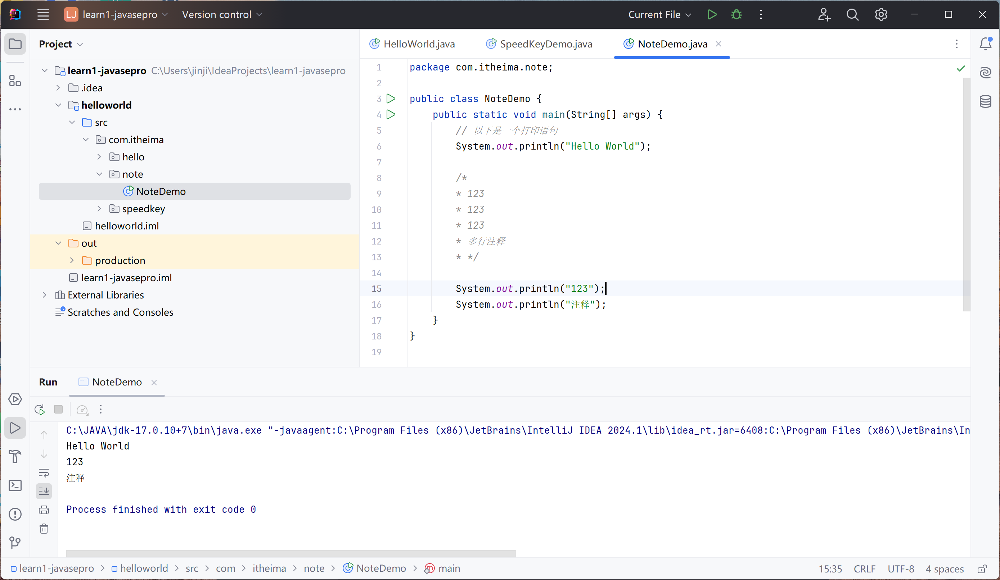
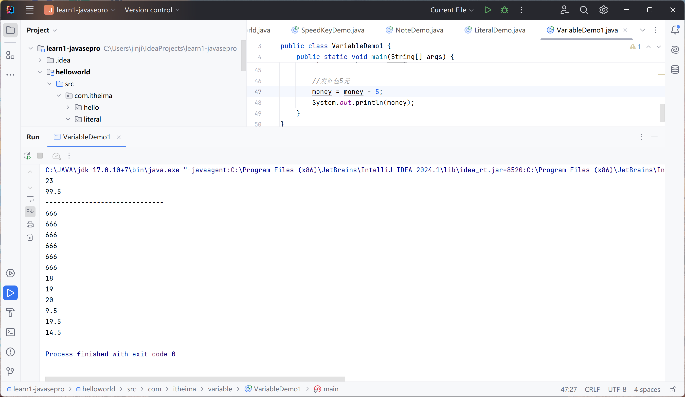

# JAVA基本语法


## 注释

不影响程序执行

编译时先会去除

**养成写注释的习惯**

```java
// mark
/* */
```

```java
package com.itheima.note;

public class NoteDemo {
    public static void main(String[] args) {
        // 以下是一个打印语句
        System.out.println("Hello World");

        /*
        * 123
        * 123
        * 123
        * 多行注释
        * */

        System.out.println("123");
        System.out.println("注释");
    }
}

```



## 字面量（数据格式）

整数

小数

字符

字符串

```java
package com.itheima.literal;

import java.sql.SQLOutput;

public class LiteralDemo {
    public static void main(String[] args) {

        //1.整数
        System.out.println(666);

        //2.小数
        System.out.println(8.22);

        //3.字符
        System.out.println('a');
        System.out.println('b');
        System.out.println('c');

        //特殊字符转义符、汉字
        System.out.println('中');
        System.out.println('\t');
        System.out.println('国');
        System.out.println('\n');

        //4. 字符串
        System.out.println("字符串");
        System.out.println("   ");

        //5. 布尔值
        System.out.println(true);
        System.out.println(false);
    }
}

```

## 变量

数据格式 变量名称 = 数据；

type id = num/char/string...;

int age = 19;

变量是内存中的一块区域

变量中数据可以变化

```java
package com.itheima.variable;

public class VariableDemo1 {
    public static void main(String[] args) {
        // 1. 定义整数变量
        int age = 23;
        System.out.println(age);

        // 2. 定义双精度浮点
        double score = 99.5;
        System.out.println(score);

        System.out.println("------------------------------");

        // 3. 使用变量的好处，便于拓展和维护
        int number = 666;
//        System.out.println(666);
//        System.out.println(666);
//        System.out.println(666);
//        System.out.println(666);
//        System.out.println(666);
//        System.out.println(666);
        System.out.println(number);
        System.out.println(number);
        System.out.println(number);
        System.out.println(number);
        System.out.println(number);
        System.out.println(number);

        //4. 变量的数据可以替换
        int age2 = 18;
        System.out.println(age2);
        age2 = 19;  //赋值语句
        System.out.println(age2);
        age2 = age2 + 1;    //+1
        System.out.println(age2);

        //5. 需求模拟
        double money = 9.5;
        System.out.println(money);

        //收红包10元
        money = money + 10;
        System.out.println(money);

        //发红包5元
        money = money - 5;
        System.out.println(money);
    }
}

```



### 注意事项

1. 没有先声明。先声明再使用

cannot resolve symbol

2. 没有类型
3. 重复声明，多个变量名称必须不一样
4. 可以无初始值，但使用必须赋值

## 关键字

keyword

保留，不能用

while public int...

## 标识符

identifier

类名、变量名

