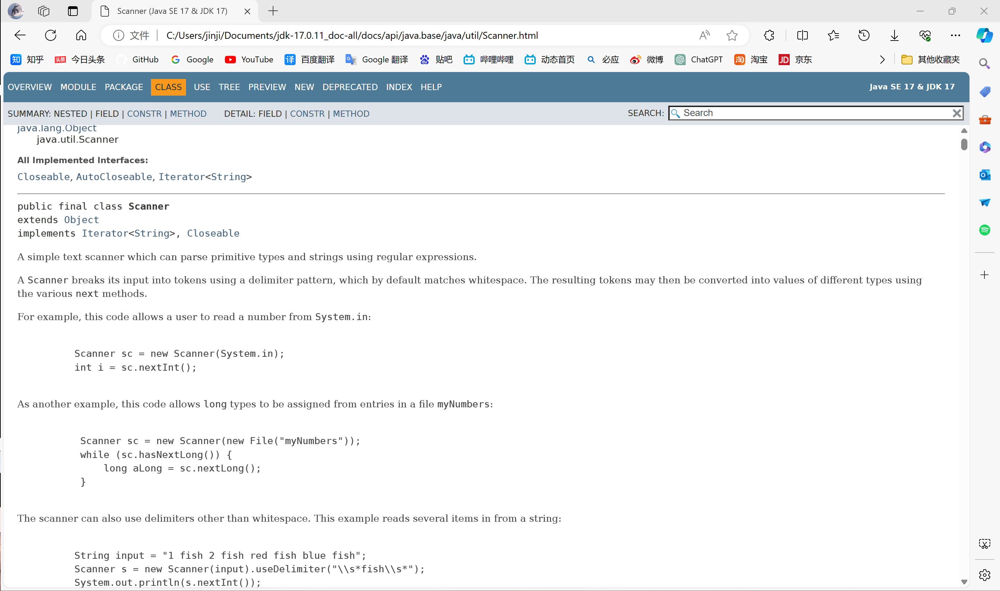

# 变量存储原理


## 二进制

0、1

一字节 byte B == 8 位 bit

## 文本字符

char ch = 'a';

字符编码

ASCII字符代码


A 65

a 97

0 48

```java
package com.itheima.variable;

public class ASCIIDemo1 {
    public static void main(String[] args) {
        System.out.println('a'+10);
        System.out.println('A'+10);
        System.out.println('0'+10);
    }
}

```

107
75
58


## 图片

像素点

0-255x255x255表示颜色

#DDFFFDD

## 声音

波形图


## 十进制、八进制、十六进制

二进制 0B开头

八进制 0开头

十六进制0X开头

```java
package com.itheima.variable;

public class ASCIIDemo1 {
    public static void main(String[] args) {
        System.out.println('a'+10);
        System.out.println('A'+10);
        System.out.println('0'+10);

        int a1 = 0B01000001;    //bin
        System.out.println(a1);

        int a2 = 0141;  //oct
        System.out.println(a2);

        int a3 = 0XFA;  //hex
        System.out.println(a3);
    }
}

```

65
97
250

# 基本数据类型


## 四大类

整型、浮点型、字符型、布尔型

### 整型

- byte	1B	-2^3 ~ 2^3-1
- short 	2B	-2^3 ~ 2^3-1
- int 	4B
- long 	8B

### 浮点型

- float	4B
- double 	8B

### 字符型

char 	2B

### 布尔型

boolean	1B	true/false

```java
package com.itheima.variable;

public class VariableDemo2 {
    public static void main(String[] args) {
        //掌握基本数据类型的使用
        //1.byte short int long
        byte a = 127;

        short s = 13244;

        int i = 422424;

        long lg = 424244422224L;

        //long类型需要后面加上L

        //2.float double
        //如果需要float后面需要加上F、f
        float f = 3.14F;

        double d = 56.45;

        //3.char 字符型
        char ch = 'a';
        char ch2 = '中';

        //4.boolean
        boolean flag = true;
        boolean flag2 = false;

        //字符串类型
        String name = "张三";
    }
}

```

# 类型转换


## 自动转换

范围小——范围大

byte->int

```java
package com.itheima.type;

public class TypeConvensionDemo {
    public static void main(String[] args) {
        byte a = 12;
        int b = a;
        System.out.println(a);
        System.out.println(b);
    }
}

```


8位到32位

```java
package com.itheima.type;

public class TypeConvensionDemo {
    public static void main(String[] args) {
        byte a = 12;
        int b = a;      //byte -> int
        System.out.println(a);
        System.out.println(b);

        int c = 100;
        double d = c;   //int -> double
        System.out.println(c);

        char ch = 'a';
        int i = ch;     //char -> int
        System.out.println(i);
    }
}

```

12
12
100
97

## 表达式的自动类型转换

byte/short/char->int->long->float->double

```java
package com.itheima.type;

public class TypeConvensionDemo2 {
    public static void main(String[] args) {
        byte a = 10;
        int b  = 20;
        long c = 30;
        long rs = a+b+c;
        System.out.println(rs);

        double rs2 = a+b+c;
        System.out.println(rs2);

        byte i = 10;
        short j = 30;
        int rs3 = i+j;
        System.out.println(rs3);

        byte b1 = 110;
        byte b2 = 80;
        int b3 = b1+b2;
        System.out.println(b3);
    }
}

```

60
60.0
40
190

byte short char 自动转换为int进行运算

整型自动转换成浮点double进行运算

## 强制类型转换

大类型->小范围

数据丢失


浮点->整型

保留整数

```
byte b = 9;
int a = (int)b;
```

# 运算符


## 算数运算符

- +
- -
- *
- /
- %

```java
package com.itheima.operator;

public class OperatorDemo1 {
    public static void main(String[] args) {
        int a = 10;
        int b = 2;
        System.out.println(a + b);
        System.out.println(a - b);
        System.out.println(a * b);
        System.out.println(a / b);
        System.out.println(5 / 2);  //2.5->2
        System.out.println(5. / 2);  //2.5

        int i = 5;
        int j = 2;
        System.out.println(i / j);  //2.5->2
        System.out.println(1.*i / j);  //2.5

        System.out.println(a % b);
        System.out.println(3 % 2);
    }
}
```


### +作连字符

```java
package com.itheima.operator;

public class OperatorDemo1 {
    public static void main(String[] args) {
        int a = 10;
        int b = 2;
        System.out.println(a + b);
        System.out.println(a - b);
        System.out.println(a * b);
        System.out.println(a / b);
        System.out.println(5 / 2);  //2.5->2
        System.out.println(5. / 2);  //2.5

        int i = 5;
        int j = 2;
        System.out.println(i / j);  //2.5->2
        System.out.println(1.*i / j);  //2.5

        System.out.println(a % b);
        System.out.println(3 % 2);

        System.out.println("--------------------------------------");

        //目标2 使用+作为连接符
        int a2 = 5;
        System.out.println("abc" + a2);
        System.out.println(a2 + 5);
        System.out.println("ithiema" + a2 + 'a');
        System.out.println(a2 + 'a' + "itheima");
    }
}
```

abc5
10
ithiema5a
102itheima

## 自增自减运算符

自增：++

自减：--	

只能操作变量

++a：先加再用

a++：先用再加


```java
package com.itheima.operator;

public class OperatorDemo2 {
    public static void main(String[] args) {
        int a = 10;
        a++;    // a = a+1
        ++a;
        System.out.println(a);

        a--;    // a = a-1
        --a;
        System.out.println(a);
        System.out.println("-------------------------------------");
        int i = 10;
        int rs = ++i;
        System.out.println(rs);
        System.out.println(i);

        int j = 10;
        int rs2 = j++;
        System.out.println(rs2);
        System.out.println(j);
    }
}

```

12

10

\-------------------------------------

11
11
10
11

## 赋值运算符

基本：=

拓展：+= -= *= /= %=

```java
package com.itheima.operator;

public class OperatorDemo3 {
    public static void main(String[] args) {
       // 需求:收红包
        double a = 9.5;
        double b = 520;
        a += b; //a = (double)(a+b)
        System.out.println(a);

        //需求：发红包
        double i = 600;
        double j = 520;
        i -= j; // i = (double)i-j
        System.out.println(i);

        int m = 10;
        int n = 5;
        m /= n;
        System.out.println(m);

        m %= n;
        System.out.println(m);

        System.out.println("---------------------------");
        byte x = 10;
        byte y = 30;
        x += y; // == x = (byte)(x+y)
        System.out.println(x);
    }
}
```


## 关系运算符

符号：\> \>= < <= == !=

```java
package com.itheima.operator;

public class OperatorDemo4 {
    public static void main(String[] args) {
        int a = 10;
        int b = 5;
        boolean rs = a > b;
        System.out.println(rs);

        System.out.println(a >= b);
        System.out.println(2 >= 2);
        System.out.println(a < b);
        System.out.println(2 <= 2);
        System.out.println(a == b);
        System.out.println(5 == 5);
//        System.out.println(a = b);  //这是用来赋值的
        System.out.println(a == b);
        System.out.println(a != b);
    }
}
```


## 逻辑运算符

与、非、或、异或：&、!、|、^

```java
package com.itheima.operator;

public class OperatorDemo5 {
    public static void main(String[] args) {
        double size = 6.8;
        int storage = 16;

        // 与
        boolean rs = size >= 6.95 & storage >=8;
        System.out.println(rs);

        // 或
        boolean rs2 = size >= 6.95 | storage >=8;
        System.out.println(rs2);

        // 非，取反
        System.out.println(!true);
        System.out.println(!false);
        System.out.println(!(2 > 1));
        System.out.println(false^true);
    }
}

```


false
true
false
true
false
true


### && || 短路与、短路或

&& 左边为false右边不执行

|| 左边为true右边不执行

```java
package com.itheima.operator;

public class OperatorDemo5 {
    public static void main(String[] args) {
        double size = 6.8;
        int storage = 16;

        // 与
        boolean rs = size >= 6.95 & storage >=8;
        System.out.println(rs);

        // 或
        boolean rs2 = size >= 6.95 | storage >=8;
        System.out.println(rs2);

        // 非，取反
        System.out.println(!true);
        System.out.println(!false);
        System.out.println(!(2 > 1));
        System.out.println(false^true);

        // &&
        int i = 10;
        int j = 20;
        System.out.println(i>100 && ++j>90);
        System.out.println(j);

        // ||
        int m = 10;
        int n = 30;
        System.out.println(m>3 || ++n > 40);
        System.out.println(n);
    }
}
```

false
true
false
true
false
true
false
20
true
30


## 三元运算符

```java
package com.itheima.operator;

public class OperatorDemo6 {
    public static void main(String[] args) {
        //三元运算符
        double score = 98.5;
        String rs = score >=60 ? "成绩合格" : "成绩不合格";
        System.out.println(rs);

        //找出最大值并输出
        int a = 99;
        int b = 67;
        int max = a > b ? a : b;
        System.out.println(max);

        //3个整数最大值
        int i = 10;
        int j = 45;
        int k = 34;
        int temp = i > j ?  i:
                     j > k ? j : k;

        System.out.println(temp);
        
        System.out.println(10>3 || 10>3 && 10<3);
    }
}

```


成绩合格
99
45

true

### 优先级

\* / > + -

not ! > and & > or |

小括号括起来

```java
        System.out.println((10>3 || 10>3) && 10<3);
```

false


# API

API：应用程序编程接口

找API文档




## 案例知识：在程序中接受用户通过键盘输入的数据

导入包

```
import xxxx.xxx
```

新建Scanner对象

```java
package com.itheima.scanner;

import java.util.Scanner;

public class ScannerDemo {
    public static void main(String[] args) {
        Scanner sc = new Scanner(System.in);    //自动导入包

        System.out.println("请输入你的年龄");
        int age = sc.nextInt();
        System.out.println("您的年龄是："+age);

        System.out.println("请输入你的名字");
        String name = sc.next();
        System.out.println(name + "欢迎您进入系统~~");
    }
}
```


