 # 程序流程控制结构

顺序、分支、循环

## 分支结构

if switch

### if分支

```java
package com.itheima.branch;

public class IfDemo1 {
    public static void main(String[] args) {
        // 需求1：测量用户体温
        double t = 36.9;
        if (t > 37){
            System.out.println("这个人的温度异常，赶紧把他带走");
        }

        // 需求2：发红包
        double money = 99;
        if(money >= 90){
            System.out.println("发红包成功了~");
        }else{
            System.out.println("余额不足");
        }

        // 需求3:绩效系统
        int score = 78;
        if (score >= 0 && score <= 60){
            System.out.println("您的级别是D");
        } else if (score >= 60 && score < 80){
            System.out.println("您的级别是C");
        } else if (score >= 80 && score < 90){
            System.out.println("您的级别是B");
        } else if (score >= 90 && score < 100){
            System.out.println("您的级别是A");
        }
    }
}

```

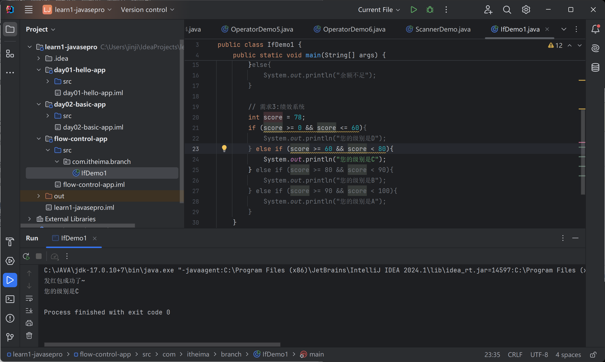

{}可以省略，**但不推荐**

### switch分支

switch == if ...elif... elif ....

break跳出分支

```java
package com.itheima.branch;

public class SwitchDemo2 {
    public static void main(String[] args) {
        String week = "周三";
        switch (week) {
            case "周一":
                System.out.println("1");
                break;
            case "周二":
                System.out.println("2");
                break;
            case "周三":
                System.out.println("3");
                break;
            case "周四":
                System.out.println("4");
                break;
            case "周五":
                System.out.println("5");
                break;
            case "周六":
                System.out.println("6");
                break;
            case "周日":
                System.out.println("7");
                break;
            default:
                System.out.println("000");
                break;
        }
    }
}

```


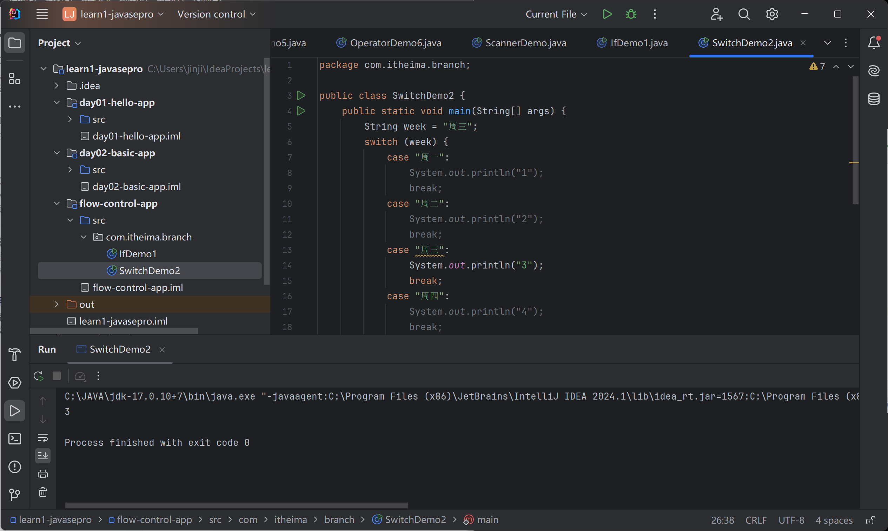

注意事项：

1. 表达式类型只能是byte、short、int、char、enum（jdk5+）、String（JDK7）

**不支持：double、float、long**

2. case的值不能重复

3. 不要忘记写break，不然一直执行下去

4. 多个相同代码的时候，可以简化

```java
package com.itheima.branch;

public class SwitchDemo4 {
    public static void main(String[] args) {
        String week = "周三";
        switch (week) {
            case "周一":
            case "周二":
            case "周三":
                System.out.println("修bug");
                break;
            case "周四":
            case "周五":
                System.out.println("帮忙");
                break;
            case "周六":
            case "周日":
                System.out.println("打游戏");
                break;
            default:
                System.out.println("000");
                break;
        }
    }
}

```


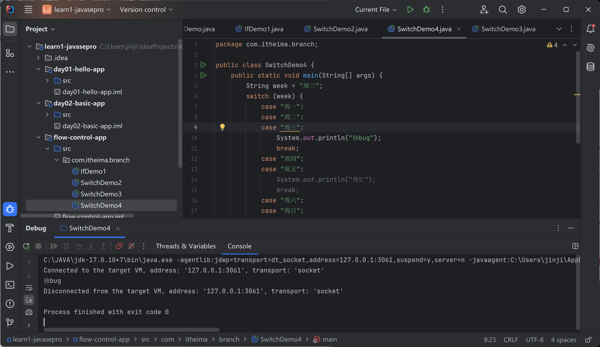

### if、switch比较

if功能>>switch

区间使用if

值的比较实用switch

## 循环结构

for、while、do-while

### for循环

for(初始化语句；循环条件；迭代语句){...}

```java
package com.itheima.loop;

public class ForDemo1 {
    // 打印多行HelloWorld
    public static void main(String[] args) {
        for(int i = 0; i < 5; i ++){
            System.out.println("Hello World");
        }
    }
}

```

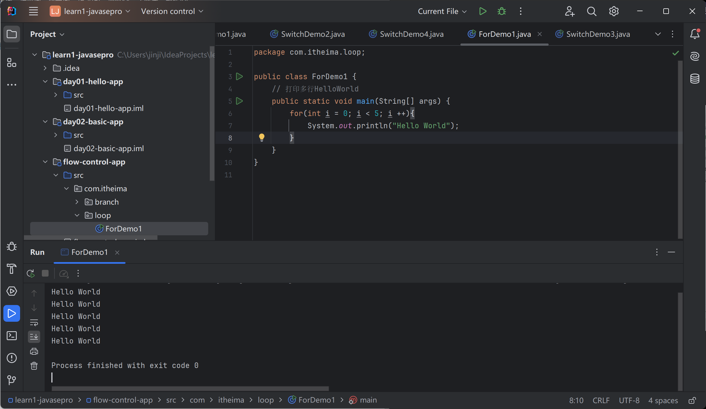

常见场景：

减少代码重复性，灵活控制程序的执行


for循环的求和

1-100求和

```java
package com.itheima.loop;

public class ForDemo2 {
    // 批量产生数据
    public static void main(String[] args) {
        for(int i = 1; i <= 100; i ++){
            System.out.println("i");
        }

        System.out.println("------------------");

        int sum = 0;

        // 1.定义一个循环，产生1-100，求和
        for(int i = 1; i <= 100; i ++){
            sum = sum + i;
        }
        System.out.println("1-100 sum = "+ sum);
    }
}

```

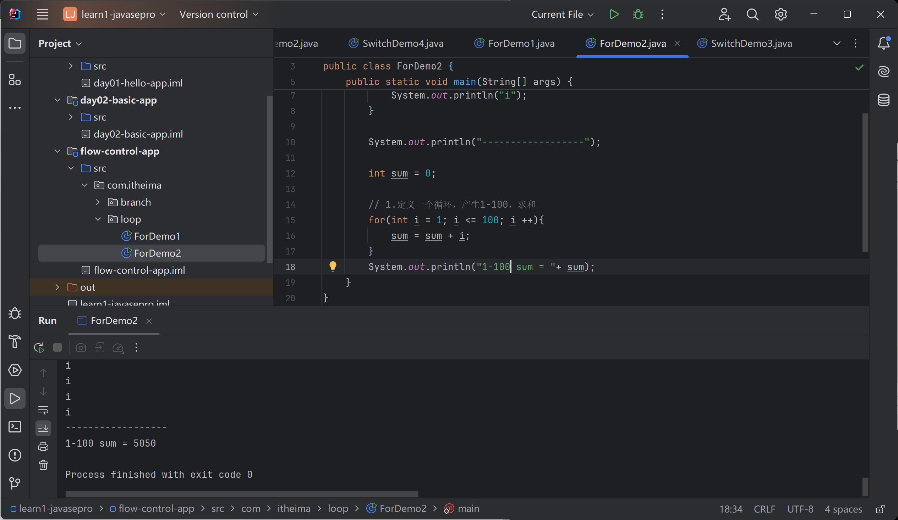

1-100奇数和

两种方法

```java
package com.itheima.loop;

public class ForDemo2 {
    // 批量产生数据
    public static void main(String[] args) {

        int sum = 0;

        // 定义一个循环，产生1-100，求和
        for(int i = 1; i <= 100; i +=2){
            sum = sum + i;
        }
        System.out.println("1-100 sum = "+ sum);

        int sum1 = 0;

        // 定义一个循环，产生1-100，求和
        for(int i = 1; i <= 100; i ++){
            if(i % 2 == 1){
                sum1 += i;
            }
        }
        System.out.println("1-100 sum = "+ sum1);
    }
}

```

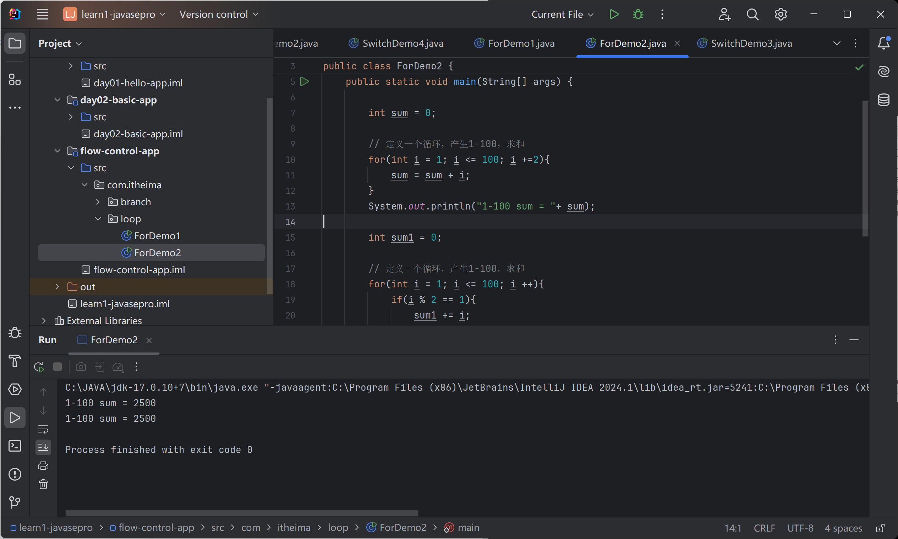

### while循环

while(循环条件){....}

```java
package com.itheima.loop;

public class WhileDemo3 {
    public static void main(String[] args) {
        int i = 0;
        while (i < 5){
            System.out.println("Hello World");
            i++;
        }
    }
}
```

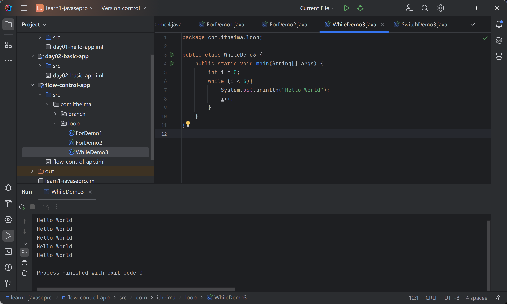

使用案例：

需求：将纸张叠成珠穆朗玛峰的高度

**不知道循环次数**

```java
package com.itheima.loop;

public class WhileDemo4 {
    public static void main(String[] args) {
        double peakHeight = 8848860;
        double paperThickness = 0.1;

        int count = 0;

        while(paperThickness < peakHeight){
            paperThickness = paperThickness * 2;
            count ++;
        }

        System.out.println("需要折叠多少次：" + count);
        System.out.println("最终纸张的厚度是：" + paperThickness);
    }
}

```

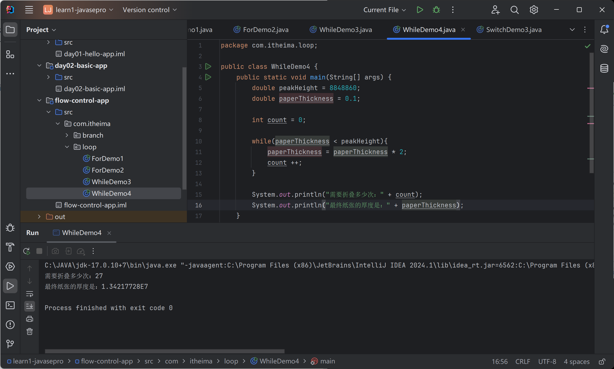


### do-while循环

do{...}while(循环条件)

先执行后判断

```java
package com.itheima.loop;

public class DoWhileDemo5 {
    public static void main(String[] args) {
        int i = 0;
        do{
            System.out.println("Hello World");
            i ++;
        }while (i < 3);
    }
}

```

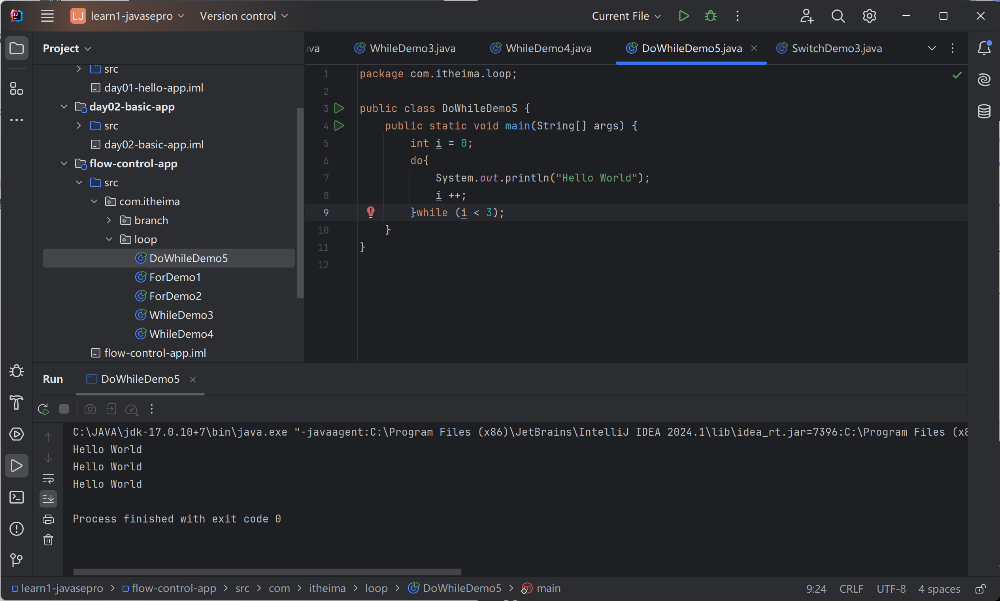

应用场景：

执行后检测

### for、while、do-while 总结

while 和 for 功能上相同，都能实现

一开始不知道循环次数，使用while

知道循环次数，使用for

```java
package com.itheima.loop;

public class DoWhileDemo5 {
    public static void main(String[] args) {
        int i = 0;
        do{
            System.out.println("Hello World");
            i ++;
        }while (i < 3);


        // 特点：先执行后判断
        do{
            System.out.println("Hello World");
        }while (false);

        System.out.println("---------------");

        for(int j = 0; j < 3; j++){
            System.out.println("Hello World");
        }

        int m = 0;
        while(m < 3){
            System.out.println("Hello World");
            m++;
        }
        System.out.println(m);
    }
}

```

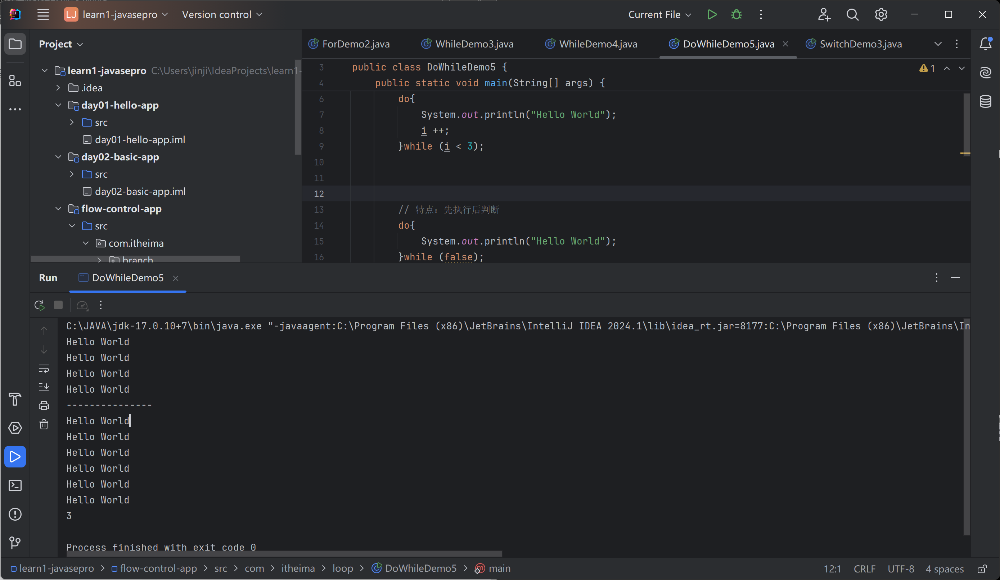

### 死循环

```java
package com.itheima.loop;

public class EndlessLoopDemo6 {
    public static void main(String[] args) {
        for( ; ; ){
            System.out.println("Hello World");
        }
        
        while(true){
            System.out.println("Hello World");
        }

        do{
            System.out.println("Hello World");
        }while (true);
    }
}

```

应用场景：服务器

### 循环嵌套

for{for{}}

```java
package com.itheima.loop;

public class LoopNestedDemo7 {
    public static void main(String[] args) {
        for (int i = 0; i < 3; i++) {
            // i = 1,2,3
            for(int j = 0; j < 5; j++){
                System.out.println("我爱你" + i);
            }
            System.out.println("----------------------------");
        }
        for(int i = 1; i <= 3 ; i++){
            for(int j = 1; j <= 4; j++){
                System.out.print("*");//不换行
            }
            System.out.println();//换行
        }
    }
}

```

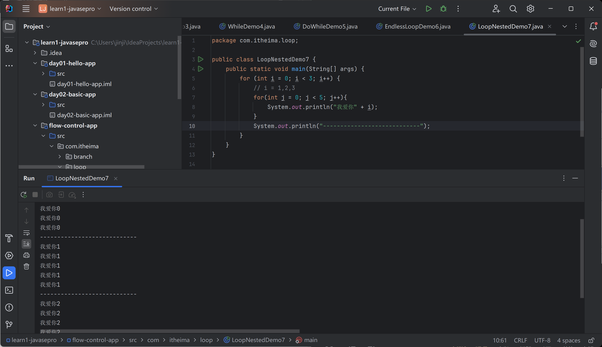

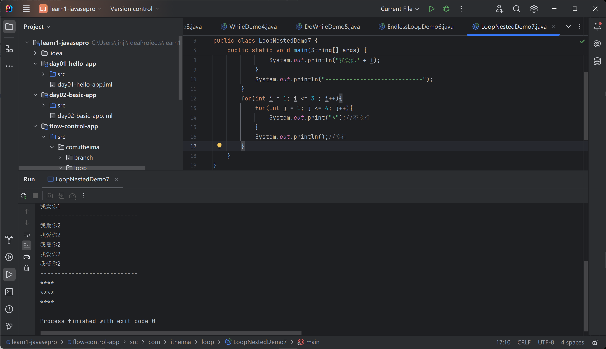

### 跳转关键字

break：跳出并结束当前所在循环的执行

continue：跳出当前循环的执行，进入下一次

不能出现在其他地方

```java
package com.itheima.loop;

public class BreakAndContinueDemo8 {
    public static void main(String[] args) {

        //1. break
        for (int i = 1; i <= 5; i++) {
            System.out.println("我爱你" + i);
            if (i == 3) //说了三次退出
                break;
        }

        //2. continue
        for (int i = 1; i <= 5; i++) {
            if(i == 3)  //到了第三天不用洗
                continue;
            System.out.println("洗碗" + i);
        }
    }
}

```

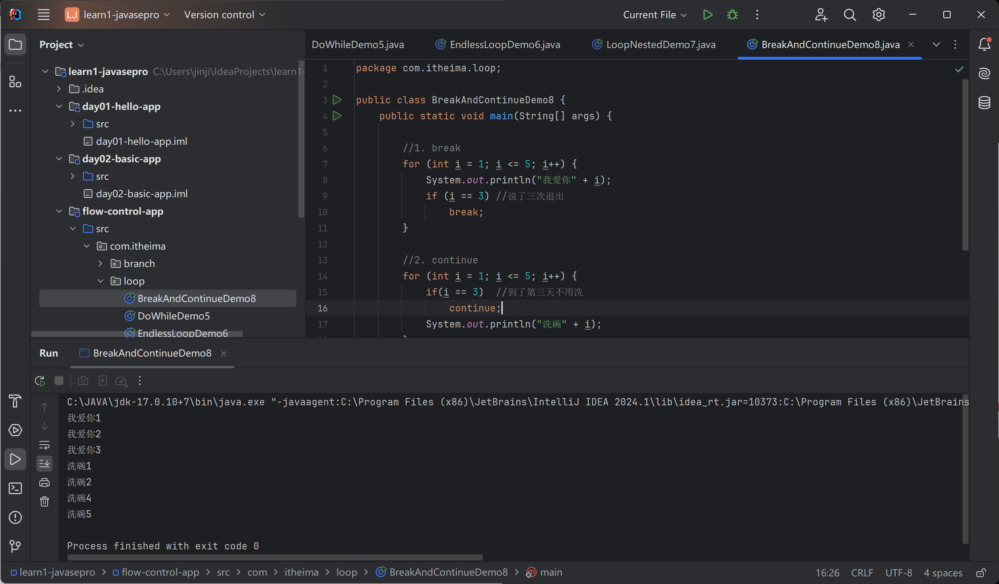

## 案例：生成随机数


### Random的使用

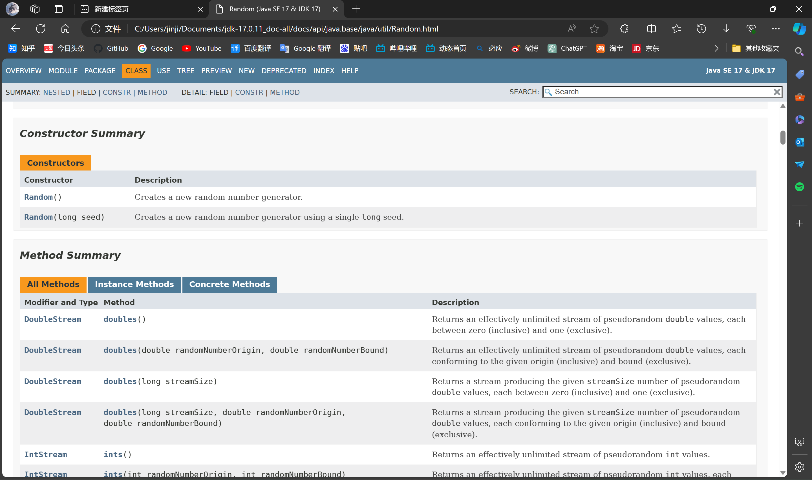

1. 自动导包

2. 获取Random对象

3. 生成指定区间的随机数

```java
package com.itheima.random;

import org.w3c.dom.ls.LSOutput;

import java.util.Random;

public class RandomDemo1 {
    public static void main(String[] args) {
        Random r = new Random();

        for (int i = 0; i < 5; i++) {
            int data = r.nextInt(10);   //0-9
            System.out.println(data);
        }

        System.out.println("--------------------");

        // 3-17之间的随机数
        for (int i = 0; i < 5; i++) {
            int data = r.nextInt(15)+3;   //0-14 +3
            System.out.println(data);
        }

    }
}
```

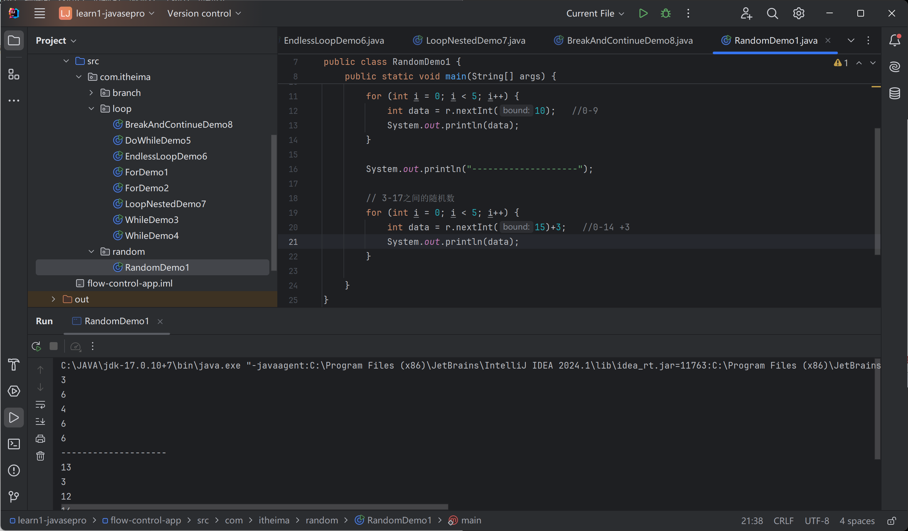

### 猜数字

```java
package com.itheima.random;

import java.util.Random;
import java.util.Scanner;

public class RandomTest2 {
    public static void main(String[] args) {
        //随机生产1-100的中将号码
        Random r = new Random();
        int luckNumber = r.nextInt(100) + 1;

        Scanner sc = new Scanner(System.in);

        while(true){
            //提示用户信息
            System.out.println("请输入您猜测的数字：");
            int guessNumber = sc.nextInt();

            //判断用户猜的数字大小
            if(guessNumber > luckNumber){
                System.out.println("您猜的数字太大");
            }else if(guessNumber < luckNumber){
                System.out.println("您猜的数字太小");
            }else{
                System.out.println("恭喜你猜对了");
                break;  //结束死循环
            }
        }
    }
}

```

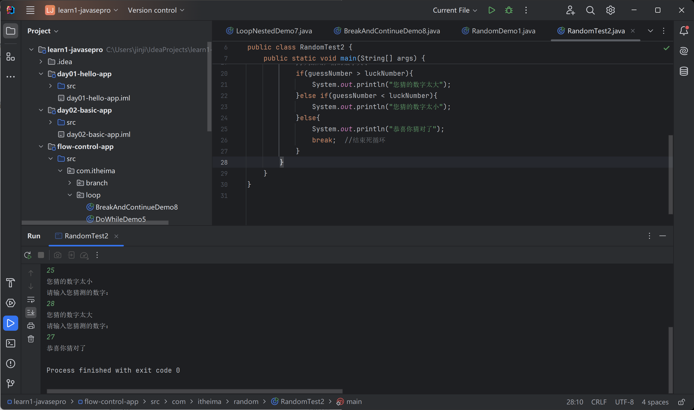