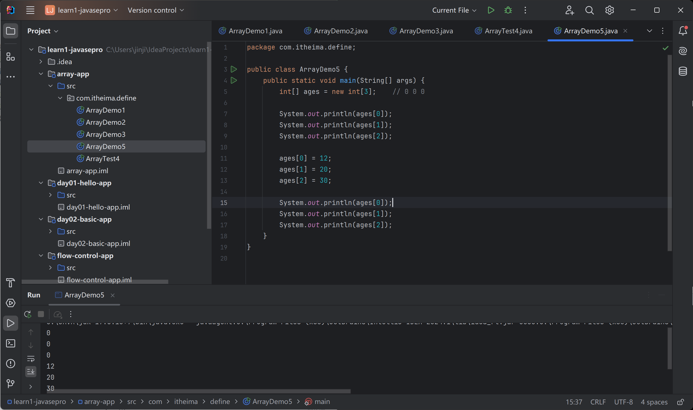
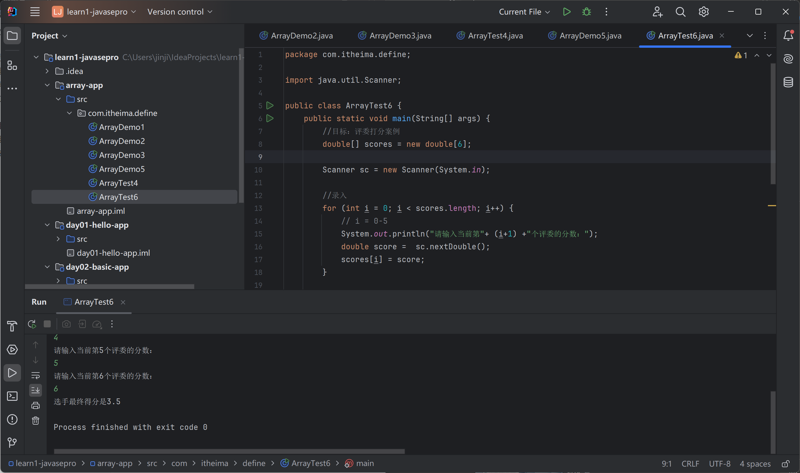
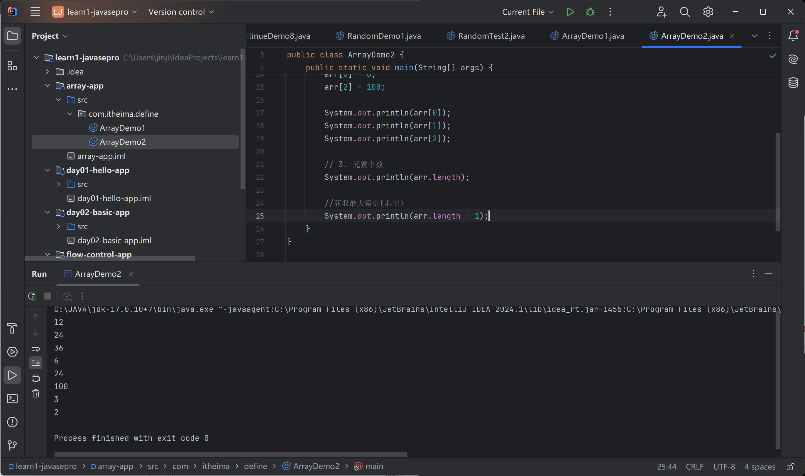
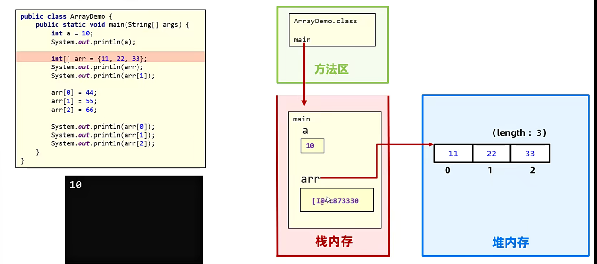
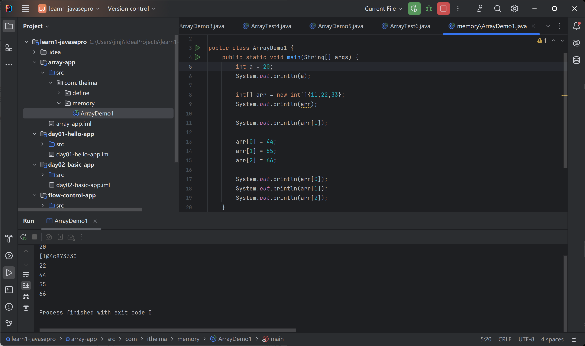
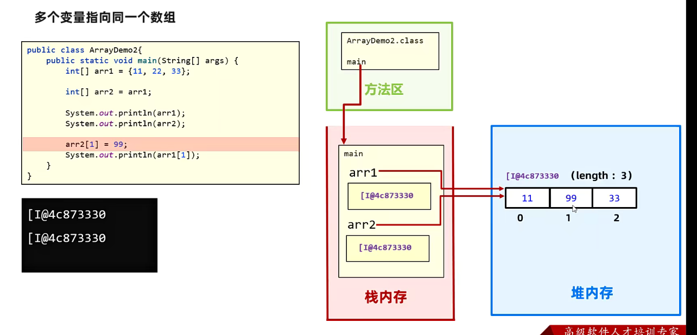

# JAVA数组

数组：容器，存储同一批数据

## 数组的定义

静态、动态

### 静态初始化数组

引用数据类型，存放内存信息

三种方法

```java
package com.itheima.define;

public class ArrayDemo1 {
    public static void main(String[] args) {
        // 静态定义
        // 数据类型[]  数组名 = new 数组类型[]{元素1,2,3}
        int[] ages = new int[]{12,24,36};
        double[] scores = new double[]{89.9,99.5,34.5,43.1};

        // 简化写法
        int[] age2 = {12,24,36};
        double[] score2 = {89.9,99.5,34.5,43.1};

        // 中括号放在数组名后面（C-style）
        int ages3[] = new int[]{12,24,36};
        double scores3[] = new double[]{89.9,99.5,34.5,43.1};
    }
}

```

注意点：

1. 什么类型的数组存放什么类型的数据

2. 尽量不用C格式的定义

### 动态初始化数组

不先存入具体元素值，只确定类型长度

初始化：整型0，布尔false，引用NULL

```java
package com.itheima.define;

public class ArrayDemo5 {
    public static void main(String[] args) {
        int[] ages = new int[3];    // 0 0 0

        System.out.println(ages[0]);
        System.out.println(ages[1]);
        System.out.println(ages[2]);

        ages[0] = 12;
        ages[1] = 20;
        ages[2] = 30;

        System.out.println(ages[0]);
        System.out.println(ages[1]);
        System.out.println(ages[2]);
    }
}

```



#### 案例训练

歌唱比赛评分

```java
package com.itheima.define;

import java.util.Scanner;

public class ArrayTest6 {
    public static void main(String[] args) {
        //目标：评委打分案例
        double[] scores = new double[6];

        Scanner sc = new Scanner(System.in);

        //录入
        for (int i = 0; i < scores.length; i++) {
            // i = 0-5
            System.out.println("请输入当前第"+ (i+1) +"个评委的分数：");
            double score =  sc.nextDouble();
            scores[i] = score;
        }

        double sum = 0;

        //求和
        for (int i = 0; i < scores.length; i++) {
            sum  += scores[i];
        }

        System.out.println("选手最终得分是" + sum / scores.length);
    }
}

```



## 数组的访问

数组名[索引]

长度属性：length

```java
package com.itheima.define;

public class ArrayDemo2 {
    public static void main(String[] args) {
        int[] arr = {12,24,36};

        // 1. 访问数组的全部数据
        System.out.println(arr[0]);
        System.out.println(arr[1]);
        System.out.println(arr[2]);
//        System.out.println(arr[3]);

        // 2. 修改数组的数据
        arr[0] = 6;
        arr[2] = 100;

        System.out.println(arr[0]);
        System.out.println(arr[1]);
        System.out.println(arr[2]);

        // 3. 元素个数
        System.out.println(arr.length);

        //获取最大索引(非空）
        System.out.println(arr.length - 1);
    }
}

```



如果超出最大索引，会出现bug

## 数组的遍历

遍历：一个个数据的访问

```java
package com.itheima.define;

public class ArrayDemo3 {
    public static void main(String[] args) {
        int[] ages = {12,24,36};

        for (int i = 0; i < ages.length; i++) {
            // i = 0,1,2
            System.out.println(ages[i]);
        }
    }
}

```

12

24

36

### 数组求和

员工销售额求和

```java
package com.itheima.define;

public class ArrayTest4 {
    public static void main(String[] args) {
        int[] money = {16,26,36,6,100};

        int sum = 0;
        for (int i = 0; i < money.length; i++) {
            sum += money[i];
        }

        System.out.println("员工的销售总额" + sum);
    }
}

```


## 数组的执行原理

Java内存分配介绍：

- 方法区
- 栈
- 堆
- 本地方法栈
- 寄存器



```java
package com.itheima.memory;

public class ArrayDemo1 {
    public static void main(String[] args) {
        int a = 20;
        System.out.println(a);

        int[] arr = new int[]{11,22,33};
        System.out.println(arr);

        System.out.println(arr[1]);

        arr[0] = 44;
        arr[1] = 55;
        arr[2] = 66;

        System.out.println(arr[0]);
        System.out.println(arr[1]);
        System.out.println(arr[2]);
    }
}

```



### 多个变量指向同一个数组

数组是引用变量，存储地址




```java
package com.itheima.memory;

public class ArrayDemo2 {
    public static void main(String[] args) {
        int[] arr1 = {11,22,33};
        int[] arr2 = arr1; //赋值，地址一样

        System.out.println(arr1);
        System.out.println(arr2);
        
        arr2[1] = 99;
        System.out.println(arr1[1]);
    }
}

```

[I@4c873330
[I@4c873330
99

如果存储地址是NULL，不包含任何对象

访问会空指针异常
