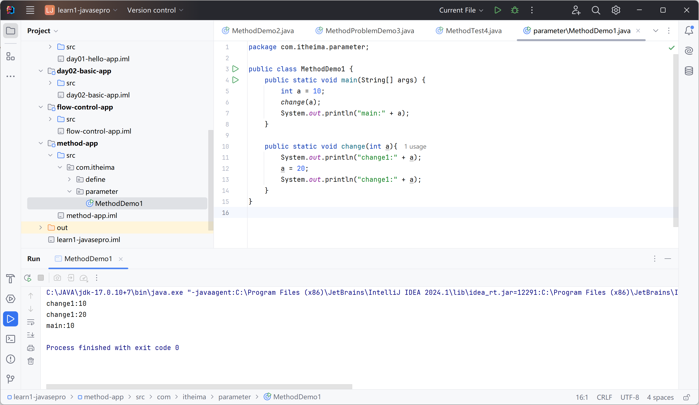
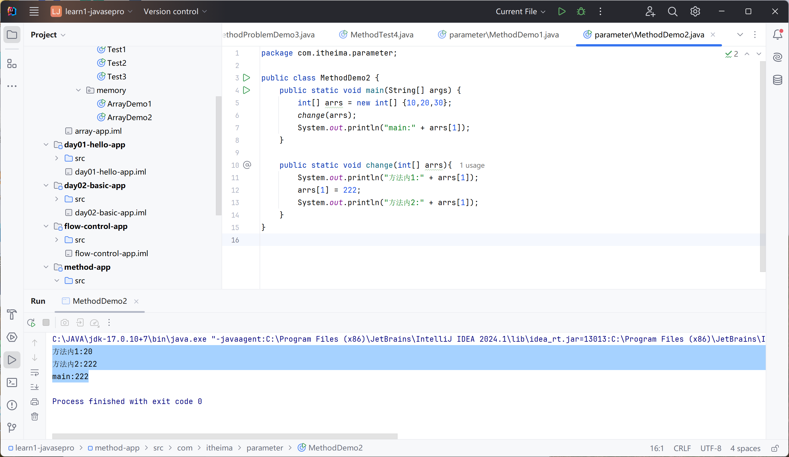
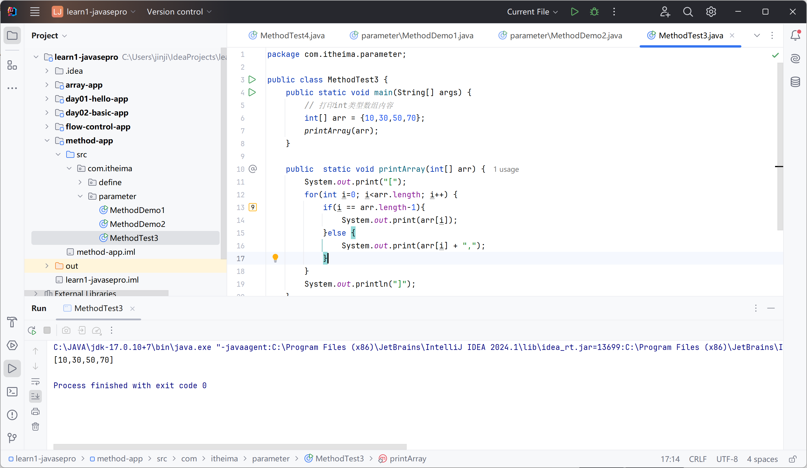
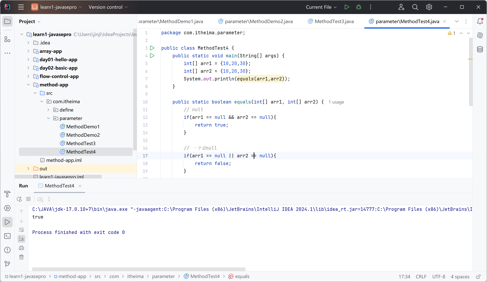
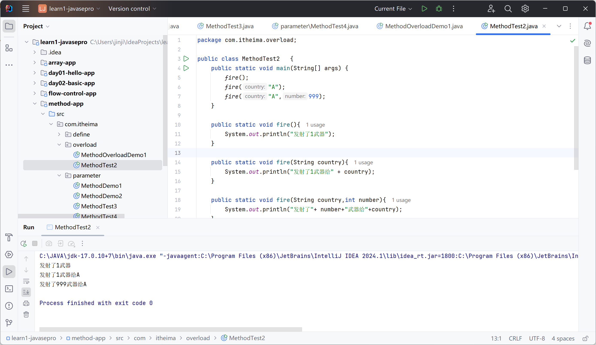
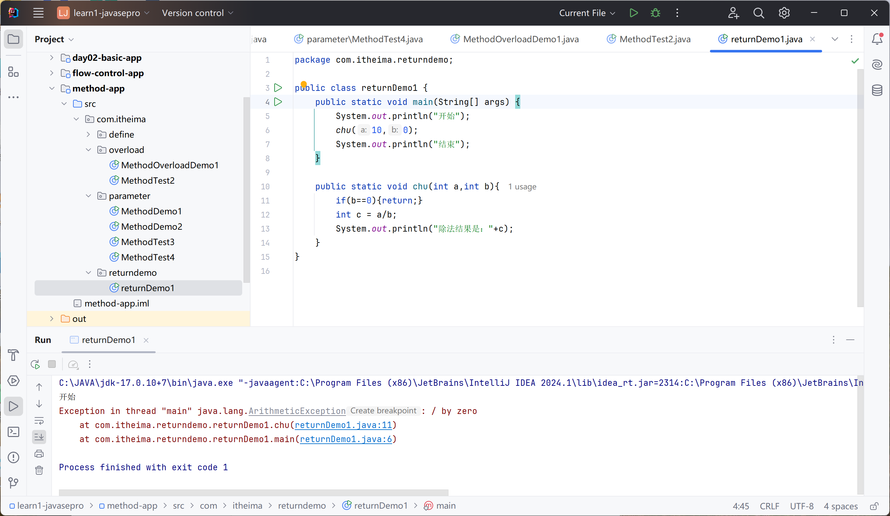
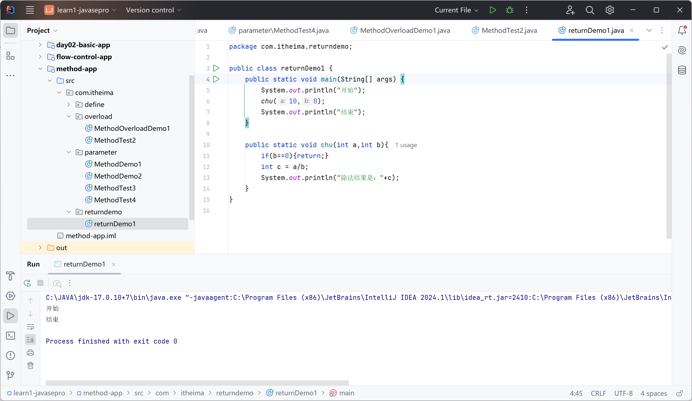

# JAVA方法


## 定义

静态方法

提高代码效率

```java
public static int sum(int a, int b) {
    return a + b;
}
```

```java
package com.itheima.define;

public class MethodDemo1 {
    public static void main(String[] args) {
        //李工
        int rs = sum(10,20);
        System.out.println("李工："+rs);

        //张工
        int rs2 = sum(30,20);
        System.out.println("张工："+rs2);
    }

    public static int sum(int a, int b) {
        return a + b;
    }
}

```

李工：30
张工：50

注意：

必须return返回方法的类型

形参用，分开

### 方法的其他形式

void无返回值，可以不用return

不接受数据：无形参

```java
package com.itheima.define;

public class MethodDemo2 {
    public static void main(String[] args) {
        printHelloWorld(3);
        printHelloWorld(3);
    }

    public static void printHelloWorld(int n){
        for (int i = 0; i < n; i++) {
            System.out.println("Hello World");
        }
    }
}

```

Hello World
Hello World
Hello World
Hello World
Hello World
Hello World

### 使用常见问题

方法无法嵌套

返回值必须符合方法的类型

void不能返回值

```java
package com.itheima.define;

public class MethodProblemDemo3 {
    public static void main(String[] args) {
        //常见问题
        printHelloWorld();

        //调用有返回值的方法
        int rs = sum(10,20);
        System.out.println(rs);

        //直接输出调用
        System.out.println(sum(10,20));


        //直接调用
        sum(100,200);
    }

    public static int sum(int a, int b) {
        return a + b;
    }

    public static void printHelloWorld(){
        System.out.println("Hello World");
    }
}

```

### 案例详解

1. 求1-n的和

```java
package com.itheima.define;

public class MethodTest4 {
    public static void main(String[] args) {
        int rs = add(5);
        System.out.println(rs);

        int rs2 = add(100);
        System.out.println(rs2);
    }

    public static int add(int n){
        int sum = 0;
        for (int i = 0; i < n; i++) {
            sum += i;
        }
        return sum;
    }
}

```

10
4950

2. 判断一个数是奇数还是偶数

```java
package com.itheima.define;

public class MethodTest4 {
    public static void main(String[] args) {
//        int rs = add(5);
//        System.out.println(rs);
//
//        int rs2 = add(100);
//        System.out.println(rs2);
        System.out.println("----------------------");

        judge(10);
    }

    public static int add(int n){
        int sum = 0;
        for (int i = 0; i < n; i++) {
            sum += i;
        }
        return sum;
    }

    public static void judge(int number){
        if(number % 2 == 0 ){
            System.out.println("偶数");
        } else{
            System.out.println("奇数");
        }
    }
}

```

偶数

## 方法的执行原理

方法被调用时，进入到栈内存中执行

栈——先进后出

## JAVA的参数传递机制

值传递：传输的是实参中存储的值的**副本**

实参：方法内部定义

形参：小括号内定义

### 基本类型的传递

```java
package com.itheima.parameter;

public class MethodDemo1 {
    public static void main(String[] args) {
        int a = 10;
        change(a);
        System.out.println("main:" + a);
    }

    public static void change(int a){
        System.out.println("change1:" + a);
        a = 20;
        System.out.println("change1:" + a);
    }
}

```

change1:10
change1:20
main:10



###  引用类型的传递

int[]

```java
package com.itheima.parameter;

public class MethodDemo2 {
    public static void main(String[] args) {
        int[] arrs = new int[] {10,20,30};
        change(arrs);
        System.out.println("main:" + a);
    }

    public static void change(int[] arrs){
        System.out.println("方法内1:" + a);
        arrs[1] = 222;
        System.out.println("方法内2:" + a);
    }
}

```

方法内1:20
方法内2:222
main:222



### 相关案例

1. 接受数组内容并打印

```java
package com.itheima.parameter;

public class MethodTest3 {
    public static void main(String[] args) {
        // 打印int类型数组内容
        int[] arr = {10,30,50,70};
        printArray(arr);
    }

    public  static void printArray(int[] arr) {
        System.out.print("[");
        for(int i=0; i<arr.length; i++) {
            if(i == arr.length-1){
                System.out.print(arr[i]);
            }else {
                System.out.print(arr[i] + ",");
            }
        }
        System.out.println("]");
    }
}

```



修改完善：

```java
package com.itheima.parameter;

public class MethodTest3 {
    public static void main(String[] args) {
        // 打印int类型数组内容
        int[] arr = {10,30,50,70};
        printArray(arr);
    }

    public  static void printArray(int[] arr) {
        if(arr == null){
            System.out.println(arr);
            return;
        }
        System.out.print("[");
        for(int i=0; i<arr.length; i++) {
//            if(i == arr.length-1){
//                System.out.print(arr[i]);
//            }else {
//                System.out.print(arr[i] + ",");
//            }
            System.out.print(i == arr.length-1 ? arr[i] : arr[i] + ",");
        }
        System.out.println("]");
    }
}

```

2. 比较int数组是否一样

```java
package com.itheima.parameter;

public class MethodTest4 {
    public static void main(String[] args) {
        int[] arr1 = {10,20,30};
        int[] arr2 = {10,20,30};
        System.out.println(equals(arr1,arr2));
    }

    public static boolean equals(int[] arr1, int[] arr2) {
        // null
        if(arr1 == null && arr2 == null){
            return true;
        }

        // 一个是null
        if(arr1 == null || arr2 == null){
            return false;
        }

        //比较长度
        if(arr1.length != arr2.length){
            return false;
        }

        for(int i = 0; i < arr1.length; i++){
            // 判断对应位置是否相同
            if(arr1[i] != arr2[i]){
                return false;
            }
        }
        return true;
    }
}

```



## 方法重载

一个类中，方法名相同，形参不同（个数、顺序、类型）不关心名称

```java
package com.itheima.overload;

public class MethodOverloadDemo1 {
    public static void main(String[] args) {
        test();
        test(1);
    }

    public static void test(){
        System.out.println("test1");
    }

    public static void test(int a){
        System.out.println("test2");
    }

    public static void test(double a){

    }

    public static void test(int a, int b){

    }

    public static void test(int b, double a){
        
    }
}

```

test1

test2

例子：

```java
package com.itheima.overload;

public class MethodTest2   {
    public static void main(String[] args) {
        fire();
        fire("A");
        fire("A",999);
    }

    public static void fire(){
        System.out.println("发射了1武器");
    }

    public static void fire(String country){
        System.out.println("发射了1武器给" + country);
    }

    public static void fire(String country,int number){
        System.out.println("发射了"+ number+"武器给"+country);
    }
}

```



## 补充：在方法中单独使用return

return; 无返回值方法中

立即跳出当前方法的执行

```java
package com.itheima.returndemo;

public class returnDemo1 {
    public static void main(String[] args) {
        System.out.println("开始");
        chu(10,0);
        System.out.println("结束");
    }

    public static void chu(int a,int b){
        if(b==0){return;}
        int c = a/b;
        System.out.println("除法结果是："+c);
    }
}

```






