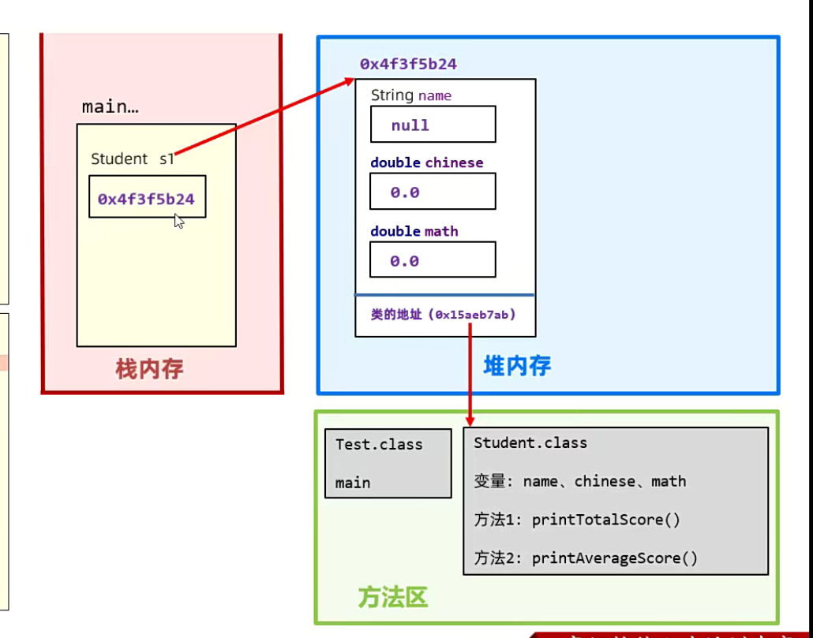
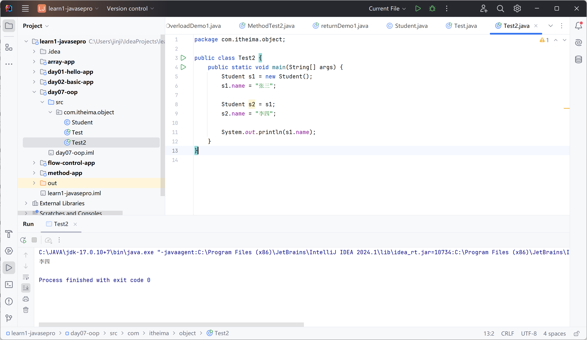
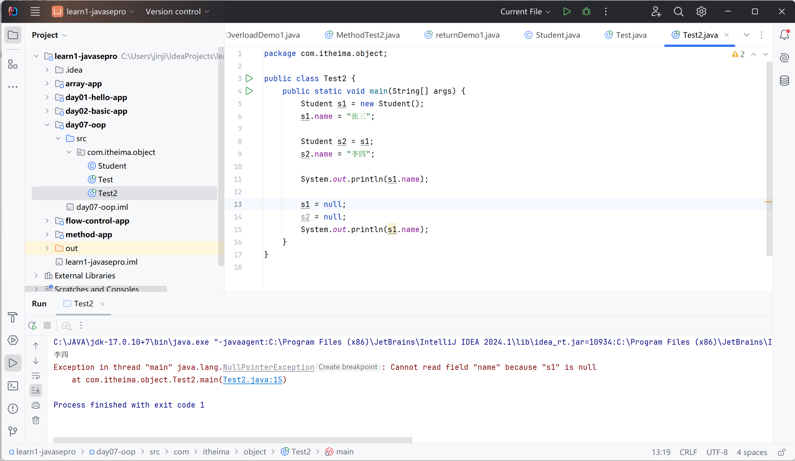
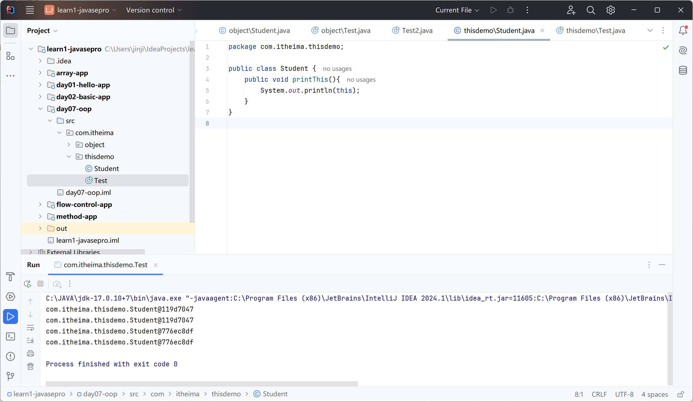
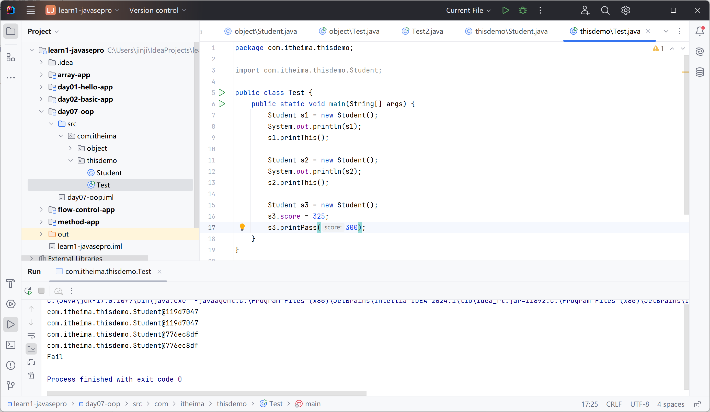
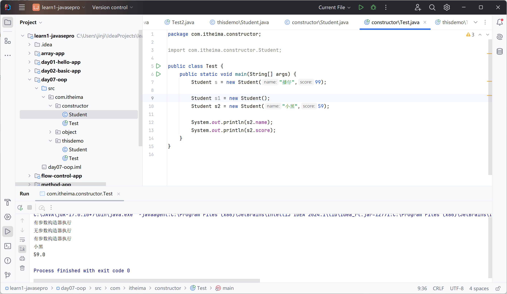
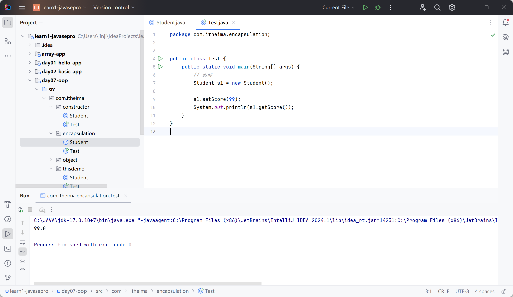
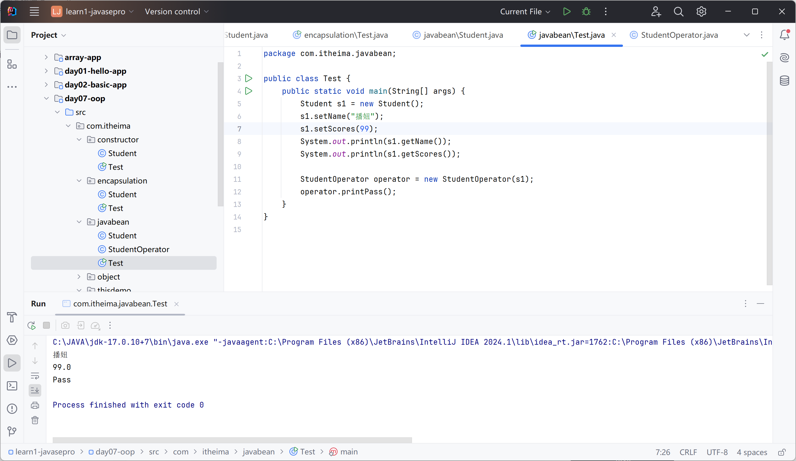
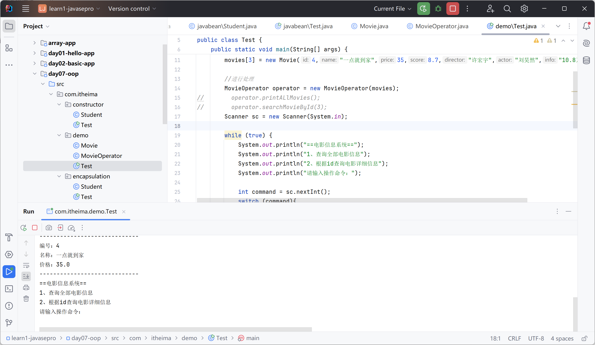

# 面向对象编程

JAVA中的对象

创建一个学生对象，封装数据

```java
package com.itheima.object;

public class Student {
    String name;
    double chinese;
    double math;

    public void printTotalScore(){
        System.out.println(name + "的总成绩是" + (chinese + math));
    }

    public void printAverageScore(){
        System.out.println(name + "的平均成绩是" + (chinese+math)/2 );
    }
}

```

Test

```java
package com.itheima.object;

public class Test {
    public static void main(String[] args) {
        Student s1 = new Student();
        s1.name = "潘妞";
        s1.chinese = 100;
        s1.math = 100;
        s1.printTotalScore();
        s1.printAverageScore();
        
        Student s2 = new Student();
        s2.name = "潘仔";
        s2.chinese = 90;
        s2.math = 90;
        s2.printTotalScore();
        s2.printAverageScore();
    }
}

```

潘妞的总成绩是200.0
潘妞的平均成绩是100.0
潘仔的总成绩是180.0
潘仔的平均成绩是90.0

## 计算机中的执行原理

在堆内存中开辟空间

引用类型的变量（存储地址）

方法区中存放变量和方法



## 注意事项

类名用英文单词首字母大写、驼峰命名

成员变量（对象的属性）、成员方法（对象的行为）

成员变量不需要赋初始值

一个文件可以多个class（类），但只能有一个public（公共类）

对象之间数据不会互相影响，但多个变量指向同一个对象会

无引用的对象自动回收（引用计数）

例：

```java
package com.itheima.object;

public class Test2 {
    public static void main(String[] args) {
        Student s1 = new Student();
        s1.name = "张三";

        Student s2 = s1;
        s2.name = "李四";

        System.out.println(s1.name);
    }
}

```





## this关键字

拿到当前对象

```java
package com.itheima.thisdemo;

import com.itheima.thisdemo.Student;

public class Test {
    public static void main(String[] args) {
        Student s1 = new Student();
        System.out.println(s1);
        s1.printThis();

        Student s2 = new Student();
        System.out.println(s2);
        s2.printThis();
    }
}

```

```java
package com.itheima.thisdemo;

public class Student {
    public void printThis(){
        System.out.println(this);
    }
}

```



### 应用场景

解决变量命名冲突

this.score 获取当前对象的成员变量score

```java
package com.itheima.thisdemo;

public class Student {
    double score;
    public void printThis(){
        System.out.println(this);
    }

    public void printPass(double score){
        if(score > this.score){
            System.out.println("Pass");
        }else{
            System.out.println("Fail");
        }
    }
}

```



## 构造器

特殊的方法

new的时候，调用

```java
package com.itheima.constructor;

public class Student {
    String name;
    double score;
    /*构造器*/
    public Student (){
        System.out.println("无参数构造器执行");
    }

    public Student (String name,double score){
        System.out.println("有参数构造器执行");
        this.name = name;
        this.score = score;
    }
}

```

用于对象的初始化

```java
package com.itheima.constructor;

import com.itheima.constructor.Student;

public class Test {
    public static void main(String[] args) {
        Student s = new Student("播仔",99);

        Student s1 = new Student();
        Student s2 = new Student("小黑",59);

        System.out.println(s2.name);
        System.out.println(s2.score);
    }
}

```



不写构造器：默认生成无参数构造器

写了有参构造器：不会生成

## 封装

**面向对象三大特征：封装、继承、多态**

把对象要处理的数据、处理数据的方法都涉及到一个对象中

合理隐藏、合理暴露

成员使用

```java
package com.itheima.encapsulation;

public class Student {
    // 私有不可访问
    private double score;

    public void printPass(){
        System.out.println(score > 60 ? "Passed" : "Failed");
    }

    //getter and setter
    public double getScore() {
        return score;
    }

    public void setScore(double score) {
        this.score = score;
    }
}

```

调用的时候不能直接访问私有成员变量，需要调用公共的方法

```java
package com.itheima.encapsulation;


public class Test {
    public static void main(String[] args) {
        // 封装
        Student s1 = new Student();

        s1.setScore(99);
        System.out.println(s1.getScore());
    }
}

```



## 实体JavaBean

1. 所有成员变量私有，提供getter、setter方法

2. 有必须有一个公共的无参构造器

**仅仅用来保存数据**

```java
package com.itheima.javabean;

public class Student {
    // 1. 必须私有化成员变量
    private String name;
    private double scores;

    // 2. 必须有无参构造器
    public Student() {
    }

    public Student(String name, double scores) {
        this.name = name;
        this.scores = scores;
    }

    public String getName() {
        return name;
    }

    public void setName(String name) {
        this.name = name;
    }

    public double getScores() {
        return scores;
    }

    public void setScores(double scores) {
        this.scores = scores;
    }

}

```

调用：

```java
package com.itheima.javabean;

public class Test {
    public static void main(String[] args) {
        Student s1 = new Student();
        s1.setName("播妞");
        s1.setScores(99);
        System.out.println(s1.getName());
        System.out.println(s1.getScores());
    }
}

```

### 应用场景

数据和数据处理的业务分离

Student、StudentOperator

```java
package com.itheima.javabean;

public class StudentOperator {
    private Student student;
    public StudentOperator(Student student) {
        this.student = student;
    }

    public void printPass(){
        if(student.getScores() > 60){
            System.out.println("Pass");
        }else{
            System.out.println("Fail");
        }
    }
}

```

调用：

```java
package com.itheima.javabean;

public class Test {
    public static void main(String[] args) {
        Student s1 = new Student();
        s1.setName("播妞");
        s1.setScores(99);
        System.out.println(s1.getName());
        System.out.println(s1.getScores());

        StudentOperator operator = new StudentOperator(s1);
        operator.printPass();
    }
}

```



## 面向对象编程综合案例

需求：电影信息系统

展示、查找（id）



Movie.java

```java
package com.itheima.demo;

public class Movie {
    private int id;
    private String name;
    private double price;
    private double score;
    private String director;
    private String actor;
    private String info;

    public Movie() {    }

    public Movie(int id, String name, double price, double score, String director, String actor, String info) {
        this.id = id;
        this.name = name;
        this.price = price;
        this.score = score;
        this.director = director;
        this.actor = actor;
        this.info = info;
    }

    public int getId() {
        return id;
    }

    public void setId(int id) {
        this.id = id;
    }

    public String getName() {
        return name;
    }

    public void setName(String name) {
        this.name = name;
    }

    public double getPrice() {
        return price;
    }

    public void setPrice(double price) {
        this.price = price;
    }

    public double getScore() {
        return score;
    }

    public void setScore(double score) {
        this.score = score;
    }

    public String getDirector() {
        return director;
    }

    public void setDirector(String director) {
        this.director = director;
    }

    public String getActor() {
        return actor;
    }

    public void setActor(String actor) {
        this.actor = actor;
    }

    public String getInfo() {
        return info;
    }

    public void setInfo(String info) {
        this.info = info;
    }

}

```

MovieOperator.java

```java
package com.itheima.demo;

public class MovieOperator {
    private Movie[] movies;
    public MovieOperator(Movie[] movies) {
        this.movies = movies;
    }

    public void printALlMovies(){
        System.out.println("--------系统的全部电影如下--------");
        for (int i = 0; i < movies.length; i++) {
            Movie m = movies[i];
            System.out.println("编号："+ m.getId());
            System.out.println("名称："+ m.getName());
            System.out.println("价格："+ m.getPrice());
            System.out.println("-----------------------------");
        }
    }

    public void searchMovieById(int id){
        for (int i = 0; i < movies.length; i++) {
            Movie m = movies[i];
            if(m.getId() == id){
                System.out.println("该电影详情如下：");
                System.out.println("编号："+ m.getId());
                System.out.println("名称："+ m.getName());
                System.out.println("价格："+ m.getPrice());
                System.out.println("得分："+ m.getScore());
                System.out.println("导演："+ m.getDirector());
                System.out.println("主演："+ m.getActor());
                System.out.println("其他："+ m.getInfo());
            }
        }
    }
}

```

Test.java

```java
package com.itheima.demo;

import java.util.Scanner;

public class Test {
    public static void main(String[] args) {
        Movie[] movies = new Movie[4];
        movies[0] = new Movie(1,"水门桥",38.9,9.8,"徐克","吴京","12万人想看");
        movies[1] = new Movie(2,"出拳吧",39,7.8,"唐晓白","田雨","3.5万人想看");
        movies[2] = new Movie(3,"月球陨落",42,7.9,"罗兰","贝瑞","17.9万人想看");
        movies[3] = new Movie(4,"一点就到家",35,8.7,"许宏宇","刘昊然","10.8万人想看");

        //进行处理
        MovieOperator operator = new MovieOperator(movies);
//        operator.printALlMovies();
//        operator.searchMovieById(3);
        Scanner sc = new Scanner(System.in);

        while (true) {
            System.out.println("==电影信息系统==");
            System.out.println("1、查询全部电影信息");
            System.out.println("2、根据id查询电影详细信息");
            System.out.println("请输入操作命令：");

            int command = sc.nextInt();
            switch (command){
                case 1:
                    // 展示全部电影信息
                    operator.printALlMovies();
                    break;
                case 2:
                    // 根据id查询电影详细信息
                    System.out.println("请您输入查询的电影id：");
                    int id = sc.nextInt();
                    operator.searchMovieById(id);
                    break;
                default:
                    System.out.println("您输入的命令有问题");
            }
        }
    }
}

```

## 成员变量，局部变量的区别

1. 类中位置不同：成员变量在方法外，局部变量在方法内

2. 初始化值不同：成员变量有默认值；局部变量没有，需要初始化

3. 内存位置不同：成员变量在堆内存；局部变量在栈内存

4. 作用域不同：成员变量整个对象；局部变量方法内

5. 生命周期不同：伴随对象；方法调用生、方法调用死
