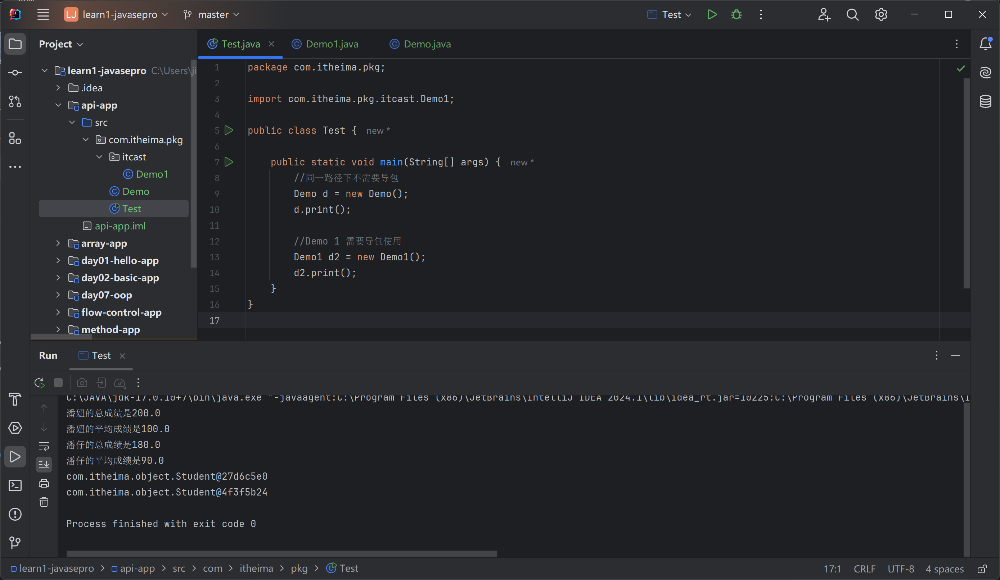
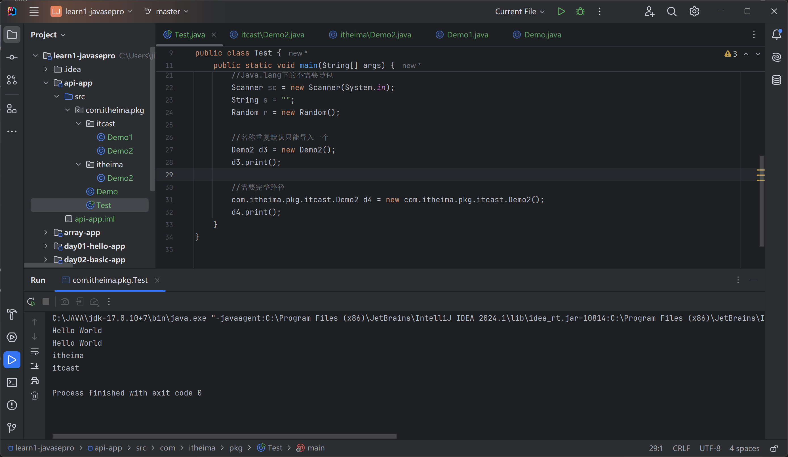
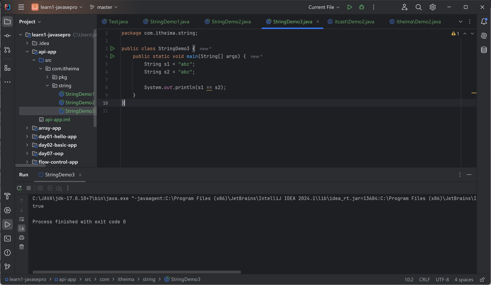
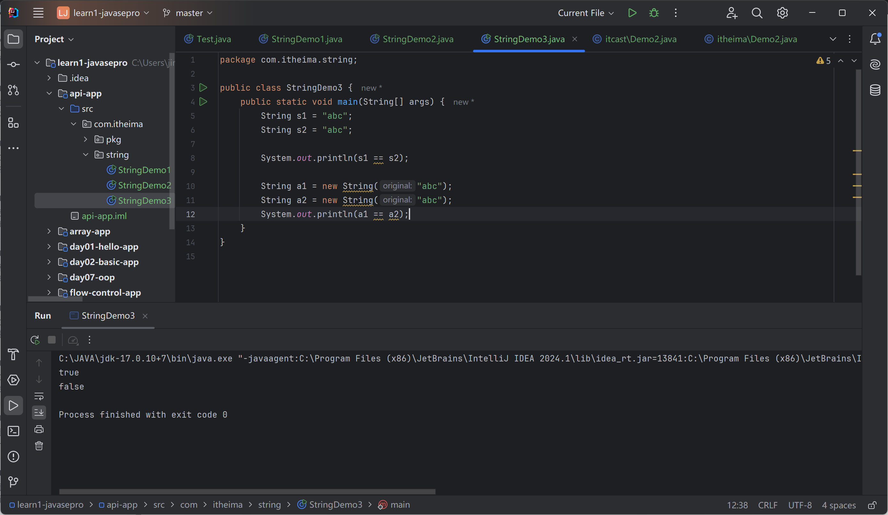
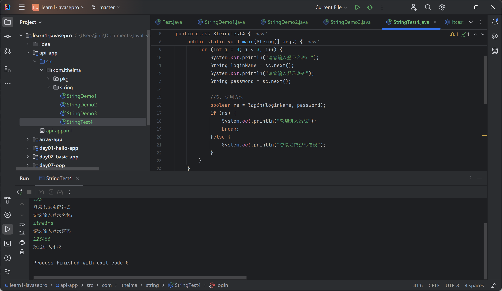
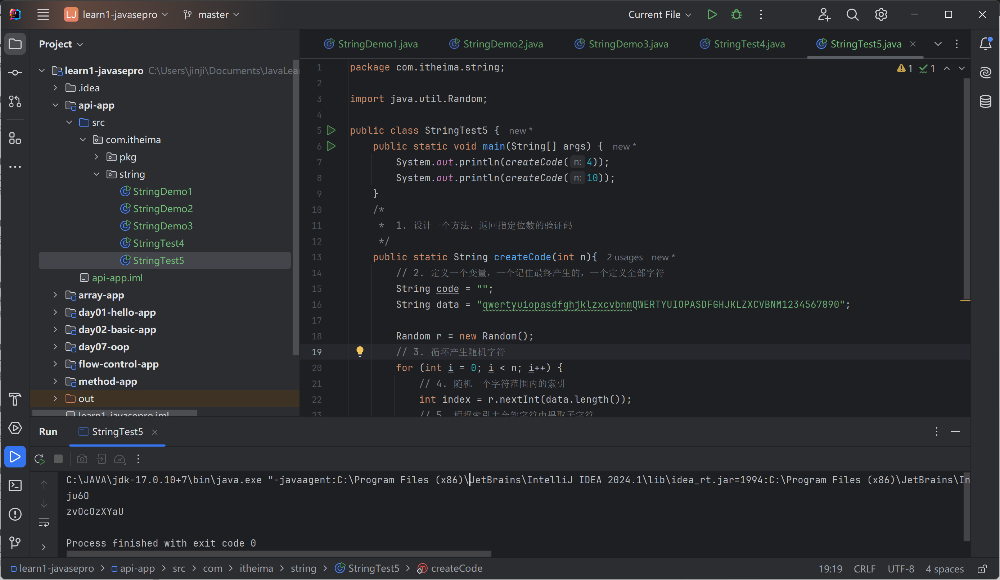
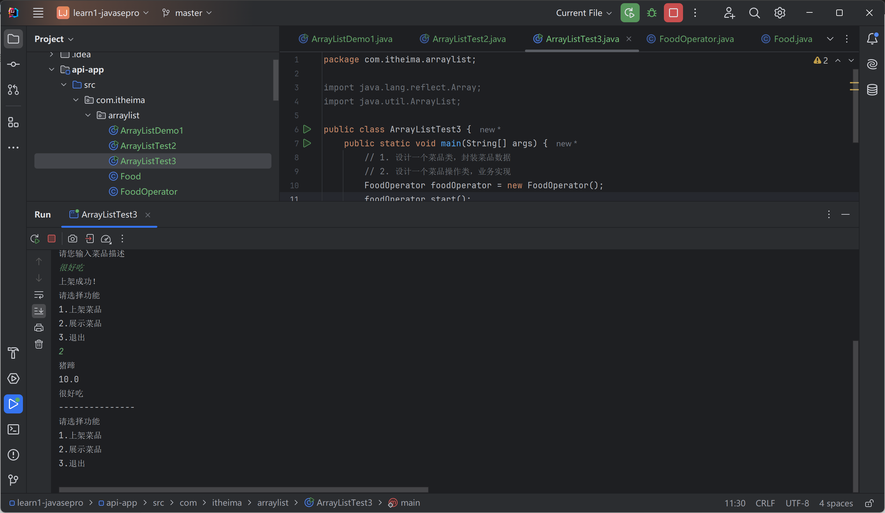

# 面向对象基础应用：常见API

java.base包

## 包

分门别类管理程序的文件夹

```java
package com.itheima.pkg;

import com.itheima.pkg.itcast.Demo1;
import com.itheima.pkg.itheima.Demo2;

import java.util.Random;
import java.util.Scanner;

public class Test {

    public static void main(String[] args) {
        //同一路径下不需要导包
        Demo d = new Demo();
        d.print();

        //Demo 1 需要导包使用
        Demo1 d2 = new Demo1();
        d2.print();

        //使用Java提供的程序也要导包
        //Java.lang下的不需要导包
        Scanner sc = new Scanner(System.in);
        String s = "";
        Random r = new Random();

        //名称重复默认只能导入一个
        Demo2 d3 = new Demo2();
        d3.print();

        //需要完整路径
        com.itheima.pkg.itcast.Demo2 d4 = new com.itheima.pkg.itcast.Demo2();
        d4.print();
    }
}

```





## String

java.lang.String

1. 创建对象
2. 封装字符串数据
3. 调用方法

### 常见构造器

使用双引号，或者new对象

```java
package com.itheima.string;

public class StringDemo1 {
    public static void main(String[] args) {
        // 1. 直接用引号得到字符串对象
        String name = "itheima";
        System.out.println(name);

        // 2. new String创建对象，并用构造器初始化字符串
        String rs1 = new String();
        System.out.println(rs1);

        String rs2 = new String("itheima");
        System.out.println(rs2);

        char[] chars = {'a','黑','马'};
        String rs3 = new String(chars);
        System.out.println(rs3);

        byte[] bytes1 = {97,98,99};
        String rs4 = new String(bytes1);
        System.out.println(rs4);
    }
}

```

itheima

itheima
a黑马
abc

### 常用方法

```java
package com.itheima.string;

public class StringDemo2 {
    public static void main(String[] args) {
        String s = "黑马Java";
        //1. 获取长度
        System.out.println(s.length());

        //2. 提取索引位置字符
        System.out.println(s.charAt(1));

        //字符串的遍历
        for (int i = 0; i < s.length(); i++) {
            System.out.println(s.charAt(i));
        }

        //3.转为字符数组
        char[] chars = s.toCharArray();
        for (int i = 0; i < chars.length; i++) {
            System.out.println(chars[i]);
        }

        //4.判断内容一样返回true
        String s1 = "黑马";
        String s2 = "黑马";

        System.out.println(s1 == s2);   //内存 false
        System.out.println(s1.equals(s2));  //true

        //5.忽略大小写比较字符串内容
        String c1 = "34AeFG";
        String c2 = "34aEfG";
        System.out.println(c1.equals(c2));  //false
        System.out.println(c1.equalsIgnoreCase(c2));    //true

        //6.截取字符串内容
        String s3 = "Java是最好的编程语言之一";
        String rs = s3.substring(0,8);
        System.out.println(rs);

        //7.从当前索引截取到末尾
        String rs2 = s3.substring(5);
        System.out.println(rs2);

        //8.某个内容替换新内容返回新的字符串
        String info = "这个电影简直是个垃圾";
        String rs3 = info.replace("垃圾","**");
        System.out.println(rs3);

        //9.判断是否包含关键字
        String info2 = "Java是最好的编程语言之一，我爱Java";
        System.out.println(info2.contains("Java"));
        System.out.println(info2.contains("java"));
        System.out.println(info2.contains("java2"));

        //10.判断是否某个字符串开头
        String rs4 = "张三丰";
        System.out.println(rs4.startsWith("张"));
        System.out.println(rs4.startsWith("张三"));
        System.out.println(rs4.startsWith("张三2"));

        //11.分隔开为字符串数组
        String rs5 = "张无忌，周芷若，殷素素，赵敏";
        String[] names = rs5.split("，");
        for (int i = 0; i < names.length; i++) {
            System.out.println(names[i]);
        }
    }
}

```

### 注意事项

1. String对象内容不可变。每次创建新的对象

2. 以双引号写出的会存储在常量池中，内容相同存储一份（节约内存）

3. new创建，每次创建一个新的对象，放在堆内存中





### 应用案例


#### 用户登录功能

```java
package com.itheima.string;

import java.util.Scanner;

public class StringTest4 {
    public static void main(String[] args) {
        // 1.登录界面
        Scanner sc = new Scanner(System.in);
        for (int i = 0; i < 3; i++) {
            System.out.println("请您输入登录名称：");
            String loginName = sc.next();
            System.out.println("请您输入登录密码");
            String password = sc.next();

            //5. 调用方法
            boolean rs = login(loginName, password);
            if (rs) {
                System.out.println("欢迎进入系统");
                break;
            }else {
                System.out.println("登录名或密码错误");
            }
        }
    }


    /*
    * 2. 开发一个登陆的方法，接受用户名密码，返回认证结果
    * */
    public static boolean login(String loginName, String password) {
        // 3. 准备正确的用户名密码
        String okLoginName = "itheima";
        String okPassword = "123456";

        // 4. 判断用户是否登录成功
        return loginName.equals(okLoginName) && password.equals(okPassword);
    }
}

```

output:

```
请您输入登录名称：
ithei
请您输入登录密码
123
登录名或密码错误
请您输入登录名称：
itheima
请您输入登录密码
123456
欢迎进入系统
```




问题：

字符串比较使用==：可能内容一样，地址不一样

基本数据类型才使用==比较

字符串使用equals方法


#### 随机产生验证码功能

```java
package com.itheima.string;

import java.util.Random;

public class StringTest5 {
    public static void main(String[] args) {
        System.out.println(createCode(4));
        System.out.println(createCode(10));
    }
    /*
     *  1. 设计一个方法，返回指定位数的验证码
     */
    public static String createCode(int n){
        // 2. 定义一个变量，一个记住最终产生的，一个定义全部字符
        String code = "";
        String data = "qwertyuiopasdfghjklzxcvbnmQWERTYUIOPASDFGHJKLZXCVBNM1234567890";

        Random r = new Random();
        // 3. 循环产生随机字符
        for (int i = 0; i < n; i++) {
            // 4. 随机一个字符范围内的索引
            int index = r.nextInt(data.length());
            // 5. 根据索引去全部字符中提取子字符
            code += data.charAt(index);
        }
        // 6. return
        return code;
    }
}
```



ju6O
zvOcOzXYaU

## ArrayList

集合：大小可变

ArrayList\<E\>

\<E\>：限制类型

### 常用方法

添加元素

```java
package com.itheima.arraylist;

import java.util.ArrayList;

public class ArrayListDemo1 {
    public static void main(String[] args) {
        // 1. 创建一个ArrayList的集合对象
        ArrayList list = new ArrayList();
        list.add("黑马");
        list.add(666);
        list.add(99.5);
        list.add("黑马");
        list.add("Java");
        System.out.println(list);
    }
}

```

[黑马, 666, 99.5, 黑马, Java]

用泛型限制元素类型

```java
package com.itheima.arraylist;

import java.util.ArrayList;

public class ArrayListDemo1 {
    public static void main(String[] args) {
        // 1. 创建一个ArrayList的集合对象
        ArrayList<String> list = new ArrayList<String>();
        list.add("黑马");
        list.add("黑马");
        list.add("Java");
        System.out.println(list);
    }
}

```

[黑马, 黑马, Java]

完整：

```java
package com.itheima.arraylist;

import java.util.ArrayList;

public class ArrayListDemo1 {
    public static void main(String[] args) {
        //1. 创建一个ArrayList的集合对象
        ArrayList<String> list = new ArrayList<String>();
        list.add("黑马");
        list.add("黑马");
        list.add("Java");
        System.out.println(list);

        //2. 往某个索引位置处天年假一个数据
        list.add(1,"mySQL");
        System.out.println(list);

        //3. 根据索引获取值
        String rs = list.get(1);
        System.out.println(rs);

        //4. 返回集合中元素个数
        System.out.println(list.size());

        //5. 索引删除元素，并返回被删除的元素值
        System.out.println(list.remove(1));
        System.out.println(list);

        //6. 删除某个元素值，成功ture
        System.out.println(list.remove("Java"));
        System.out.println(list);

        list.add("html");
        System.out.println(list);

        //默认删除第一次出现的黑马的数据
        System.out.println(list.remove("黑马"));
        System.out.println(list);

        //7. 修改某个索引的位置，修改后返回原来的值
        System.out.println(list.set(1, "黑马程序员"));
        System.out.println(list);

    }
}

```

output:

```java
[黑马, 黑马, Java]
[黑马, mySQL, 黑马, Java]
mySQL
4
mySQL
[黑马, 黑马, Java]
true
[黑马, 黑马]
[黑马, 黑马, html]
true
[黑马, html]
html
[黑马, 黑马程序员]
```

### 案例

掌握从容器中找出某些数据并成功删除的技巧

直接删会出bug

```java
package com.itheima.arraylist;

import java.util.ArrayList;

public class ArrayListTest2 {
    public static void main(String[] args) {
        // 1.创建一个ArrayList对象
        ArrayList<String> list = new ArrayList<>();
        list.add("java入门");
        list.add("宁夏枸杞");
        list.add("黑枸杞");
        list.add("人字拖");
        list.add("特级枸杞");
        list.add("枸杞子");
        System.out.println(list);

//        for (int i = 0; i < list.size(); i++) {
//            //i = 0 1 2 3 4 5
//            //取出当前数据
//            String ele = list.get(i);
//            if(ele.contains("枸杞")){
//                // 直接从集合中删除该元素
//                list.remove(i);
//            }
//
//        }

        // 方式一：每次删除后，i向左退一步
        for (int i = 0; i < list.size(); i++) {
            //i = 0 1 2 3 4 5
            //取出当前数据
            String ele = list.get(i);
            if(ele.contains("枸杞")){
                // 直接从集合中删除该元素
                list.remove(ele);
                i--;
            }
        }

        // 方式二：倒着遍历
        for( int i = list.size()-1; i >= 0; i--){
            String ele = list.get(i);
            if(ele.contains("枸杞")){
                list.remove(ele);
            }
        }

        System.out.println(list);
    }
}

```

[java入门, 宁夏枸杞, 黑枸杞, 人字拖, 特级枸杞, 枸杞子]
[java入门, 人字拖]

### 综合案例

模仿外卖系统中的商家系统

需求：上架、信息浏览

使用ArrayList、面向对象



Food.java

```java
package com.itheima.arraylist;

public class Food {
    private String name;
    private double price;
    private String desc;

    public Food() {
    }

    public Food(String name, double price, String desc) {
        this.name = name;
        this.price = price;
        this.desc = desc;
    }

    public String getName() {
        return name;
    }

    public void setName(String name) {
        this.name = name;
    }

    public double getPrice() {
        return price;
    }

    public void setPrice(double price) {
        this.price = price;
    }

    public String getDesc() {
        return desc;
    }

    public void setDesc(String desc) {
        this.desc = desc;
    }
}

```

FoodOperator.java

```java
package com.itheima.arraylist;

import java.util.ArrayList;
import java.util.Scanner;

public class FoodOperator {
    // 1.定义一个arraylist存储菜品信息
    private ArrayList<Food> foodlist = new ArrayList<>();

    public FoodOperator() {}

    public FoodOperator(ArrayList<Food> foodlist) {
        this.foodlist = foodlist;
    }

    // 2. 上架功能
    public void addFood() {
        // 3. 创建一个菜品对象，封装信息
        Food f = new Food();

        // 4. 录入信息
        Scanner sc = new Scanner(System.in);
        System.out.println("请您输入菜品名称");
        String name = sc.next();
        f.setName(name);

        System.out.println("请您输入菜品价格");
        double price = sc.nextDouble();
        f.setPrice(price);

        System.out.println("请您输入菜品描述");
        String desc = sc.next();
        f.setDesc(desc);

        // 5. 添加到集合
        foodlist.add(f);
        System.out.println("上架成功！");
    }

    //6. 展示菜品
    public void showAllFoods(){
        for (int i = 0; i < foodlist.size(); i++) {
            Food f = foodlist.get(i);
            System.out.println(f.getName());
            System.out.println(f.getPrice());
            System.out.println(f.getDesc());
            System.out.println("---------------");
        }
    }

    // 负责展示操作界面
    public void start(){
        Scanner sc = new Scanner(System.in);
        while (true) {
            System.out.println("请选择功能");
            System.out.println("1.上架菜品");
            System.out.println("2.展示菜品");
            System.out.println("3.退出");

            String command = sc.next();
            switch (command) {
                case "1":
                    addFood();
                    break;
                case "2":
                    showAllFoods();
                    break;
                case "3":
                    System.out.println("下次再来哦");
                    return;
                default:
                    System.out.println("输入的命令不存在");
            }
        }
    }
}

```

ArrayTest3.java
```java
package com.itheima.arraylist;

import java.lang.reflect.Array;
import java.util.ArrayList;

public class ArrayListTest3 {
    public static void main(String[] args) {
        // 1. 设计一个菜品类，封装菜品数据
        // 2. 设计一个菜品操作类，业务实现
        FoodOperator foodOperator = new FoodOperator();
        foodOperator.start();
    }
}

```

