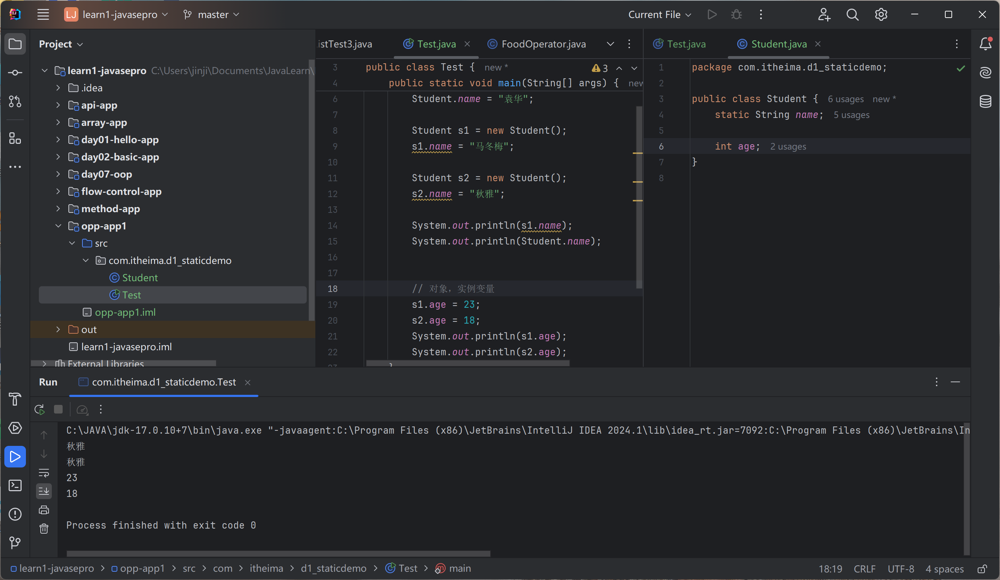
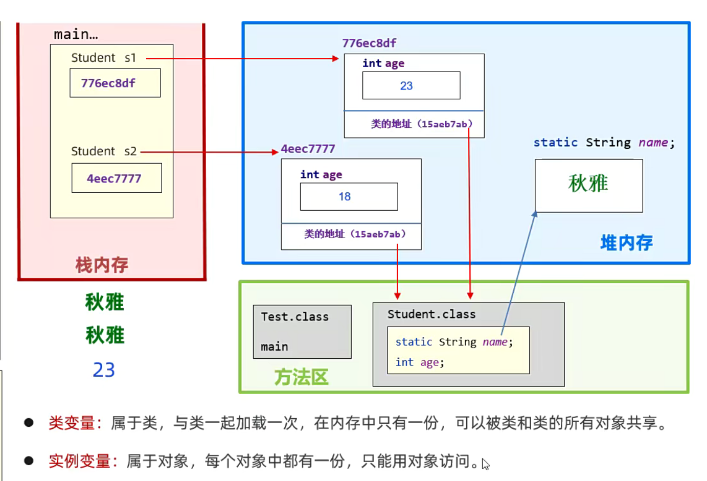
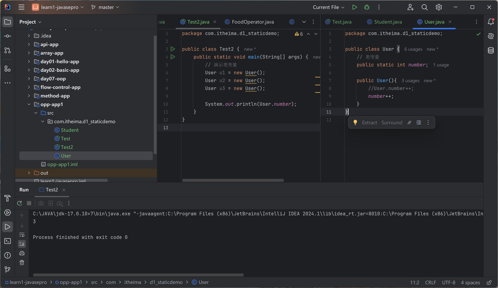
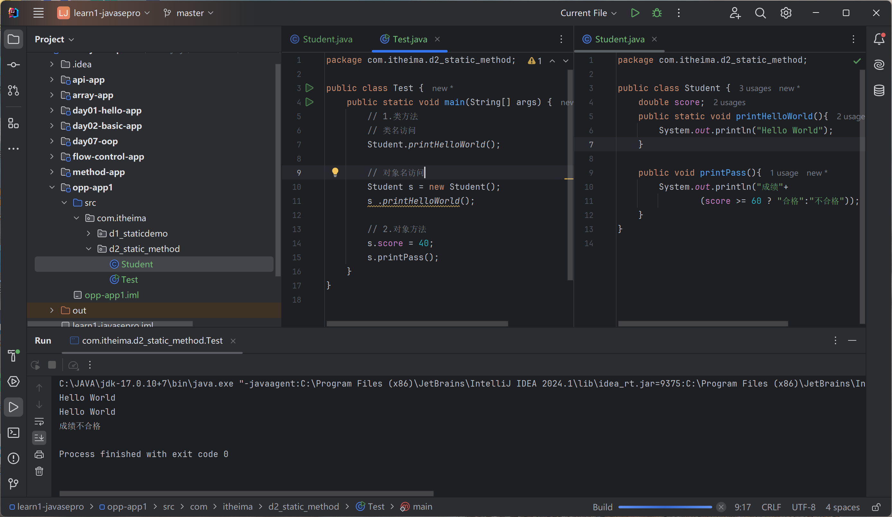
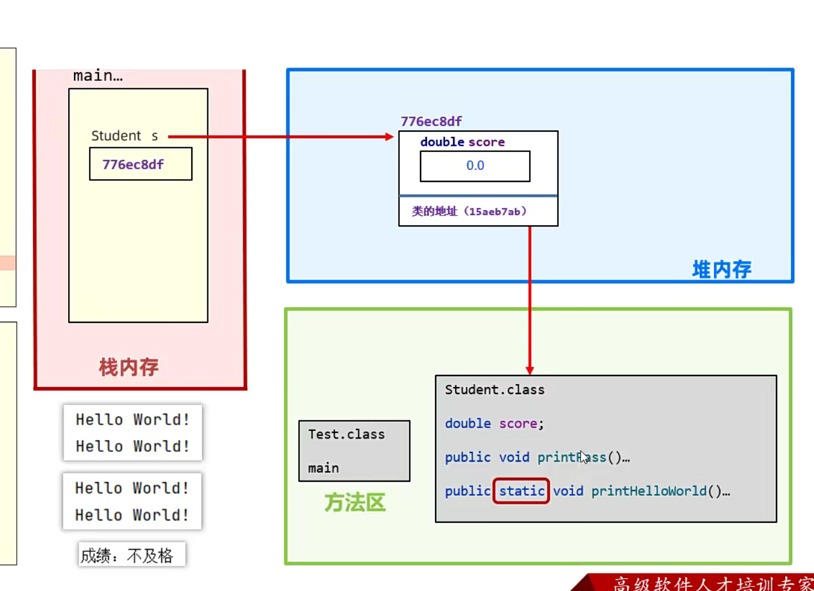
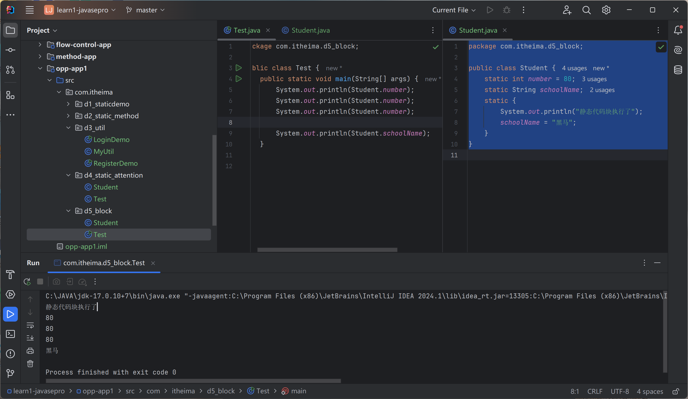
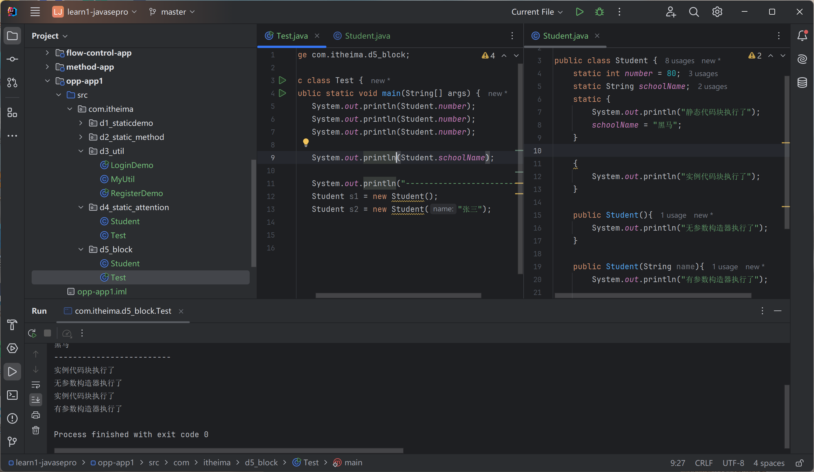

# STATIC

静态、static

修饰成员变量、修饰成员方法

类变量：static修饰、属于类、会被类的全部对象共享

实例变量：无static修饰

```java
package com.itheima.d1_staticdemo;

public class Test {
    public static void main(String[] args) {
        // 类变量的用法
        Student.name = "袁华";

        Student s1 = new Student();
        s1.name = "马冬梅";

        Student s2 = new Student();
        s2.name = "秋雅";

        System.out.println(s1.name);
        System.out.println(Student.name);


        // 对象，实例变量
        s1.age = 23;
        s1.age = 18;
        System.out.println(s1.age);
        System.out.println(s2.age);
    }
}

```

秋雅
秋雅
18
23




## 修饰成员变量

### 成员变量的原理

类对象：保存在堆内存中；所有对象共享一个类中的变量

实例变量（对象变量）：每个对象的内存中



### 应用场景

需要一份；共享访问、修改

创建了多少个用户对象：

User

```java
package com.itheima.d1_staticdemo;

public class User {
    // 类变量
    public static int number;

    public User(){
        //User.number++;
        number++;
    }
}

```

```java
package com.itheima.d1_staticdemo;

public class Test2 {
    public static void main(String[] args) {
        // 演示类变量
        User u1 = new User();
        User u2 = new User();
        User u3 = new User();

        System.out.println(User.number);
    }
}

```

3



## 修饰成员方法 

类方法：类名.方法名()；对象名.方法名()；属于类，类名访问或者对象访问。

实例方法：对象名.方法名()；属于对象，只能用对象访问。

Student

```java
package com.itheima.d2_static_method;

public class Student {
    double score;
    public static void printHelloWorld(){
        System.out.println("Hello World");
    }

    public void printPass(){
        System.out.println("成绩"+
                (score >= 60 ? "合格":"不合格"));
    }
}

```

```java
package com.itheima.d2_static_method;

public class Test {
    public static void main(String[] args) {
        // 1.类方法
        // 类名访问
        Student.printHelloWorld();

        // 对象名访问
        Student s = new Student();
        s .printHelloWorld();

        // 2.对象方法
        s.score = 40;
        s.printPass();
    }
}

```



### 成员方法的执行原理



### main方法

类方法：

`java Test`

启动Test.main();

参数String[] args：

`java Test arg1 arg2 arg3...`

### 应用场景

好处：提高代发复用

工具类

1. 创建MyUtil类，静态方法生成验证码；禁止创建对象：`private MyUtil(){   }	`

```java
package com.itheima.d3_util;

import java.util.Random;

public class MyUtil {
    private MyUtil(){   }
    public static String createCode(int n){
        // 2. 定义一个变量，一个记住最终产生的，一个定义全部字符
        String code = "";
        String data = "qwertyuiopasdfghjklzxcvbnmQWERTYUIOPASDFGHJKLZXCVBNM1234567890";

        Random r = new Random();
        // 3. 循环产生随机字符
        for (int i = 0; i < n; i++) {
            // 4. 随机一个字符范围内的索引
            int index = r.nextInt(data.length());
            // 5. 根据索引去全部字符中提取子字符
            code += data.charAt(index);
        }
        // 6. return
        return code;
    }
}

```

2. 在登录、注册中使用

```java
package com.itheima.d3_util;

import java.util.Random;

public class LoginDemo {
    public static void main(String[] args) {
        System.out.println(MyUtil.createCode(4));
    }
}

```

```java
package com.itheima.d3_util;

import java.util.Random;

public class RegisterDemo {
    public static void main(String[] args) {
        System.out.println(MyUtil.createCode(6));
    }
}
```

Java.utils.Math工具类

## Static的注意事项

1. 类方法中可以直接访问类的成员，不可以访问实例成员。

```java
package com.itheima.d4_static_attention;

public class Student {
    static String schoolName;   //类变量
    double score;
    // 
    public static void printHelloWorld(){
        //Student.schoolName = "黑马";
        //可以省略类名
        schoolName = "黑马";
        Student.printHelloWorld2();

        //System.out.println(score);
        //printPass();
    }

    public static void printHelloWorld2(){}

    public void printPass(){    }
}


```

2. 实例方法中可以访问类成员，也可以访问实例成员
3. 实例方法可以用this，但是类方法不行

```java
package com.itheima.d4_static_attention;

public class Student {
    static String schoolName;   //类变量
    double score;
    //
    public static void printHelloWorld(){
        //Student.schoolName = "黑马";
        //可以省略类名
        schoolName = "黑马";
        Student.printHelloWorld2();

        //System.out.println(score);
        //printPass();
    }

    public static void printHelloWorld2(){}

    public void printPass(){
        schoolName = "黑马2";
        printHelloWorld();

        System.out.println(score);
        this.printPass2();
    }

    public void printPass2(){   }
}


```

## 应用：代码块


### 静态代码块

static{	}

类的初始化、自动加载一次、对类变量的初始化赋值

Student

```java
package com.itheima.d5_block;

public class Student {
    static int number = 80;
    static String schoolName;
    static {
        System.out.println("静态代码块执行了");
        schoolName = "黑马";
    }
}

```

```java
package com.itheima.d5_block;

public class Test {
    public static void main(String[] args) {
        System.out.println(Student.number);
        System.out.println(Student.number);
        System.out.println(Student.number);

        System.out.println(Student.schoolName);
    }
}

```

静态代码块执行了
80
80
80
黑马



用途：初始化类变量

### 实例代码块

{	}

对象创建时执行，构造器前执行

```java
package com.itheima.d5_block;

public class Student {
    static int number = 80;
    static String schoolName;
    static {
        System.out.println("静态代码块执行了");
        schoolName = "黑马";
    }

    {
        System.out.println("实例代码块执行了");
    }

    public Student(){
        System.out.println("无参数构造器执行了");
    }

    public Student(String name){
        System.out.println("有参数构造器执行了");

    }
}

```

```java
package com.itheima.d5_block;

public class Test {
    public static void main(String[] args) {
        System.out.println(Student.number);
        System.out.println(Student.number);
        System.out.println(Student.number);

        System.out.println(Student.schoolName);

        System.out.println("-------------------------");
        Student s1 = new Student();
        Student s2 = new Student("张三");
    }
}

```



用途：创建日志

## 应用：单例设计模式

### 饿汉式单例模式

确保一个类只有一个对象

写法：

- 类的构造私有
- 定义一个变量记住类的一个对象
- 定义一个类方法，返回对象

A类

```java
package com.itheima.d6_singleinstance;

public class A {
    private static A a = new A();

    private A() {

    }

    public static A getObject(){
        return a;
    }
}
```

```java
package com.itheima.d6_singleinstance;

public class Test1 {
    public static void main(String[] args) {
        //new A();
        A a1 = A.getObject();
        A a2 = A.getObject();

        System.out.println(a1);
        System.out.println(a2);
    }
}

```

output:

com.itheima.d6_singleinstance.A@119d7047
com.itheima.d6_singleinstance.A@119d7047

应用场景：Runtime类，运行环境

### 懒汉式单例模式

拿对象的时候才创建对象

- 类的构造私有
- 定义一个变量记住类的一个对象
- 定义一个类方法，返回对象

```java
package com.itheima.d6_singleinstance;

public class B {
    private static B b;

    private B() {   }

    //定义类方法，保证第一次调用创建，其他返回
    public static B getInstance() {
        if(b == null) {
            b = new B();
        }
        return b;
    }
}

```

```java
package com.itheima.d6_singleinstance;

public class Test2 {
    public static void main(String[] args) {
        B b1 = B.getInstance();
        B b2 = B.getInstance();

        System.out.println(b1);
        System.out.println(b2);
    }
}

```

output:

com.itheima.d6_singleinstance.B@119d7047
com.itheima.d6_singleinstance.B@119d7047

# 面向对象三大特征之二：继承

extends

子类能继承父类的非私有成员（变量、方法）