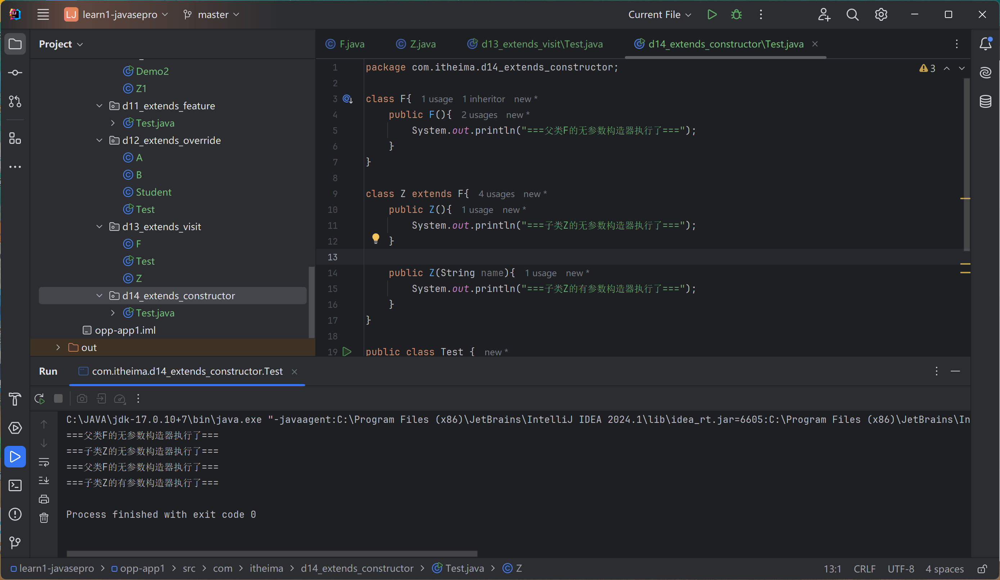

# STATIC

静态、static

修饰成员变量、修饰成员方法

类变量：static修饰、属于类、会被类的全部对象共享

实例变量：无static修饰

```java
package com.itheima.d1_staticdemo;

public class Test {
    public static void main(String[] args) {
        // 类变量的用法
        Student.name = "袁华";

        Student s1 = new Student();
        s1.name = "马冬梅";

        Student s2 = new Student();
        s2.name = "秋雅";

        System.out.println(s1.name);
        System.out.println(Student.name);


        // 对象，实例变量
        s1.age = 23;
        s1.age = 18;
        System.out.println(s1.age);
        System.out.println(s2.age);
    }
}

```

秋雅
秋雅
18
23


## 修饰成员变量

### 成员变量的原理

类对象：保存在堆内存中；所有对象共享一个类中的变量

实例变量（对象变量）：每个对象的内存中


### 应用场景

需要一份；共享访问、修改

创建了多少个用户对象：

User

```java
package com.itheima.d1_staticdemo;

public class User {
    // 类变量
    public static int number;

    public User(){
        //User.number++;
        number++;
    }
}

```

```java
package com.itheima.d1_staticdemo;

public class Test2 {
    public static void main(String[] args) {
        // 演示类变量
        User u1 = new User();
        User u2 = new User();
        User u3 = new User();

        System.out.println(User.number);
    }
}

```

3


## 修饰成员方法 

类方法：类名.方法名()；对象名.方法名()；属于类，类名访问或者对象访问。

实例方法：对象名.方法名()；属于对象，只能用对象访问。

Student

```java
package com.itheima.d2_static_method;

public class Student {
    double score;
    public static void printHelloWorld(){
        System.out.println("Hello World");
    }

    public void printPass(){
        System.out.println("成绩"+
                (score >= 60 ? "合格":"不合格"));
    }
}

```

```java
package com.itheima.d2_static_method;

public class Test {
    public static void main(String[] args) {
        // 1.类方法
        // 类名访问
        Student.printHelloWorld();

        // 对象名访问
        Student s = new Student();
        s .printHelloWorld();

        // 2.对象方法
        s.score = 40;
        s.printPass();
    }
}

```


### 成员方法的执行原理


### main方法

类方法：

`java Test`

启动Test.main();

参数String[] args：

`java Test arg1 arg2 arg3...`

### 应用场景

好处：提高代发复用

工具类

1. 创建MyUtil类，静态方法生成验证码；禁止创建对象：`private MyUtil(){   }	`

```java
package com.itheima.d3_util;

import java.util.Random;

public class MyUtil {
    private MyUtil(){   }
    public static String createCode(int n){
        // 2. 定义一个变量，一个记住最终产生的，一个定义全部字符
        String code = "";
        String data = "qwertyuiopasdfghjklzxcvbnmQWERTYUIOPASDFGHJKLZXCVBNM1234567890";

        Random r = new Random();
        // 3. 循环产生随机字符
        for (int i = 0; i < n; i++) {
            // 4. 随机一个字符范围内的索引
            int index = r.nextInt(data.length());
            // 5. 根据索引去全部字符中提取子字符
            code += data.charAt(index);
        }
        // 6. return
        return code;
    }
}

```

2. 在登录、注册中使用

```java
package com.itheima.d3_util;

import java.util.Random;

public class LoginDemo {
    public static void main(String[] args) {
        System.out.println(MyUtil.createCode(4));
    }
}

```

```java
package com.itheima.d3_util;

import java.util.Random;

public class RegisterDemo {
    public static void main(String[] args) {
        System.out.println(MyUtil.createCode(6));
    }
}
```

Java.utils.Math工具类

## Static的注意事项

1. 类方法中可以直接访问类的成员，不可以访问实例成员。

```java
package com.itheima.d4_static_attention;

public class Student {
    static String schoolName;   //类变量
    double score;
    // 
    public static void printHelloWorld(){
        //Student.schoolName = "黑马";
        //可以省略类名
        schoolName = "黑马";
        Student.printHelloWorld2();

        //System.out.println(score);
        //printPass();
    }

    public static void printHelloWorld2(){}

    public void printPass(){    }
}


```

2. 实例方法中可以访问类成员，也可以访问实例成员
3. 实例方法可以用this，但是类方法不行

```java
package com.itheima.d4_static_attention;

public class Student {
    static String schoolName;   //类变量
    double score;
    //
    public static void printHelloWorld(){
        //Student.schoolName = "黑马";
        //可以省略类名
        schoolName = "黑马";
        Student.printHelloWorld2();

        //System.out.println(score);
        //printPass();
    }

    public static void printHelloWorld2(){}

    public void printPass(){
        schoolName = "黑马2";
        printHelloWorld();

        System.out.println(score);
        this.printPass2();
    }

    public void printPass2(){   }
}


```

## 应用：代码块


### 静态代码块

static{	}

类的初始化、自动加载一次、对类变量的初始化赋值

Student

```java
package com.itheima.d5_block;

public class Student {
    static int number = 80;
    static String schoolName;
    static {
        System.out.println("静态代码块执行了");
        schoolName = "黑马";
    }
}

```

```java
package com.itheima.d5_block;

public class Test {
    public static void main(String[] args) {
        System.out.println(Student.number);
        System.out.println(Student.number);
        System.out.println(Student.number);

        System.out.println(Student.schoolName);
    }
}

```

静态代码块执行了
80
80
80
黑马


用途：初始化类变量

### 实例代码块

{	}

对象创建时执行，构造器前执行

```java
package com.itheima.d5_block;

public class Student {
    static int number = 80;
    static String schoolName;
    static {
        System.out.println("静态代码块执行了");
        schoolName = "黑马";
    }

    {
        System.out.println("实例代码块执行了");
    }

    public Student(){
        System.out.println("无参数构造器执行了");
    }

    public Student(String name){
        System.out.println("有参数构造器执行了");

    }
}

```

```java
package com.itheima.d5_block;

public class Test {
    public static void main(String[] args) {
        System.out.println(Student.number);
        System.out.println(Student.number);
        System.out.println(Student.number);

        System.out.println(Student.schoolName);

        System.out.println("-------------------------");
        Student s1 = new Student();
        Student s2 = new Student("张三");
    }
}

```


用途：创建日志

## 应用：单例设计模式

### 饿汉式单例模式

确保一个类只有一个对象

写法：

- 类的构造私有
- 定义一个变量记住类的一个对象
- 定义一个类方法，返回对象

A类

```java
package com.itheima.d6_singleinstance;

public class A {
    private static A a = new A();

    private A() {

    }

    public static A getObject(){
        return a;
    }
}
```

```java
package com.itheima.d6_singleinstance;

public class Test1 {
    public static void main(String[] args) {
        //new A();
        A a1 = A.getObject();
        A a2 = A.getObject();

        System.out.println(a1);
        System.out.println(a2);
    }
}

```

output:

com.itheima.d6_singleinstance.A@119d7047
com.itheima.d6_singleinstance.A@119d7047

应用场景：Runtime类，运行环境

### 懒汉式单例模式

拿对象的时候才创建对象

- 类的构造私有
- 定义一个变量记住类的一个对象
- 定义一个类方法，返回对象

```java
package com.itheima.d6_singleinstance;

public class B {
    private static B b;

    private B() {   }

    //定义类方法，保证第一次调用创建，其他返回
    public static B getInstance() {
        if(b == null) {
            b = new B();
        }
        return b;
    }
}

```

```java
package com.itheima.d6_singleinstance;

public class Test2 {
    public static void main(String[] args) {
        B b1 = B.getInstance();
        B b2 = B.getInstance();

        System.out.println(b1);
        System.out.println(b2);
    }
}

```

output:

com.itheima.d6_singleinstance.B@119d7047
com.itheima.d6_singleinstance.B@119d7047

# 面向对象三大特征之二：继承

extends

子类能继承父类的非私有成员（变量、方法）

B 继承A

父类私有的不能继承

```java
package com.itheima.d7_extends;

public class A {
    //公开成员
    public int i;
    public void print1(){
        System.out.println("===print1===");
    }

    // 私有成员
    private int j;
    private void print2(){
        System.out.println("===print2===");
    }
}

```

```java
package com.itheima.d7_extends;

public class B extends A {
    public void print3(){
        System.out.println(i);
        print1();

        // 父类私有的不能继承
        //System.out.println(j);
        //print2();
    }
}

```

## 继承执行原理

如果使用B继承A，则创建一个B对象需要再方法区创建一个A对象，并连接到B类

只能访问父类的公共区域

## 好处

减少代码复用

多个子类的重复代码放到父类中


## 权限修饰符

public：公共

private：私有

protected：保护的

缺省


1. 在本类中

```java 
package com.itheima.d9_modifier;

public class Fu {
    private void privateMethod(){
        System.out.println("===private===");
    }

    void method(){
        System.out.println("-===缺省===");
    }

    protected void protectedMethod(){
        System.out.println("===protected===");
    }

    public void publicMethod(){
        System.out.println("===public===");
    }

    // 本类中都可以访问
    public void test(){
        privateMethod();
        method();
        protectedMethod();
        publicMethod();
    }
}
```

2. 同一个包的其他类中

```java
package com.itheima.d9_modifier;

public class Demo {
    public static void main(String[] args) {
        Fu  f = new Fu();
        // f.privateMethod();    不能访问
        f.method();
        f.protectedMethod();
        f.publicMethod();
    }
}

```

3. 任意包下的子类中

```java
package com.itheima.d10_modifier;

import com.itheima.d9_modifier.Fu;

public class Z1 extends Fu {
    public void test(){
        //privateMethod();  不能访问
        //method(); 不能访问
        protectedMethod();
        publicMethod();
    }
}

```

4. 任意包下的任意类中

```java
package com.itheima.d10_modifier;

import com.itheima.d9_modifier.Fu;

public class Demo2{
    public static void main(String[] args){
        Fu f = new Fu();
        //f.privateMethod();  不能访问
        //f.method(); 不能访问
        //f.protectedMethod();
        f.publicMethod();
    }
}

```

## 单继承

不支持多继承一个类不能继承两个父类

支持多层继承

```java
package com.itheima.d11_extends_feature;

public class Test {
    public static void main(String[] args) {

    }
}

class A{}
class B extends A{}
//class C extends A,B {}

class D extends B{}
```

多继承会报错


Object类：**所有类默认继承Object类，是Object类的子类**

## 方法重写

子类重写父类的方法名称

B对A方法重写

A

```java
package com.itheima.d11_extends_override;

public class A {
    public void print1(){
        System.out.println("111");
    }

    public void print2(int a, int b){
        System.out.println("111111");
    }
}

```

B

```java
package com.itheima.d11_extends_override;

public class B extends A{

    //方法重写
    @Override
    public void print1() {
        System.out.println("666");
    }
    //方法重写

    @Override
    public void print2(int a, int b) {
        System.out.println("666666");
    }
}

```

```java
package com.itheima.d11_extends_override;

public class Test {
    public static void main(String[] args) {
        B b = new B();
        b.print1();
        b.print2(2,3);
    }
}

```

666
666666


注意：

1. @override 编译器检查
2. 重写方法权限必须大于等于父类的方法
3. 返回值必须一样或者范围更小
4. 私有方法、静态方法不能重写

### 应用场景

子类继承Object的toString()方法

```java
package com.itheima.d11_extends_override;

public class Student{
    private String name;
    private int age;

    public Student(String name, int age) {
        this.name = name;
        this.age = age;
    }

    public String getName() {
        return name;
    }

    public void setName(String name) {
        this.name = name;
    }

    public int getAge() {
        return age;
    }

    public void setAge(int age) {
        this.age = age;
    }
}
```

```java
package com.itheima.d11_extends_override;

public class Test {
    public static void main(String[] args) {
        B b = new B();
        b.print1();
        b.print2(2,3);

        System.out.println("---------------");

        Student s = new Student("播妞",19);
        System.out.println(s.toString());
        System.out.println(s);
    }
}

```

output:

```
666
666666
---------------
com.itheima.d11_extends_override.Student@4eec7777
com.itheima.d11_extends_override.Student@4eec7777

```

重写toString方法：

```java
package com.itheima.d11_extends_override;

public class Student{
    private String name;
    private int age;

    public Student(String name, int age) {
        this.name = name;
        this.age = age;
    }

    public String getName() {
        return name;
    }

    public void setName(String name) {
        this.name = name;
    }

    public int getAge() {
        return age;
    }

    public void setAge(int age) {
        this.age = age;
    }

    @Override
    public String toString() {
        return "Student{"+"name=" + name + ", age=" + age + '}';
    }
}
```


output:

```
666
666666
---------------
Student{name=播妞, age=19}
Student{name=播妞, age=19}
```

## 子类中访问其他成员的特点

就近原则

变量的访问

F 

```java
package com.itheima.d12_extends_visit;

public class F {
    String name = "父类名称";
    public void showName(){
        System.out.println(name);
    }
}

```

Z

```java
package com.itheima.d12_extends_visit;

public class Z extends F {
    String name = "子类名称";

    public void showName(){
        String name = "局部名称";
        System.out.println(name);
        System.out.println(this.name);  //子类成员
        System.out.println(super.name); //父类成员
    }
}

```

Test

```java
package com.itheima.d12_extends_visit;

public class Test {
    public static void main(String[] args) {
        Z z = new Z();
        z.showName();
    }
}

```

局部名称
子类名称
父类名称


方法的访问就近原则

F 

```java
package com.itheima.d12_extends_visit;

public class F {
    String name = "父类名称";
    public void showName(){
        System.out.println(name);
    }

    public void print1(){
        System.out.println("===父类执行的print1方法===");
    }
}

```

Z

```java
package com.itheima.d12_extends_visit;

public class Z extends F {
    String name = "子类名称";

    public void showName(){
        String name = "局部名称";
        System.out.println(name);
        System.out.println(this.name);  //子类成员
        System.out.println(super.name); //父类成员
    }

    @Override
    public void print1(){
        System.out.println("===子类执行的print1方法===");
    }

    public void showMethod(){
        print1();   //子类的方法
        super.print1();//父类的方法
    }
}
```

局部名称
子类名称
父类名称
===子类执行的print1方法===
===父类执行的print1方法===


## 子类构造器

先调用父类构造器，再调用自己

```java
package com.itheima.d14_extends_constructor;

class F{
    public F(){
        System.out.println("===父类F的无参数构造器执行了===");
    }
}

class Z extends F{
    public Z(){
        System.out.println("===子类Z的无参数构造器执行了===");
    }

    public Z(String name){
        System.out.println("===子类Z的有参数构造器执行了===");
    }
}

public class Test {
    public static void main(String[] args) {
        Z z = new Z();
        Z z2 = new Z("播妞");
    }
}

```

===父类F的无参数构造器执行了===
===子类Z的无参数构造器执行了===
**===父类F的无参数构造器执行了===**
===子类Z的有参数构造器执行了===



注意事项：

子类构造器第一行默认是super()；写不写都有，调用父类无参构造器。

父类没有无参构造器，必须手写super(...)调用父类有参构造器

### 应用场景

父类构造器调用

```java
package com.itheima.d14_extends_constructor;

import org.w3c.dom.ls.LSOutput;

public class Test2 {
    public static void main(String[] args) {
        Teacher t = new Teacher("李四",36,"JAVA");
        System.out.println(t.getName());
        System.out.println(t.getAge());
        System.out.println(t.getSkill());
    }
}

class Teacher extends People {
    private String skill;

    public Teacher(String name,int age,String skill) {
        super(name,age);    //调用父类的有参构造器
        this.skill = skill;
    }

    public String getSkill() {
        return skill;
    }

    public void setSkill(String skill) {
        this.skill = skill;
    }

    public void printInfo(){
        System.out.println(getName() + "具备的技能" + skill);
    }
}


class People {
    private String name;
    private int age;

    public People(String name,int age) {
        this.name = name;
        this.age = age;
    }

    public String getName() {
        return name;
    }

    public void setName(String name) {
        this.name = name;
    }

    public int getAge() {
        return age;
    }

    public void setAge(int age) {
        this.age = age;
    }
}


```

李四
36
JAVA

### 补充知识：this()调用兄弟构造器

```java
package com.itheima.d14_extends_constructor;

import javax.swing.*;

public class Test3 {
    public static void main(String[] args) {
        Student s1 = new Student("李四",26,"家里蹲大学");
        //如果没有学校，默认是黑马程序员
        Student s2 = new Student("张三",28);
        System.out.println(s2.getName());
        System.out.println(s2.getAge());
        System.out.println(s2.getSchoolName());
    }   

}

class Student{
    private String name;
    private int age;
    private String schoolName;

    public Student(){   }

    public Student(String name, int age) {
        this(name,age,"黑马程序员");
    }

    public Student(String name, int age, String schoolName) {
        this.name = name;
        this.age = age;
        this.schoolName = schoolName;
    }

    public String getName() {
        return name;
    }

    public void setName(String name) {
        this.name = name;
    }

    public int getAge() {
        return age;
    }

    public void setAge(int age) {
        this.age = age;
    }

    public String getSchoolName() {
        return schoolName;
    }

    public void setSchoolName(String schoolName) {
        this.schoolName = schoolName;
    }
}
```

张三
28
黑马程序员

