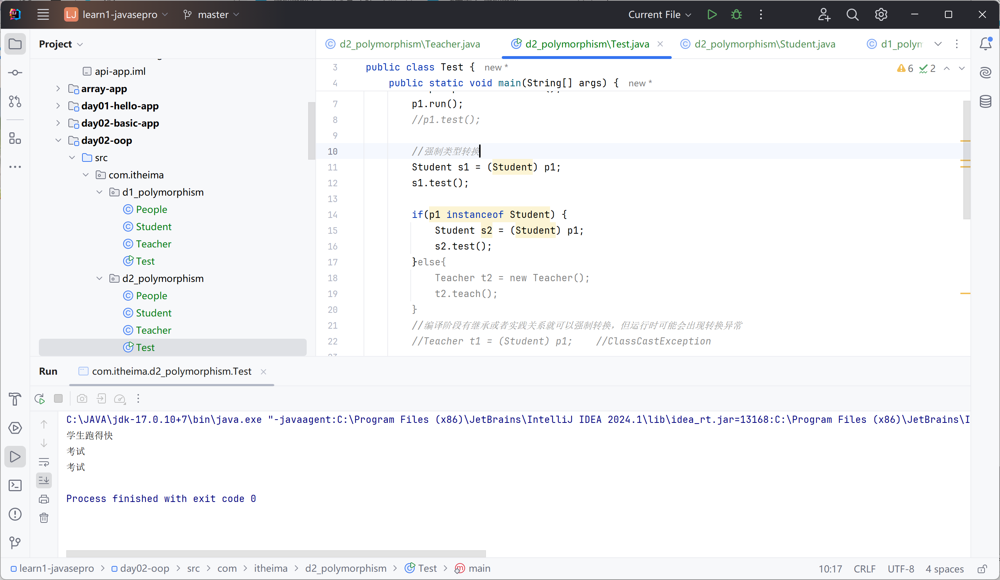
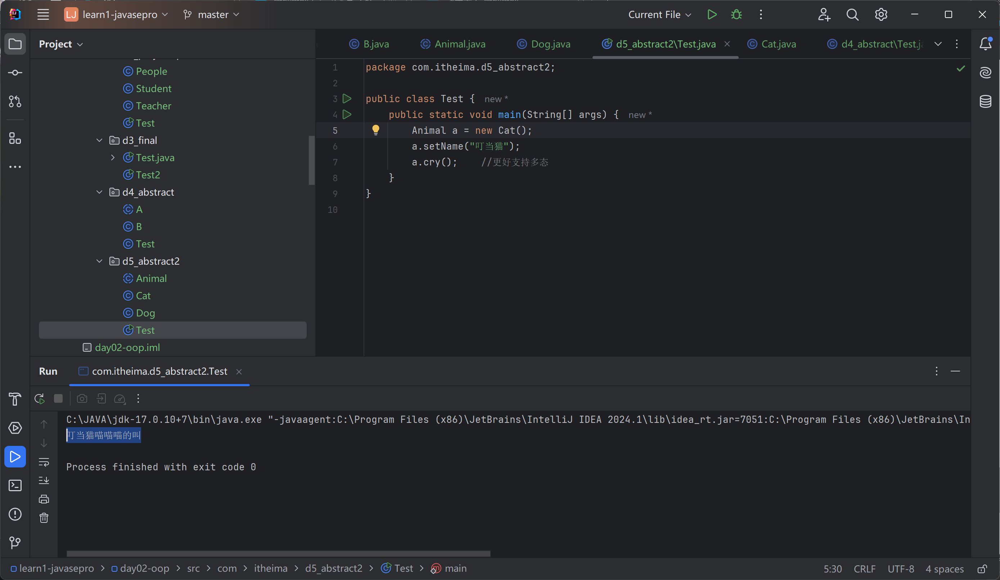
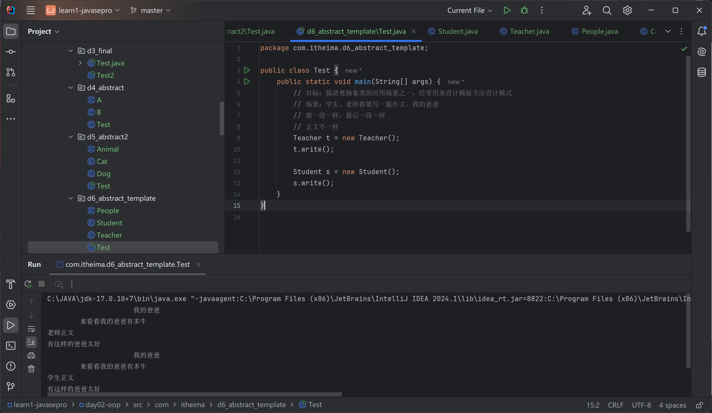
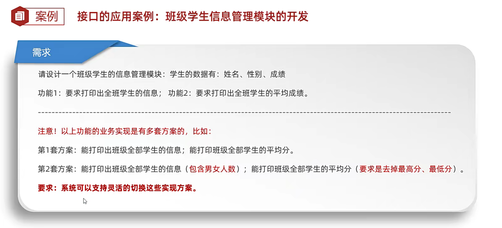
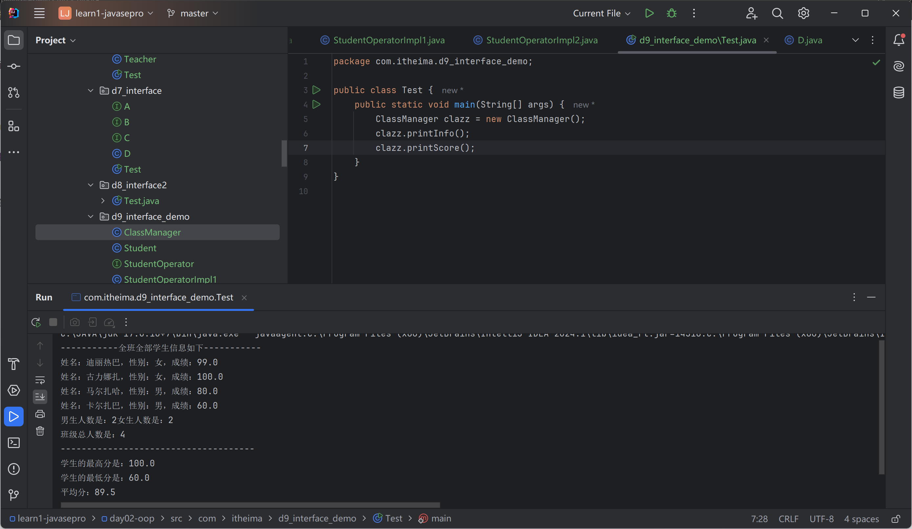
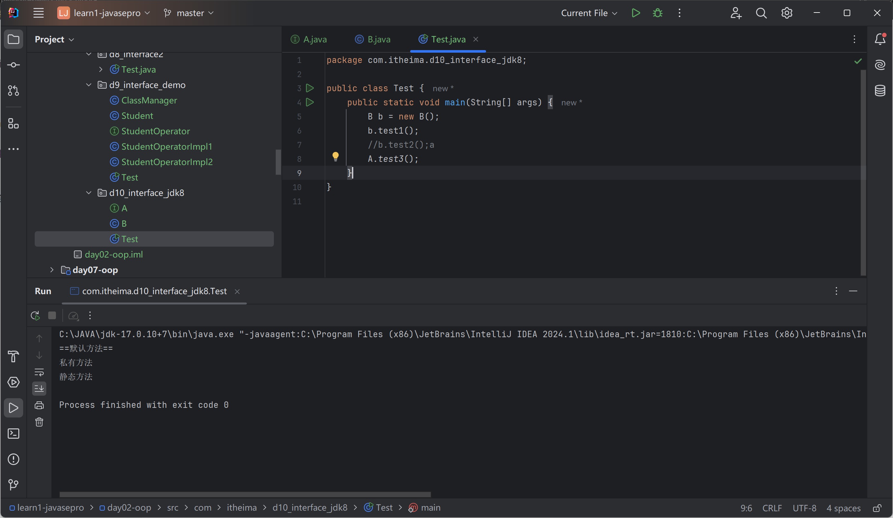

# 面向对象三大特征之三：多态

继承/实现

对象多态

People->Student/Teacher

```java
package com.itheima.d1_polymorphism;

public class Test {
    public static void main(String[] args) {
        People p1 = new Teacher();
        p1.run();

        People p2 = new Student();
        p2.run();
    }
}

```

People

```java
package com.itheima.d1_polymorphism;

public class People {
    public void run(){
        System.out.println("人可以跑");
    }
}

```

Student

```java
package com.itheima.d1_polymorphism;

public class Student extends People{
    @Override
    public void run() {
        System.out.println("学生跑得快");
    }
}
```

Teacher

```java
package com.itheima.d1_polymorphism;

public class Teacher extends People{
    @Override
    public void run() {
        System.out.println("老师跑得慢");
    }
}
```

output:

老师跑得慢
学生跑得快

## 多态的前提

有继承/实现关系；

存在父类引用子类对象；存在方法重写。

编译看左边，运行看右边

注意事项：成员变量不谈多态

## 使用多态的好处

在多态形式下，右边对象是解耦合的，便于拓展和维护。

```java
package com.itheima.d2_polymorphism;

public class Test {
    public static void main(String[] args) {
        //解耦合，右边对象可以随时切换
        People p1 = new Student();
        p1.run();

        // 父类对象类型的变量作为形参
        Student s = new Student();
        go(s);
        Teacher t = new Teacher();
        go(t);

    }

    public static void go (People p) {

    }
}

```

问题：调用不了子类的独有功能

```java
package com.itheima.d2_polymorphism;

public class Student extends People {
    @Override
    public void run() {
        System.out.println("学生跑得快");
    }

    public void test() {
        System.out.println("考试");
    }
}

```

```java
package com.itheima.d2_polymorphism;

public class Teacher extends People {
    @Override
    public void run() {
        System.out.println("老师跑得慢");
    }

    public void teach() {
        System.out.println("老师教知识");
    }
}

```

```java
        People p1 = new Student();
        p1.run();
        //p1.test();
```

## 多态下的类型转换问题

子类 变量名 = （子类）父类

```java
package com.itheima.d2_polymorphism;

public class Test {
    public static void main(String[] args) {
        //解耦合，右边对象可以随时切换
        People p1 = new Student();
        p1.run();
        //p1.test();

        //强制类型转换
        Student s1 = (Student) p1;
        s1.test();

        if(p1 instanceof Student) {
            Student s2 = (Student) p1;
            s2.test();
        }else{
            Teacher t2 = new Teacher();
            t2.teach();
        }
        //编译阶段有继承或者实践关系就可以强制转换，但运行时可能会出现转换异常
        //Teacher t1 = (Student) p1;    //ClassCastException

        //p instanceof Student


        // 父类对象类型的变量作为形参
        Student s = new Student();
        go(s);
        Teacher t = new Teacher();
        go(t);

    }

    public static void go (People p) {

    }
}

```



解决多态下不能调用子类独有方法的问题

# final

最终，修饰类方法变量

修饰类：最终类，不能被继承

修饰方法：不能被重写

修饰变量：不能被更改

```java
package com.itheima.d3_final;

public class Test {
    public static final String SCHOOL_NAME = "黑马";//常量
    public static void main(String[] args) {
        //修饰变量总规则，有且仅能赋值一次
        final int a;
        a = 13;//二次赋值报错
        final double r = 3.14;
        //r = 0.1;//二次赋值报错
    }
}

final class A{}
//class B extends  A{}  //不能继承

class C{
    public final void test(){
    }
}

class D extends C{
    //不能重写
    //@override
    //public void test(){
    //}
}


	
```

## 常量

public static Final

```java
package com.itheima.d3_final;


public class Test2 {
    public static final String SCHOOL_NAME = "黑马程序员";
    // 目标确认常量
    public static void main(String[] args) {
        System.out.println(SCHOOL_NAME);
        System.out.println(SCHOOL_NAME);
    }

}

```

# 抽象 abstruct

abstruct 抽象类、抽象方法

1. 抽象类不一定有抽象方法，有抽象方法是抽象类
2. 类该有的成员抽象类都可以有
3. 抽象类不能创建对象，仅作为一种特殊的父类让子类继承
4. 必须完成抽象类的全部方法

```java
package com.itheima.d4_abstract;

public abstract class A {
    public abstract void run() ;
        // 只有方法签名，没有方法体
}

```

```java
package com.itheima.d4_abstract;

public  class B extends A{
    public void run(){
        System.out.println("B");
    }
}

```

## 好处

更好支持多态

Animal

```java
package com.itheima.d5_abstract2;

public abstract class Animal {
    private String name;

    public abstract void cry();

    public String getName() {
        return name;
    }

    public void setName(String name) {
        this.name = name;
    }
}

```

Cat

```java
package com.itheima.d5_abstract2;

public class Cat extends Animal{
    @Override
    public void cry() {
        System.out.println(getName() + "喵喵喵的叫");
    }
}

```

Dog

```java
package com.itheima.d5_abstract2;

public class Dog extends Animal{
    @Override
    public void cry() {
        System.out.println(getName() + "汪汪汪的叫");
    }
}

```

Test

```java
package com.itheima.d5_abstract2;

public class Test {
    public static void main(String[] args) {
        Animal a = new Cat();
        a.setName("叮当猫");
        a.cry();    //更好支持多态
    }
}

```

叮当猫喵喵喵的叫



抽象类不是必须的

## 应用场景

模板方法设计模式

解决的问题：

解决方法中存在重复代码的问题。

写法：

1. 定义抽象方法
2. 定义模板方法，把相同代码放进去
3. 定义抽象方法，具体交给子类完成

People

```java
package com.itheima.d6_abstract_template;

public abstract class People {
    /*
     * 设计模版方法设计模式
     * 1. 定义一个模板方法
     */

    public final void write(){
        System.out.println("\t\t\t\t\t 我的爸爸");
        System.out.println("\t\t来看看我的爸爸有多牛");
        //2. 并不清楚正文怎么写
        writeMain();
        System.out.println("有这样的爸爸太好");
    }

    // 设计一个抽象方法交给子类完成
    public abstract void writeMain();
}

```

Student

```java
package com.itheima.d6_abstract_template;

public class Student extends People{
//    public void write(){
//        System.out.println("\t\t\t\t\t 我的爸爸");
//        System.out.println("\t\t来看看我的爸爸有多牛");
//        System.out.println("\t学生正文");
//        System.out.println("有这样的爸爸太好");
//    }

    @Override
    public void writeMain() {
        System.out.println("学生正文");
    }
}
```

Teacher

```java
package com.itheima.d6_abstract_template;

public class Teacher extends People{
//    public void write(){
//        System.out.println("\t\t\t\t\t 我的爸爸");
//        System.out.println("\t\t来看看我的爸爸有多牛");
//        System.out.println("\t老师正文");
//        System.out.println("有这样的爸爸太好");
//    }

    @Override
    public void writeMain() {
        System.out.println("老师正文");
    }
}
```

Test

```java
package com.itheima.d6_abstract_template;

public class Test {
    public static void main(String[] args) {
        // 目标：搞清楚抽象类的应用场景之一，经常用来设计模版方法设计模式
        // 场景：学生、老师都要写一篇作文，我的爸爸
        // 第一段一样，最后一段一样
        // 正文不一样
        Teacher t = new Teacher();
        t.write();

        Student s = new Student();
        s.write();
    }
}

```



output:

```
					 我的爸爸
		来看看我的爸爸有多牛
老师正文
有这样的爸爸太好
					 我的爸爸
		来看看我的爸爸有多牛
学生正文
有这样的爸爸太好
```

# 接口

Interface

包含成员变量（常量）、成员方法（抽象方法）

不能创建对象，用来被实现，实现接口的类成为实现类。

一个类可以实现多个接口。

```java
package com.itheima.d7_interface;

public class D implements B,C{

    @Override
    public void testb1() {

    }

    @Override
    public void testb2() {

    }

    @Override
    public void testc1() {

    }

    @Override
    public void testc2() {

    }
}

```

```java
package com.itheima.d7_interface;

public interface B {
    void testb1();
    void testb2();
}

```

```java
package com.itheima.d7_interface;

public interface C {
    void testc1();
    void testc2();
}

```

## 好处

1. 弥补了类单继承的不足

```java
package com.itheima.d8_interface2;

public class Test {
    public static void main(String[] args) {
        Student s = new A();
        ((A)s).drive();
    }
}

class A extends Student implements Driver,Singer{

    @Override
    public void drive() {

    }

    @Override
    public void sing() {

    }
}

class Student{

}

interface Driver{
    void drive();
}

interface Singer{
    void sing();
}
```

2. 可以面向接口编程

```java
package com.itheima.d8_interface2;

public class Test {
    public static void main(String[] args) {
        Driver s = new A();
        s.drive();

        Driver d = new B();
        d.drive();
    }
}

class A extends Student implements Driver,Singer{

    @Override
    public void drive() {

    }

    @Override
    public void sing() {

    }
}

class B extends Student implements Driver{

    @Override
    public void drive() {

    }
}

class Student{

}

interface Driver{
    void drive();
}

interface Singer{
    void sing();
}
```

## 应用案例

灵活切换实现方案，而不用更改其他代码





## 新增三个方法

JDK8开始，新增的三个方法

便于项目拓展和维护

默认方法、静态方法、私有方法

```java
package com.itheima.d10_interface_jdk8;

public interface A {
    /*
     * 1. 默认方法，必须用default修饰，默认会被public修饰
     * 实例方法：对象的方法，必须使用实现类的对象来访问
     */

    default void test1(){
        System.out.println("==默认方法==");
        test2();
    }

    /*
     * 2. 私有方法，必须使用private修饰
     * JDK9+
     */
    private void test2(){
        System.out.println("私有方法");
    }

    /*
     * 3. 静态方法，必须使用static修饰
     */
    static void test3(){
        System.out.println("静态方法");
    }
}

```

实现类

```java
package com.itheima.d10_interface_jdk8;

public class B implements A {
}

```

Test

```java
package com.itheima.d10_interface_jdk8;

public class Test {
    public static void main(String[] args) {
        B b = new B();
        b.test1();
        //b.test2();a
        A.test3();
    }
}
```



## 多继承，注意事项

一个接口可以同时继承多个接口

```java
package com.itheima.d11_interface_attention;

public class Test {
    public static void main(String[] args) {

    }
}

interface A {
    void test1();
}
interface B {
    void test2();
}
interface C {
    void test3();
}

interface D extends A, B, C {}

class E implements D {
    @Override
    public void test1() {

    }

    @Override
    public void test2() {

    }

    @Override
    public void test3() {

    }
}

```

注意事项：

1. 一个接口继承多个接口，不能有方法起签名冲突
2. 一个类继承多个接口，不能有方法起签名冲突
3. 一个类继承了父类，又实现了接口，父类中和接口中有同名默认方法，优先用父类的
4. 一个类实现了多个接口，存在同名默认，可以不冲突，这个类要重写

```JAVA
package com.itheima.d11_interface_attention;

public class Test2 {
    public static void main(String[] args) {
        Zi zi = new Zi();
        zi.run();

        N n = new N();
        n.test();
    }
}

interface I{
    void test1();
}

interface J{
    String test1();
}

// 一个类继承多个接口，不能有方法起签名冲突
//interface K extends I,J{
//}

// 一个接口继承多个接口，不能有方法起签名冲突
//class E implements I,J{
//}


// 一个类继承了父类，又实现了接口，父类中和接口中有同名默认方法，优先用父类的
class Fu{
    public void run(){
        System.out.println("===父类run===");
    }
}

interface IT1{
    default void run(){
        System.out.println("===接口IT中的run===");
    }
}

class Zi extends Fu implements IT1{

}

// 一个类实现了多个接口，存在同名默认，可以不冲突，这个类要重写
interface It1{
    default void test(){
        System.out.println("IT1");
    }
}

interface IT2{
    default void test(){
        System.out.println("IT2");
    }
}

class N implements It1,IT2{

    @Override
    public void test() {
        System.out.println("自己的test方法");
    }
}
```

