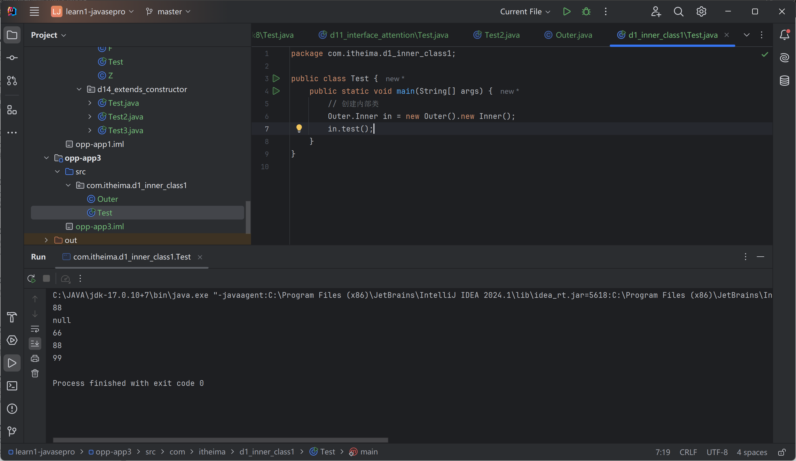

# 内部类

类内部的类

## 成员内部类

定义在类内部

```java
package com.itheima.d1_inner_class1;

public class Outer {
    private int age = 99;
    public static String a;
    public class Inner{
        int age = 88;
        private String name;
        public static String schoolName;//jdk16+

        public void test(){
            System.out.println(age);    //访问外部类的成员
            System.out.println(a);

            int age = 66;
            System.out.println(age);    //66
            System.out.println(this.age);   //88
            System.out.println(Outer.this.age); //99
        }


        public String getName() {
            return name;
        }

        public void setName(String name) {
            this.name = name;
        }
    }
}

```

Test

```java
package com.itheima.d1_inner_class1;

public class Test {
    public static void main(String[] args) {
        // 创建内部类
        Outer.Inner in = new Outer().new Inner();
        in.test();
    }
}

```

88
null
66
88
99



## 静态内部类

只能访问外部类的静态成员

```java
package com.itheima.d2_inner_class2;

public class Outer {
    private int age;
    public static String schoolName;
    public static class Inner {
        private String name;
        public static int a;

        public void test(){
            //能访问静态成员
            System.out.println(schoolName);
            //不能访问实例成员
            //System.out.println(age);
        }

        public String getName(){
            return name;
        }

        public void setName(String name){
            this.name = name;
        }
    }

    public static void test2(){
        System.out.println(schoolName);
        //System.out.println(age);
    }
}

```

```java
package com.itheima.d2_inner_class2;

public class Test {
    public static void main(String[] args) {
        Outer.Inner in = new Outer.Inner();
        in.test();
    }
}

```

## 局部内部类

定义在方法中，代码块中，构造器等执行体中

## 匿名内部类

不需要为这个类声明名字

更方便创建一个子类对象

```java
package com.itheima.d3_inner_class3;

public class Test {
    public static void main(String[] args) {
        //1. 把这个匿名内部类编译成子类，创建子类对象
        Animal a = new Animal(){
            @Override
            public void cry(){
                System.out.println("猫喵喵喵的叫~");
            }
        };
        a.cry();
    }
}


abstract class Animal{
    public abstract void cry();
}
```

猫喵喵喵的叫~


### 应用场景

通常作为一个参数传输给方法

```java
package com.itheima.d3_inner_class3;

public class Test2 {
    public static void main(String[] args) {
//         Swimming s1 = new Swimming(){
//             @Override
//             public void swim() {
//                 System.out.println("狗游泳飞快");
//             }
//         };
//         go(s1);
        go(new Swimming() {
             @Override
             public void swim() {
                 System.out.println("狗游泳飞快");
             }
         });
    }

    public static void go (Swimming s){
        System.out.println("开始--------------------------");
        s.swim();
    }
}

interface Swimming{
    void swim();
}
```

开发中的真实使用场景

gui编程

```java
package com.itheima.d5_inner_class5;

import javax.swing.*;
import java.awt.event.ActionEvent;
import java.awt.event.ActionListener;

public class Test {
    public static void main(String[] args) {
        // GUI编程
        // 1.创建窗口
        JFrame win = new JFrame("登录界面");

        JPanel panel = new JPanel();
        win.add(panel);

        JButton btn = new JButton("登录");
        panel.add(btn);

        // 给按钮绑定单击事件
        btn.addActionListener(new ActionListener() {

            @Override
            public void actionPerformed(ActionEvent e) {
                JOptionPane.showMessageDialog(win,"登录一下");
            }
        });

        win.setSize(400,400);
        win.setLocationRelativeTo(null);
        win.setDefaultCloseOperation(JFrame.EXIT_ON_CLOSE);
        win.setVisible(true);


    }
}

```

```java
package com.itheima.d5_inner_class5;

import javax.swing.*;
import java.awt.event.ActionEvent;
import java.awt.event.ActionListener;

public class Test {
    public static void main(String[] args) {
        // GUI编程
        // 1.创建窗口
        JFrame win = new JFrame("登录界面");

        JPanel panel = new JPanel();
        win.add(panel);

        JButton btn = new JButton("登录");
        panel.add(btn);

        // 给按钮绑定单击事件
//        btn.addActionListener(new ActionListener() {
//
//            @Override
//            public void actionPerformed(ActionEvent e) {
//                JOptionPane.showMessageDialog(win,"登录一下");
//            }
//        });
        //简化
        btn.addActionListener(e -> JOptionPane.showMessageDialog(win,"登录一下"));

        win.setSize(400,400);
        win.setLocationRelativeTo(null);
        win.setDefaultCloseOperation(JFrame.EXIT_ON_CLOSE);
        win.setVisible(true);


    }
}

```


# 枚举

特殊类

enum 枚举类名{...}

1. 枚举类第一行只能罗列一些常量
2. 构造器是私有的
3. 最终类不可继承
4. 第二行开始可以添加其他各种成员
5. 新增了几个方法，继承java.lang.Enum类

```java
package com.itheima.d6_enum;

public enum A {
    //常量，记住枚举类的一个对象
    X,Y,Z;
    A(){

    }

    A(String name){
    }
    private String name;

    public String getName(){
        return name;
    }
}

```

Test

```java
package com.itheima.d6_enum;

public class Test {
    public static void main(String[] args) {
        A a1 = A.X;
        A a2 = A.Y;
        A a3 = A.Z;

        System.out.println(a2.ordinal());
        System.out.println(a3.ordinal());
    }
}

```


## 应用场景

用来表示一组信息，然后作为参数进行传递

1. 使用常量传递

```java
package com.itheima.d6_enum;

public class Test2 {
    public static void main(String[] args) {
        provideInfo(Constant.BOY);
    }

    public static void provideInfo(int sex){
        switch (sex){
            case Constant.BOY:
                System.out.println("展示一些信息给男生观看");
                break;
            case Constant.GIRL:
                System.out.println("展示一些信息给女生观看");
                break;
        }
    }
}


```

2. 使用枚举类

```java
package com.itheima.d6_enum;

public enum Constant {
    BOY,GIRL;
}

```

Test

```java
package com.itheima.d6_enum;

public class Test2 {
    public static void main(String[] args) {
        provideInfo(Constant.BOY);
    }

    public static void provideInfo(Constant sex){
        switch (sex){
            case BOY:
                System.out.println("展示一些信息给男生观看");
                break;
            case GIRL:
                System.out.println("展示一些信息给女生观看");
                break;
        }
    }
}


```


代码可读性好

参数值得到了约束

# 泛型

\<E\> 限制数据类型

ArrayList集合

```java
package com.itheima.d7_generics;

import java.util.ArrayList;

public class Test1 {
    public static void main(String[] args) {
        ArrayList list = new ArrayList();
        list.add("java1");
        list.add("java2");
        list.add("java3");
        list.add(new Cat());

//        for (int i = 0; i < list.size(); i++) {
//            String e = (String) list.get(i);
//            System.out.println(e);
//            //第四个报错
//        }


        System.out.println("-------------------------");
        ArrayList<String> list2 = new ArrayList<String>();  //1.7+后面可以不声明
        list2.add("java1");
        list2.add("java2");
        list2.add("java3");
//        list2.add(new Cat());

        for (int i = 0; i < list2.size(); i++) {
            String e = (String) list2.get(i);
            System.out.println(e);
            //第四个报错
        }
    }
}

class Cat{}
```

## 泛型类

MyArrayList

```java
package com.itheima.d8_generics_class;

public class MyArrayList<E> {
    Object[] arr = new Object[10];
    private int size;

    public MyArrayList() {
        this.size = 0;
    }

    public boolean add(E e) {
        arr[size++] = e;
        return true;
    }

    public E get(int index) {
        return (E) arr[index];
    }
}

```

Test

```java
package com.itheima.d8_generics_class;

public class Test {
    public static void main(String[] args) {
        MyArrayList<String> list = new MyArrayList<>();
        list.add("java1");
        list.add("java2");
//        list.add(123);
        String ele = list.get(1);
        System.out.println(ele);
    }
}
```


## 泛型接口

```java
package com.itheima.d9_generics_interface;

import java.util.ArrayList;

//泛型接口
public interface Data<T> {
    void add(T t);
    ArrayList<T> getByName(String name);
}

```

实现类

Student

```java
package com.itheima.d9_generics_interface;

import java.util.ArrayList;

public class StudentData implements Data<Student>{

    @Override
    public void add(Student teacher) {

    }

    @Override
    public ArrayList<Student> getByName(String name) {
        return null;
    }
}

```

Teacher

```java
package com.itheima.d9_generics_interface;

import java.util.ArrayList;

public class TeacherData implements Data<Teacher>{

    @Override
    public void add(Teacher teacher) {

    }

    @Override
    public ArrayList<Teacher> getByName(String name) {
        return null;
    }
}

```

拓展：extends

```java
package com.itheima.d9_generics_interface;

import com.itheima.d8_generics_class.Animal;

import java.util.ArrayList;

//泛型接口
public interface Data<T extends Animal> {
    void add(T t);
    ArrayList<T> getByName(String name);
}

```

实现类只能用Animal的子类

## 泛型方法、通配符、上下限


### 使用泛型方法

\<T t\> void method_name(){...}

```java
package com.itheima.d10_generics_method;

import java.lang.reflect.Array;
import java.util.ArrayList;

public class Test {
    public static void main(String[] args) {
        String rs = test("java");
        System.out.println(rs);

        Dog d = test(new Dog());
        System.out.println(d);

        ArrayList<BWM> bwms = new ArrayList<>();
        bwms.add(new BWM());
        bwms.add(new BWM());
        go(bwms);

        ArrayList<BENZ> benzs = new ArrayList<>();
        benzs.add(new BENZ());
        benzs.add(new BENZ());
        go(benzs);
    }
    // 泛型方法
    public static <T> T test(T t){
        return t;
    }

    public static <T extends Car> void go(ArrayList<T> cars) {

    }
}

```


### 泛型通配符、上下限

? 代表一切类型

? extends Car：Car+子类 上限

? super Car: Car+父类 下限

```java
package com.itheima.d10_generics_method;

import java.lang.reflect.Array;
import java.util.ArrayList;

public class Test {
    public static void main(String[] args) {
        String rs = test("java");
        System.out.println(rs);

        Dog d = test(new Dog());
        System.out.println(d);

        ArrayList<BWM> bwms = new ArrayList<>();
        bwms.add(new BWM());
        bwms.add(new BWM());
        go(bwms);

        ArrayList<BENZ> benzs = new ArrayList<>();
        benzs.add(new BENZ());
        benzs.add(new BENZ());
        go(benzs);

        ArrayList<Dog> dogs = new ArrayList<>();
        dogs.add(new Dog());
        dogs.add(new Dog());
        go(dogs);
    }
    // 泛型方法
    public static <T> T test(T t){
        return t;
    }

    //? 通配符 ? extends Car(上限）
    //        ? super Car（下限）
    public static void go(ArrayList<? extends Car> cars) {}

//    public static <T extends Car> void go(ArrayList<T> cars) {
//
//    }
}

```

## 注意事项

1. 泛型工作在编译阶段，编译后擦除
2. 泛型不支持基础数据类型，支持对象类型（引用数据类型）

# 常用API

应用程序编程接口API 

查看API文档

## Object

所有类的祖宗类，提供一些方法

### toString、equals

1. toString 返回对象字符串形式
2. equals 比较地址是否相等

```java
package com.itheima.d12_api_object;

public class Student {
    private String name;
    private int age;

    public Student() {}

    public Student(String name, int age) {
        this.name = name;
        this.age = age;
    }

    @Override
    public String toString() {
        return "Student {name=" + name + ", age=" + age + "}";
    }

    @Override
    public boolean equals(Object o) {
        // 1.判断地址是否一样
        if (this == o) return true;
        // 2.判断null，类型是否一样
        if (o == null || getClass() != o.getClass()) return false;
        Student student = (Student) o;
        // 3.判断成员变量是否一样
        return age == student.age && name.equals(student.name);
    }


    public String getName() {
        return name;
    }

    public void setName(String name) {
        this.name = name;
    }

    public int getAge() {
        return age;
    }

    public void setAge(int age) {
        this.age = age;
    }
}

```

Test

```java
package com.itheima.d12_api_object;

public class Test {
    public static void main(String[] args) {
        Student s1 = new Student("赵敏",123);
        System.out.println(s1.toString());

        Student s2 = new Student("赵敏",123);
        System.out.println(s2.equals(s1));
        System.out.println(s2 == s1);

        s2 = s1.clone();

    }
}

```

Student {name=赵敏, age=123}
true
false


### clone 浅克隆、深克隆

 protected需要重写方法


深克隆实现

```java
package com.itheima.d12_api_object;

public class User implements Cloneable{
    private int id;
    private String username;
    private String password;
    private double[] scores;

    public User() {
    }

    public User(int id, String username, String password, double[] scores) {
        this.id = id;
        this.username = username;
        this.password = password;
        this.scores = scores;
    }

    public int getId() {
        return id;
    }

    public void setId(int id) {
        this.id = id;
    }

    public String getUsername() {
        return username;
    }

    public void setUsername(String username) {
        this.username = username;
    }

    public String getPassword() {
        return password;
    }

    public void setPassword(String password) {
        this.password = password;
    }

    public double[] getScores() {
        return scores;
    }

    public void setScores(double[] scores) {
        this.scores = scores;
    }

    @Override
    public User clone() {
        try {
            User u2 = (User) super.clone();
            u2.scores = (double[]) scores.clone();
            return u2;
        } catch (CloneNotSupportedException e) {
            throw new AssertionError();
        }
    }
}

```

Test

```java
package com.itheima.d12_api_object;

import java.util.Arrays;

public class Test2 {
    public static void main(String[] args) {
        User u1 = new User(1,"zhangsan","wo666",new double[]{99.0,99.5});
        System.out.println(u1.getId());
        System.out.println(u1.getUsername());
        System.out.println(u1.getPassword());
        System.out.println(u1.getScores());

        User u2 = (User) u1.clone();
        System.out.println(u2.getId());
        System.out.println(u2.getUsername());
        System.out.println(u2.getPassword());
        System.out.println(u2.getScores());
    }
}

```

1
zhangsan
wo666
[D@119d7047
1
zhangsan
wo666
[D@776ec8df


## Objects

工具类，提供静态方法

### equals(Object a, Object b)

```java
    public static boolean equals(Object a, Object b) {
        return (a == b) || (a != null && a.equals(b));
    }
```

Test

```java
package com.itheima.d13_api_objects;

import java.util.Objects;

public class Test {
    public static void main(String[] args) {
        String s1 = null;
        String s2 = "itheima";

        // S1 是 null 会报错
//        System.out.println(s1.equals(s2));
        System.out.println(Objects.equals(s1, s2)); //更安全

    }
}

```

false


### isNull

```java
    public static boolean isNull(Object obj) {
        return obj == null;
    }
```

Test

```java
package com.itheima.d13_api_objects;

import java.util.Objects;

public class Test {
    public static void main(String[] args) {
        String s1 = null;
        String s2 = "itheima";

        // S1 是 null 会报错
//        System.out.println(s1.equals(s2));
        System.out.println(Objects.equals(s1, s2)); //更安全

        System.out.println(Objects.isNull(s1));
        System.out.println(Objects.isNull(s2));
    }
}

```


###nonNull

```java
    public static boolean nonNull(Object obj) {
        return obj != null;
    }
```

Test

```java
package com.itheima.d13_api_objects;

import java.util.Objects;

public class Test {
    public static void main(String[] args) {
        String s1 = null;
        String s2 = "itheima";

        // S1 是 null 会报错
//        System.out.println(s1.equals(s2));
        System.out.println(Objects.equals(s1, s2)); //更安全

        System.out.println(Objects.isNull(s1));
        System.out.println(Objects.isNull(s2));

        System.out.println(Objects.nonNull(s1));
        System.out.println(Objects.nonNull(s2));
    }
}

```


## 包装类

基本数据类型包装成对象

### 自动装箱、拆箱

```java
package com.itheima.d14_integer;

import java.lang.reflect.Array;
import java.util.ArrayList;

public class Test {
    public static void main(String[] args) {
//        Integer a1 = new Integer(12); //过时
        Integer a2 = Integer.valueOf(12);
        System.out.println(a2);

        //自动装箱
        Integer a3 = 12;
        System.out.println(a3);

        //自动拆箱
        int a4 = a3;
        System.out.println(a4);

        //泛型和集合不支持基本数据类型，只能支持引用数据类型
        ArrayList<Integer> list = new ArrayList<>();
        list.add(12);   //自动装箱
        list.add(13);   //自动装箱

        int rs = list.get(1);   //自动拆箱
    }
}

```

### 字符串互相转换

1. toString 转化为字符串
2. parseInt\parseDouble 转换相应类型
3. valueOf 转换相应类型

```java
package com.itheima.d14_integer;

import java.lang.reflect.Array;
import java.util.ArrayList;

public class Test {
    public static void main(String[] args) {
//        Integer a1 = new Integer(12); //过时
        Integer a2 = Integer.valueOf(12);
        System.out.println(a2);

        //自动装箱
        Integer a3 = 12;
        System.out.println(a3);

        //自动拆箱
        int a4 = a3;
        System.out.println(a4);

        //泛型和集合不支持基本数据类型，只能支持引用数据类型
        ArrayList<Integer> list = new ArrayList<>();
        list.add(12);   //自动装箱
        list.add(13);   //自动装箱

        int rs = list.get(1);   //自动拆箱
        System.out.println("--------------------------------------");

        // 1.基本数据类型转换为字符串
        Integer a = 23;
        String rs1 = Integer.toString(a);   //23
        System.out.println(rs1+1);  //231

        String rs2 = a.toString();
        System.out.println(rs2 + 1);

        String rs3 = a + "";
        System.out.println(rs3 + 1);

        //2. 把字符串类型转换成基本类型
        String ageStr = "29";
        int ageI = Integer.parseInt(ageStr);
        int ageI2 = Integer.valueOf(ageStr);
        System.out.println(ageI + 1); //30
        System.out.println(ageI2);

        String scoreStr = "99.5";
        double score = Double.parseDouble(scoreStr);
        double score2 = Double.valueOf(scoreStr);
        System.out.println(score + 0.5); //100.0
        System.out.println(score2);
    }
}

```

## StringBuilder

可变字符串对象，容器，装的字符串可以改变

用于操作字符串

```java
package com.itheima.d15_stringBuilder;

public class Test1 {
    public static void main(String[] args) {
        StringBuilder s = new StringBuilder("itheima");

        // 1.拼接内容
        s.append(12);
        s.append("黑马");
        s.append(true);

        //支持链式编程
        s.append(666).append("黑马2").append("666");

        System.out.println(s);

        //2. reverse反转
        s.reverse();
        System.out.println(s);

        //3. 返回字符串的长度
        System.out.println(s.length());

        //4. 转为String类型
        String rs = s.toString();
        System.out.println(rs);
    }
}

```

output:

```
itheima12黑马true666黑马2666
6662马黑666eurt马黑21amiehti
24
6662马黑666eurt马黑21amiehti
```


### 好处

操作更快速，效率高

```java
package com.itheima.d15_stringBuilder;

public class Test2 {
    public static void main(String[] args) {
//        String rs = "";
//        for (int i = 0; i < 1000000; i++) {
//            rs = rs + "abc";
//        }
//        System.out.println(rs);

        StringBuilder s = new StringBuilder("");
        for (int i = 0; i < 1000000; i++) {
            s = s.append("abc");
        }
        System.out.println(s);

    }
}

```

### 应用案例

设计一个方法，用于返回任意整数数组的内容。格式[11,22,33]

```java
package com.itheima.d15_stringBuilder;

public class Test3 {
    public static void main(String[] args) {
        System.out.println(getArrayData(new int[]{11,22,33})) ;
    }
    public static String getArrayData(int[] arr){
        //1. arr == null
        if (arr == null){
            return null;
        }

        //2. arr存在 11,22,33
        StringBuilder sb = new StringBuilder();
        sb.append("[");
        for (int i = 0; i < arr.length -1; i++) {
            sb.append(arr[i]).append(", ");
        }
        sb.append(arr[arr.length - 1]);
        sb.append("]");
        return sb.toString();
    }
}

```


## StringBuffer

与StringBuffer一模一样

**StringBuilder线程不安全，StringBuffer线程安全。**

## StringJoiner (JDK8+)

代码更加简洁

add方法添加

```java
package com.itheima.d16_stringJoiner;

import java.util.StringJoiner;

public class Test1 {
    public static void main(String[] args) {
        StringJoiner s = new StringJoiner(",");
        s.add("java1");
        s.add("java2");
        s.add("java3");
        System.out.println(s);
    }
}

```

Output: java1,java2,java3


### 应用案例

构造器：delimiter,perfix,suffix

```java
package com.itheima.d16_stringJoiner;

import java.util.StringJoiner;

public class Test3 {
    public static void main(String[] args) {
        System.out.println(getArrayData(new int[]{11,22,33})) ;
    }
    public static String getArrayData(int[] arr){
        //1. arr == null
        if (arr == null){
            return null;
        }

        //2. arr存在 11,22,33
        StringJoiner s = new StringJoiner(",","[","]");
        for (int i=0; i<arr.length; i++){
            s.add(String.valueOf(arr[i]));
        }
        return s.toString();
    }
}
```

