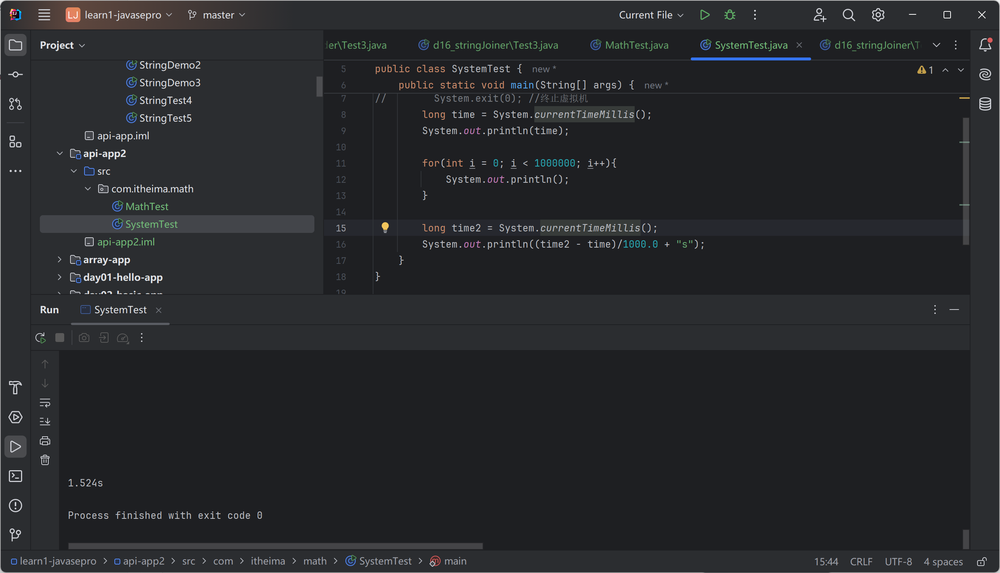
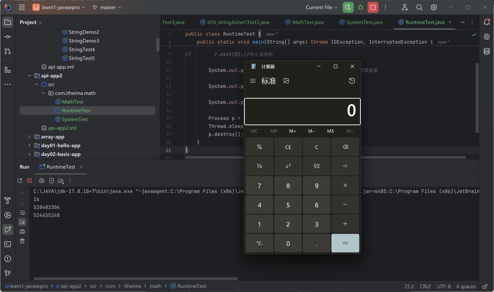
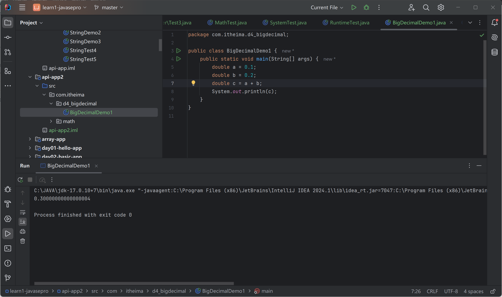
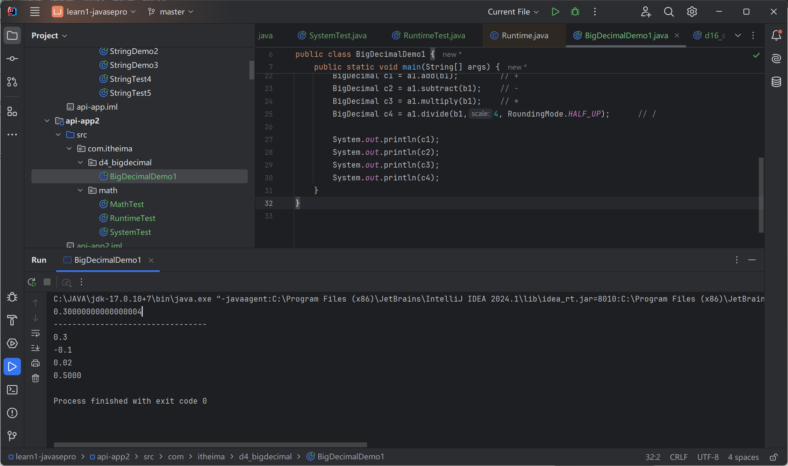
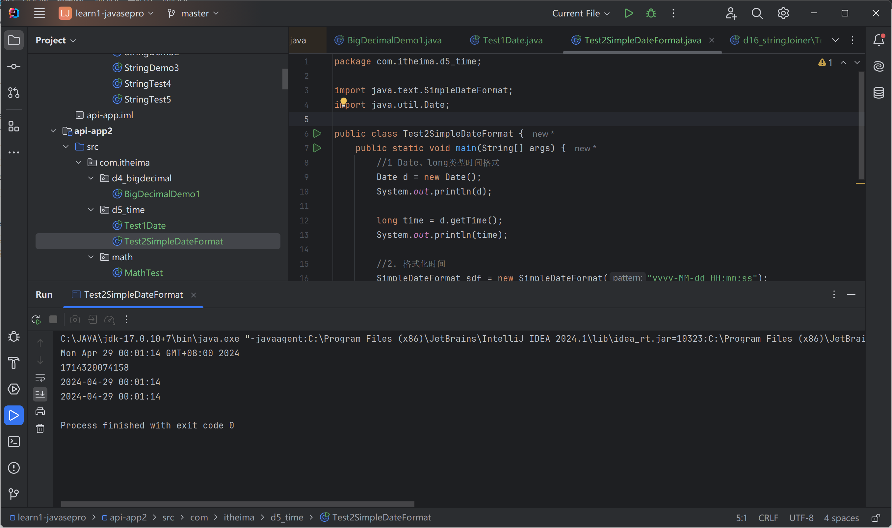
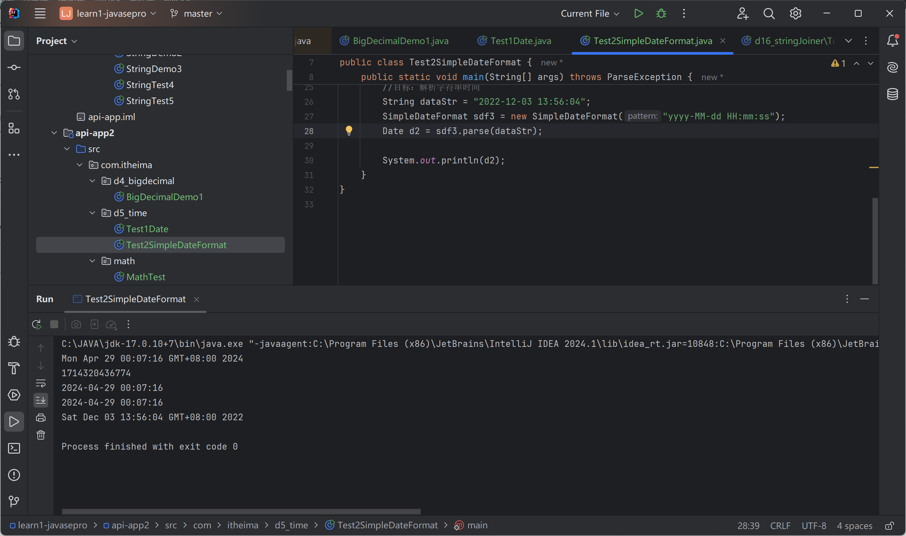

# 常见API（续）

继续上次进阶3后的内容

## Math

常见方法：

```java
package com.itheima.math;

public class MathTest {
    public static void main(String[] args) {
        //1. 取绝对值
        System.out.println(Math.abs(-12));
        System.out.println(Math.abs(123));
        System.out.println(Math.abs(-3.14));

        //2. 向上取整
        System.out.println(Math.ceil(4.0000001));
        System.out.println(Math.ceil(4.0));

        //3. 向下取整
        System.out.println(Math.floor(4.999999));
        System.out.println(Math.floor(4.0));

        //4. 四舍五入
        System.out.println(Math.round(3.499999));
        System.out.println(Math.round(3.500001));

        //5. 最大值，最小值
        System.out.println(Math.max(10, 20));
        System.out.println(Math.min(10, 20));

        //6. 幂
        System.out.println(Math.pow(2, 3)); //2^3
        System.out.println(Math.pow(3, 2)); //3^2

        //6.随机数[0.0,1.0)
        System.out.println(Math.random());
    }
}

```

output:

```
12
123
3.14
5.0
4.0
4.0
4.0
3
4
20
10
8.0
9.0
0.6874558305644874
```

## System

工具类

常见方法：

### exit

 杀死JVM

```java
package com.itheima.math;

public class SystemTest {
    public static void main(String[] args) {
        System.exit(0); //终止虚拟机
        System.out.println(123);
    }
}
```

### currentTimeMills 

当前系统毫秒值 long

运行时间分析

```java
package com.itheima.math;

import javax.sound.midi.Soundbank;

public class SystemTest {
    public static void main(String[] args) {
//        System.exit(0); //终止虚拟机
        long time = System.currentTimeMillis();
        System.out.println(time);

        for(int i = 0; i < 1000000; i++){
            System.out.println();
        }

        long time2 = System.currentTimeMillis();
        System.out.println((time2 - time)/1000.0 + "s");
    }
}

```



## Runtime

单例类

### 单例设计模式

```java
public class Runtime {
    private static final Runtime currentRuntime = new Runtime();

    private static Version version;

    /**
     * Returns the runtime object associated with the current Java application.
     * Most of the methods of class {@code Runtime} are instance
     * methods and must be invoked with respect to the current runtime object.
     *
     * @return  the {@code Runtime} object associated with the current
     *          Java application.
     */
    public static Runtime getRuntime() {
        return currentRuntime;
    }

    /** Don't let anyone else instantiate this class */
    private Runtime() {}
    //other code
}
```

获取Runtime对象

getRuntime()

```java
package com.itheima.math;

public class RuntimeTest {
    public static void main(String[] args) {
        Runtime r = Runtime.getRuntime();   //获取运行时对象
    }
}
```

单例设计模式

### 常用方法

```java
package com.itheima.math;

import java.io.IOException;

public class RuntimeTest {
    public static void main(String[] args) throws IOException, InterruptedException {
        Runtime r = Runtime.getRuntime();   //获取运行时对象

//        r.exit(0);//终止虚拟机

        System.out.println(r.availableProcessors());    //处理器数量

        System.out.println(r.totalMemory());    //内存总量

        System.out.println(r.freeMemory()); //空闲内存

        Process p = r.exec("calc");  //启动程序
        Thread.sleep(5000); //等待5秒
        p.destroy();
    }
}

```



## BigDecimal

解决浮点运算失真的问题

使用BigDecimal小数运算



### 常用方法

```java
package com.itheima.d4_bigdecimal;

import java.math.BigDecimal;
import java.math.RoundingMode;

public class BigDecimalDemo1 {
    public static void main(String[] args) {
        double a = 0.1;
        double b = 0.2;
        double c = a + b;
        System.out.println(c);

        System.out.println("---------------------------------");

//        BigDecimal a1 = new BigDecimal(Double.toString(a));
//        BigDecimal b1 = new BigDecimal(Double.toString(b));

        // 推荐构造方式
        BigDecimal a1 = BigDecimal.valueOf(a);
        BigDecimal b1 = BigDecimal.valueOf(b);

        BigDecimal c1 = a1.add(b1);         // +
        BigDecimal c2 = a1.subtract(b1);    // -
        BigDecimal c3 = a1.multiply(b1);    // *
        BigDecimal c4 = a1.divide(b1,4, RoundingMode.HALF_UP);      // /

        System.out.println(c1);
        System.out.println(c2);
        System.out.println(c3);
        System.out.println(c4);
    }
}

```

output:

```
0.30000000000000004
---------------------------------
0.3
-0.1
0.02
0.5000
```



## 时间、日期


### Date

使用方法

```java
package com.itheima.d5_time;

import java.util.Date;

public class Test1Date {
    public static void main(String[] args) {
        // 1. 代表系统当前时间信息
        Date d = new Date();
        System.out.println(d);

        // 2. 拿到时间毫秒值
        long time = d.getTime();
        System.out.println(time);

        // 3. 时间毫秒值转化为日期对象
        time += 2*1000;
        Date d2 = new Date(time);
        System.out.println(d2); // 2秒后的日期对象

        //4. setTime修改日期对象
        Date d3 = new Date();
        d3.setTime(time);
        System.out.println(d3);
    }
}
```

## 简单日期格式化

SimpleDateFormat

### 时间转字符串

```java
package com.itheima.d5_time;

import java.text.SimpleDateFormat;
import java.util.Date;

public class Test2SimpleDateFormat {
    public static void main(String[] args) {
        //1 Date、long类型时间格式
        Date d = new Date();
        System.out.println(d);

        long time = d.getTime();
        System.out.println(time);

        //2. 格式化时间
        SimpleDateFormat sdf = new SimpleDateFormat("yyyy-MM-dd HH:mm:ss");
        SimpleDateFormat sdf2 = new SimpleDateFormat("yyyy.HH.mm.ss--dd---MM");

        String rs = sdf.format(d);
        String rs2 = sdf.format(time);
        System.out.println(rs);
        System.out.println(rs2);
    }
}

```

Mon Apr 29 00:01:14 GMT+08:00 2024
1714320074158
2024-04-29 00:01:14
2024-04-29 00:01:14



### 解析字符串时间

```java
package com.itheima.d5_time;

import java.text.ParseException;
import java.text.SimpleDateFormat;
import java.util.Date;

public class Test2SimpleDateFormat {
    public static void main(String[] args) throws ParseException {
        //1 Date、long类型时间格式
        Date d = new Date();
        System.out.println(d);

        long time = d.getTime();
        System.out.println(time);

        //2. 格式化时间
        SimpleDateFormat sdf = new SimpleDateFormat("yyyy-MM-dd HH:mm:ss");
        SimpleDateFormat sdf2 = new SimpleDateFormat("yyyy.HH.mm.ss--dd---MM");

        String rs = sdf.format(d);
        String rs2 = sdf.format(time);
        System.out.println(rs);
        System.out.println(rs2);

        //目标：解析字符串时间
        String dataStr = "2022-12-03 13:56:04";
        SimpleDateFormat sdf3 = new SimpleDateFormat("yyyy-MM-dd HH:mm:ss");
        Date d2 = sdf3.parse(dataStr);

        System.out.println(d2);
    }
}
```

...
Sat Dec 03 13:56:04 GMT+08:00 2022



