# 常见API（续）

继续上次进阶3后的内容

## Math

常见方法：

```java
package com.itheima.math;

public class MathTest {
    public static void main(String[] args) {
        //1. 取绝对值
        System.out.println(Math.abs(-12));
        System.out.println(Math.abs(123));
        System.out.println(Math.abs(-3.14));

        //2. 向上取整
        System.out.println(Math.ceil(4.0000001));
        System.out.println(Math.ceil(4.0));

        //3. 向下取整
        System.out.println(Math.floor(4.999999));
        System.out.println(Math.floor(4.0));

        //4. 四舍五入
        System.out.println(Math.round(3.499999));
        System.out.println(Math.round(3.500001));

        //5. 最大值，最小值
        System.out.println(Math.max(10, 20));
        System.out.println(Math.min(10, 20));

        //6. 幂
        System.out.println(Math.pow(2, 3)); //2^3
        System.out.println(Math.pow(3, 2)); //3^2

        //6.随机数[0.0,1.0)
        System.out.println(Math.random());
    }
}

```

output:

```
12
123
3.14
5.0
4.0
4.0
4.0
3
4
20
10
8.0
9.0
0.6874558305644874
```

## System

工具类

常见方法：

### exit

 杀死JVM

```java
package com.itheima.math;

public class SystemTest {
    public static void main(String[] args) {
        System.exit(0); //终止虚拟机
        System.out.println(123);
    }
}
```

### currentTimeMills 

当前系统毫秒值 long

运行时间分析

```java
package com.itheima.math;

import javax.sound.midi.Soundbank;

public class SystemTest {
    public static void main(String[] args) {
//        System.exit(0); //终止虚拟机
        long time = System.currentTimeMillis();
        System.out.println(time);

        for(int i = 0; i < 1000000; i++){
            System.out.println();
        }

        long time2 = System.currentTimeMillis();
        System.out.println((time2 - time)/1000.0 + "s");
    }
}

```


## Runtime

单例类

### 单例设计模式

```java
public class Runtime {
    private static final Runtime currentRuntime = new Runtime();

    private static Version version;

    /**
     * Returns the runtime object associated with the current Java application.
     * Most of the methods of class {@code Runtime} are instance
     * methods and must be invoked with respect to the current runtime object.
     *
     * @return  the {@code Runtime} object associated with the current
     *          Java application.
     */
    public static Runtime getRuntime() {
        return currentRuntime;
    }

    /** Don't let anyone else instantiate this class */
    private Runtime() {}
    //other code
}
```

获取Runtime对象

getRuntime()

```java
package com.itheima.math;

public class RuntimeTest {
    public static void main(String[] args) {
        Runtime r = Runtime.getRuntime();   //获取运行时对象
    }
}
```

单例设计模式

### 常用方法

```java
package com.itheima.math;

import java.io.IOException;

public class RuntimeTest {
    public static void main(String[] args) throws IOException, InterruptedException {
        Runtime r = Runtime.getRuntime();   //获取运行时对象

//        r.exit(0);//终止虚拟机

        System.out.println(r.availableProcessors());    //处理器数量

        System.out.println(r.totalMemory());    //内存总量

        System.out.println(r.freeMemory()); //空闲内存

        Process p = r.exec("calc");  //启动程序
        Thread.sleep(5000); //等待5秒
        p.destroy();
    }
}

```


## BigDecimal

解决浮点运算失真的问题

使用BigDecimal小数运算


### 常用方法

```java
package com.itheima.d4_bigdecimal;

import java.math.BigDecimal;
import java.math.RoundingMode;

public class BigDecimalDemo1 {
    public static void main(String[] args) {
        double a = 0.1;
        double b = 0.2;
        double c = a + b;
        System.out.println(c);

        System.out.println("---------------------------------");

//        BigDecimal a1 = new BigDecimal(Double.toString(a));
//        BigDecimal b1 = new BigDecimal(Double.toString(b));

        // 推荐构造方式
        BigDecimal a1 = BigDecimal.valueOf(a);
        BigDecimal b1 = BigDecimal.valueOf(b);

        BigDecimal c1 = a1.add(b1);         // +
        BigDecimal c2 = a1.subtract(b1);    // -
        BigDecimal c3 = a1.multiply(b1);    // *
        BigDecimal c4 = a1.divide(b1,4, RoundingMode.HALF_UP);      // /

        System.out.println(c1);
        System.out.println(c2);
        System.out.println(c3);
        System.out.println(c4);
    }
}

```

output:

```
0.30000000000000004
---------------------------------
0.3
-0.1
0.02
0.5000
```


## Arrays

操作数组的工具类

### 常用方法

```java
package com.itheima.d5_arrays;

import java.lang.reflect.Array;
import java.util.Arrays;
import java.util.function.IntToDoubleFunction;

public class ArraysTest1 {
    public static void main(String[] args) {
        // 1.返回数组内容
        int[] arr = {10,20,30,40,50,60};
        System.out.println(Arrays.toString(arr));

        // 2.[start,end)拷贝数组
        int[] arr2 = Arrays.copyOfRange(arr,1,4);
        System.out.println(Arrays.toString(arr2));

        // 3.拷贝指定长度数组
        int[] arr3 = Arrays.copyOf(arr,10);
        System.out.println(Arrays.toString(arr3));

        // 4.setAll
        double[] prices = {99.9,129,100};
        // 价格打八折，存进去
        Arrays.setAll(prices, new IntToDoubleFunction() {
            @Override
            public double applyAsDouble(int value) {
                return prices[value] * 0.8;
            }
        });
        System.out.println(Arrays.toString(prices));

        // 5.排序（默认升序）
        Arrays.sort(prices);
        System.out.println(Arrays.toString(prices));

    }
}

```

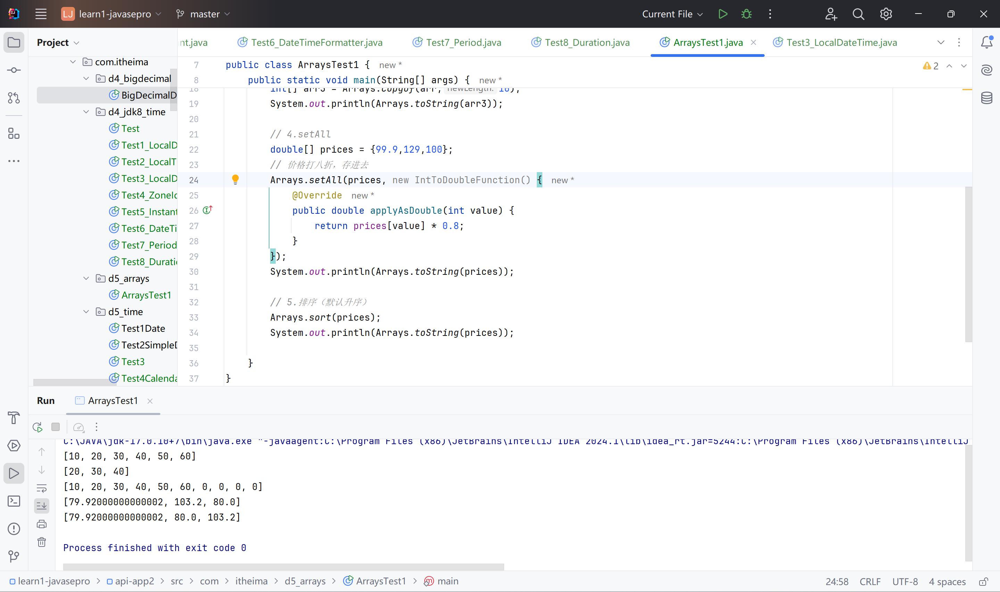

### 自定义排序规则方式

如果存储的是对象，如何排序？

#### 方式一：学生类实现Comparable接口

```java
package com.itheima.d5_arrays;

public class Student implements Comparable<Student>{
    private String name;
    private double height;
    private int age;

    @Override
    public int compareTo(Student o) {
        // 约定1：左边大于右边，返回正整数
        // 约定2: 左边小于右边，返回负整数
        // 约定3： 等于返回0
        // 按照年龄升序排序
//        if(this.age > o.age){
//            return 1;
//        }else if(this.age < o.age){
//            return -1;
//        }else return 0;
        return this.age - o.age;
    }

    @Override
    public String toString(){
        return "Student [name=" + name + ", height=" + height + ", age=" + age + "]";
    }

    public Student(){}

    public Student(String name,double height, int age) {
        this.name = name;
        this.height = height;
        this.age = age;
    }

    public String getName() {
        return name;
    }

    public void setName(String name) {
        this.name = name;
    }

    public int getAge() {
        return age;
    }

    public void setAge(int age) {
        this.age = age;
    }

    public double getHeight() {
        return height;
    }

    public void setHeight(double height) {
        this.height = height;
    }
}
```

```java
package com.itheima.d5_arrays;

import java.lang.reflect.Array;
import java.util.Arrays;

public class ArrayTest2 {
    public static void main(String[] args) {
        Student[] students = new Student[4];
        students[0] = new Student("11",177.8,23);
        students[1] = new Student("22",158.0,26);
        students[2] = new Student("33",180.5,33);
        students[3] = new Student("44",168.6,19);

        // 1.对数组排序
        Arrays.sort(students);
        System.out.println(Arrays.toString(students));

    }
}

```

output:

[Student [name=44, height=168.6, age=19], Student [name=11, height=177.8, age=23], Student [name=22, height=158.0, age=26], Student [name=33, height=180.5, age=33]]

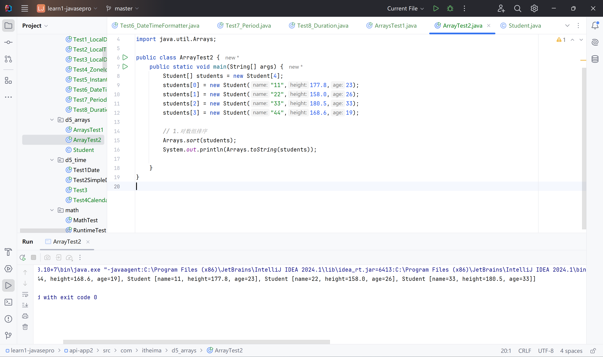

降序排序？

`return this.age - o.age;`

#### 方式二：创建Comparator进行比较

```java
package com.itheima.d5_arrays;

import java.lang.reflect.Array;
import java.util.Arrays;
import java.util.Comparator;

public class ArrayTest2 {
    public static void main(String[] args) {
        Student[] students = new Student[4];
        students[0] = new Student("11",177.8,23);
        students[1] = new Student("22",158.0,26);
        students[2] = new Student("33",180.5,33);
        students[3] = new Student("44",168.6,19);

        // 1.对数组排序
        Arrays.sort(students);
        System.out.println(Arrays.toString(students));

        // 2.重载的sort(arr,Comparator);
        Arrays.sort(students, new Comparator<Student>() {

            @Override
            public int compare(Student o1, Student o2) {
                // 约定1：左边大于右边，返回正整数
                // 约定2: 左边小于右边，返回负整数
                // 约定3： 等于返回0
//                if(o1.getHeight() > o2.getHeight()){
//                    return 1;
//                }else if(o1.getHeight() < o2.getHeight()){
//                    return -1;
//                }else
//                return 0;
                return Double.compare(o1.getHeight(),o2.getHeight());
            }
        });

        System.out.println(Arrays.toString(students));
    }
}

```

output:

[Student [name=22, height=158.0, age=26], Student [name=44, height=168.6, age=19], Student [name=11, height=177.8, age=23], Student [name=33, height=180.5, age=33]]

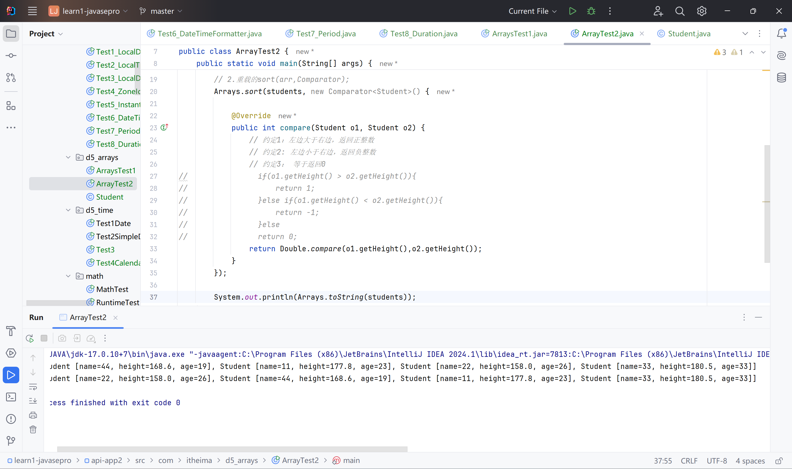

# 传统时间日期类


## Date

使用方法

```java
package com.itheima.d5_time;

import java.util.Date;

public class Test1Date {
    public static void main(String[] args) {
        // 1. 代表系统当前时间信息
        Date d = new Date();
        System.out.println(d);

        // 2. 拿到时间毫秒值
        long time = d.getTime();
        System.out.println(time);

        // 3. 时间毫秒值转化为日期对象
        time += 2*1000;
        Date d2 = new Date(time);
        System.out.println(d2); // 2秒后的日期对象

        //4. setTime修改日期对象
        Date d3 = new Date();
        d3.setTime(time);
        System.out.println(d3);
    }
}
```

## SimpleDateFormat

简单日期格式化

### 时间转字符串

```java
package com.itheima.d5_time;

import java.text.SimpleDateFormat;
import java.util.Date;

public class Test2SimpleDateFormat {
    public static void main(String[] args) {
        //1 Date、long类型时间格式
        Date d = new Date();
        System.out.println(d);

        long time = d.getTime();
        System.out.println(time);

        //2. 格式化时间
        SimpleDateFormat sdf = new SimpleDateFormat("yyyy-MM-dd HH:mm:ss");
        SimpleDateFormat sdf2 = new SimpleDateFormat("yyyy.HH.mm.ss--dd---MM");

        String rs = sdf.format(d);
        String rs2 = sdf.format(time);
        System.out.println(rs);
        System.out.println(rs2);
    }
}

```

Mon Apr 29 00:01:14 GMT+08:00 2024
1714320074158
2024-04-29 00:01:14
2024-04-29 00:01:14


### 解析字符串时间

```java
package com.itheima.d5_time;

import java.text.ParseException;
import java.text.SimpleDateFormat;
import java.util.Date;

public class Test2SimpleDateFormat {
    public static void main(String[] args) throws ParseException {
        //1 Date、long类型时间格式
        Date d = new Date();
        System.out.println(d);

        long time = d.getTime();
        System.out.println(time);

        //2. 格式化时间
        SimpleDateFormat sdf = new SimpleDateFormat("yyyy-MM-dd HH:mm:ss");
        SimpleDateFormat sdf2 = new SimpleDateFormat("yyyy.HH.mm.ss--dd---MM");

        String rs = sdf.format(d);
        String rs2 = sdf.format(time);
        System.out.println(rs);
        System.out.println(rs2);

        //目标：解析字符串时间
        String dataStr = "2022-12-03 13:56:04";
        SimpleDateFormat sdf3 = new SimpleDateFormat("yyyy-MM-dd HH:mm:ss");
        Date d2 = sdf3.parse(dataStr);

        System.out.println(d2);
    }
}
```

...
Sat Dec 03 13:56:04 GMT+08:00 2022


### 秒杀活动

```java
package com.itheima.d5_time;

import java.text.ParseException;
import java.text.SimpleDateFormat;
import java.util.Date;

public class Test3 {
    public static void main(String[] args) throws ParseException {
        String start = "2023年11月1日 0:0:0";
        String end = "2023年11月1日 0:10:0";
        String xj = "2023年11月1日 0:01:18";
        String xp = "2023年11月1日 0:10:57";

        SimpleDateFormat sdf = new SimpleDateFormat("yyyy年MM月dd日 HH:mm:ss");
        Date startDt = sdf.parse(start);
        Date endDt = sdf.parse(end);
        Date xjDt = sdf.parse(xj);
        Date xpDt = sdf.parse(xp);

        long startTime = startDt.getTime();
        long endTime = endDt.getTime();
        long xjTime = xjDt.getTime();
        long xpTime = xpDt.getTime();

        if(xjTime>=startTime && xjTime <= endTime){
            System.out.println("小贾你秒杀成功了");
        }else{
            System.out.println("小贾你秒杀失败了");
        }

        if(xpTime>=startTime && xpTime <= endTime){
            System.out.println("小鹏你秒杀成功了");
        }else{
            System.out.println("小鹏你秒杀失败了");
        }
    }
}

```


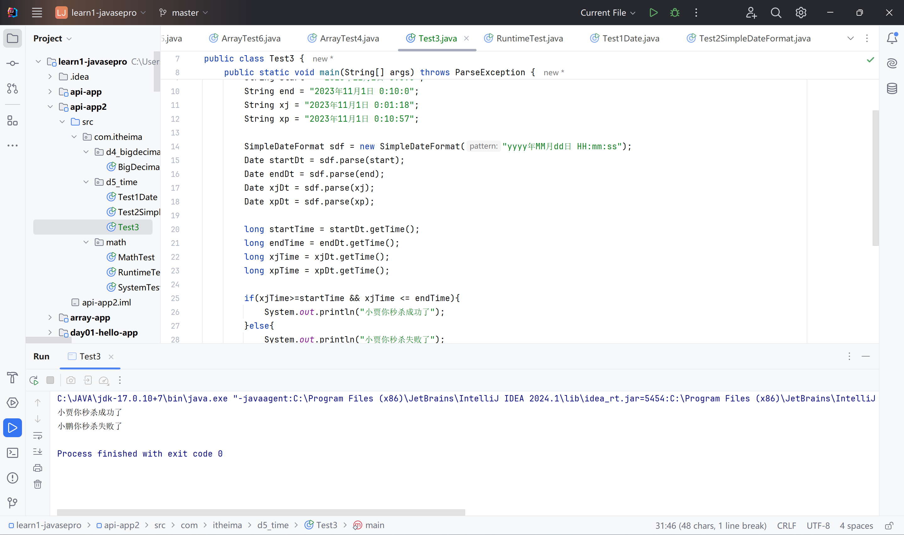

## Calendar

需求：将2023年09年10月增加一个月

代表系统此时时间的日历

单独获取、修改年月日时分秒信息。

```java
package com.itheima.d5_time;

import java.util.Calendar;
import java.util.Date;

public class Test4Calendar {
    public static void main(String[] args) {
        // 1. 得到系统此刻时间对应的日历对象
        Calendar now = Calendar.getInstance();
        System.out.println(now);

        // 2. 获取日历中的某个信息
        int year = now.get(Calendar.YEAR);
        System.out.println(year);

        int month = now.get(Calendar.MONTH);
        System.out.println(month);

        int day = now.get(Calendar.DAY_OF_MONTH);
        System.out.println(day);

        // 3. 拿到日历中记录的日期对象
        Date d = now.getTime();
        System.out.println(d);

        // 4. 拿到时间毫秒值
        long time = now.getTimeInMillis();
        System.out.println(time);

        // 5. 修改日历中的某个信息
        now.set(Calendar.MONTH, 9); //修改为十月份
        System.out.println(now);

        // 6. 为某个信息增加或者减少多少
        now.add(Calendar.DAY_OF_YEAR, 100);
        now.add(Calendar.DAY_OF_YEAR, -10);
        now.add(Calendar.DAY_OF_MONTH, 100);
        System.out.println(now);

    }
}

```

# JDK8新增的时间API

传统的时间类（Date，SimpleDateFormat，Calendar)

1. 设计不合理，使用不方便，过时
2. 都是可变对象，修改后丢失最开始的时间信息
3. 线程不安全
4. 不能精确到纳秒，只能到毫秒

JDK8新增的时间API

- LocalDate
- LocalTime
- LocalDateTime
- ZoneId
- ZonedDateTime
- DateTimeFormatter

## LocalDate 、LocalTime、LocalDatetime

代表本地年、月、日、星期

### 获取对象方法

now()方法

### 常用方法

LocalDate为例，其他都一样

```java
package com.itheima.d4_jdk8_time;

import java.time.LocalDate;

public class Test1_LocalDate {
    public static void main(String[] args) {
        LocalDate ld = LocalDate.now();
        System.out.println(ld);

        // 1.获取日期对象中的信息
        int year = ld.getYear();
        int month = ld.getMonthValue();
        int day = ld.getDayOfMonth();
        int dayOfYear = ld.getDayOfYear();
        int dayOfWeek = ld.getDayOfWeek().getValue();

        System.out.println(year);
        System.out.println(day);
        System.out.println(dayOfWeek);

        // 2. 直接修改某个信息：with..
        LocalDate ld2 = ld.withYear(2099);  //不可变对象
        LocalDate ld3 = ld2.withMonth(12);
        System.out.println(ld2);
        System.out.println(ld3);

        // 3. 加多少 plus...
        LocalDate ld4 = ld.plusYears(2);
        LocalDate ld5 = ld.plusMonths(2);

        // 4. 减多少 minus
        LocalDate ld6 = ld.minusYears(2);
        LocalDate ld7 = ld.minusMonths(2);

        // 5. 获取指定日期的LocalDate对象
        LocalDate ld8 = LocalDate.of(2099,12,3);
        LocalDate ld9 = LocalDate.of(2099,12,3);

        // 6. 判断相同
        System.out.println(ld8.equals(ld9));
        System.out.println(ld6.equals(ld7));
    }
}

```

```
2024-04-29
2024
29
1
2099-04-29
2099-12-29
true
false
```

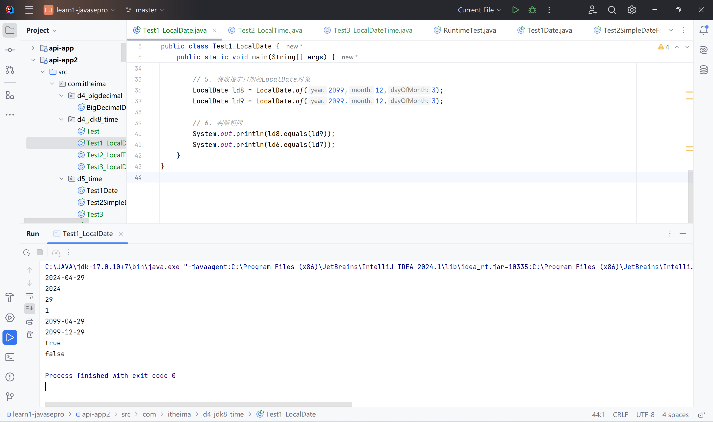

```java
package com.itheima.d4_jdk8_time;

import java.time.LocalTime;

public class Test2_LocalTime {
    public static void main(String[] args) {
        LocalTime lt = LocalTime.now();
        LocalTime lt2 = lt.plusHours(2);

        // 时间在前后
        System.out.println(lt.isBefore(lt2));
        System.out.println(lt.isAfter(lt2));
    }
}

```

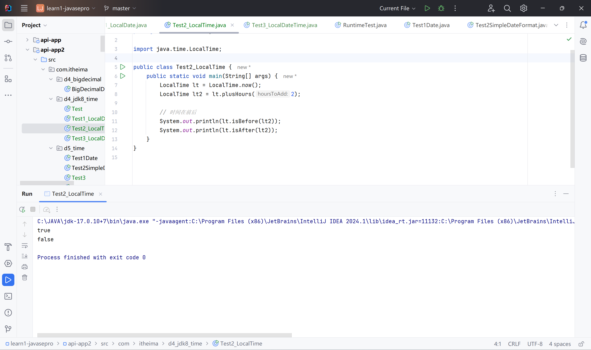

LocalDateTime可以转换为LocalDate和LocalTime

```java
package com.itheima.d4_jdk8_time;

import java.time.LocalDate;
import java.time.LocalDateTime;
import java.time.LocalTime;

public class Test3_LocalDateTime {
    public static void main(String[] args) {
        // 互相转换
        LocalDateTime ldt = LocalDateTime.now();
        LocalDate ld = ldt.toLocalDate();
        LocalTime lt = ldt.toLocalTime();

        LocalDateTime ldt10 = LocalDateTime.of(ld,lt);
    }
}

```

## ZoneID、ZoneDateTime

带时区的时间

### 常用方法

```java
package com.itheima.d4_jdk8_time;

import java.time.Clock;
import java.time.ZoneId;
import java.time.ZonedDateTime;

public class Test4_ZoneId_ZoneDateTime {
    public static void main(String[] args) {
        // 1. 获取系统的时区
        ZoneId zoneId = ZoneId.systemDefault();
        System.out.println(zoneId.getId());
        System.out.println(zoneId);

        // 列出全部时区
        System.out.println(ZoneId.getAvailableZoneIds());

        // 获取时区
        ZoneId zoneId1 = ZoneId.of("America/New_York");

        // 2. 获得带时区的时间
        ZonedDateTime now = ZonedDateTime.now(zoneId1);
        System.out.println(now);

        // 世界标准时间
        ZonedDateTime now1 = ZonedDateTime.now(Clock.systemUTC());
        System.out.println(now1);

        // 系统默认时区
        ZonedDateTime now2 = ZonedDateTime.now();
        System.out.println(now2);
    }
}
```

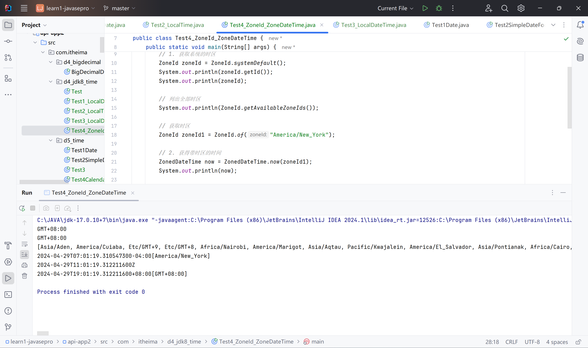

其他方法与LocalDateTime用法一致。

## Instant

代替Date

时间线上的某个时刻、时间戳

总秒数、纳秒数

作用：记录代码执行时间，或用于记录用户操作某个事件的时间点

优点：不可变对象，精确到纳秒

### 获取对象

now()

### 常用方法

```java
package com.itheima.d4_jdk8_time;

import java.time.Instant;

public class Test5_Instant {
    public static void main(String[] args) {
        // 1. 创建Instant对象，获取此刻时间信息
        Instant now = Instant.now();

        // 2. 获取总秒数
        long seconds = now.getEpochSecond();
        System.out.println(seconds);

        // 3. 不够一秒的纳秒数
        int nano = now.getNano();
        System.out.println(nano);

        System.out.println(now);

        // 修改
        Instant instant  = now.plusNanos(111);
        Instant instant1 = now.minusSeconds(20);

    }
}

```

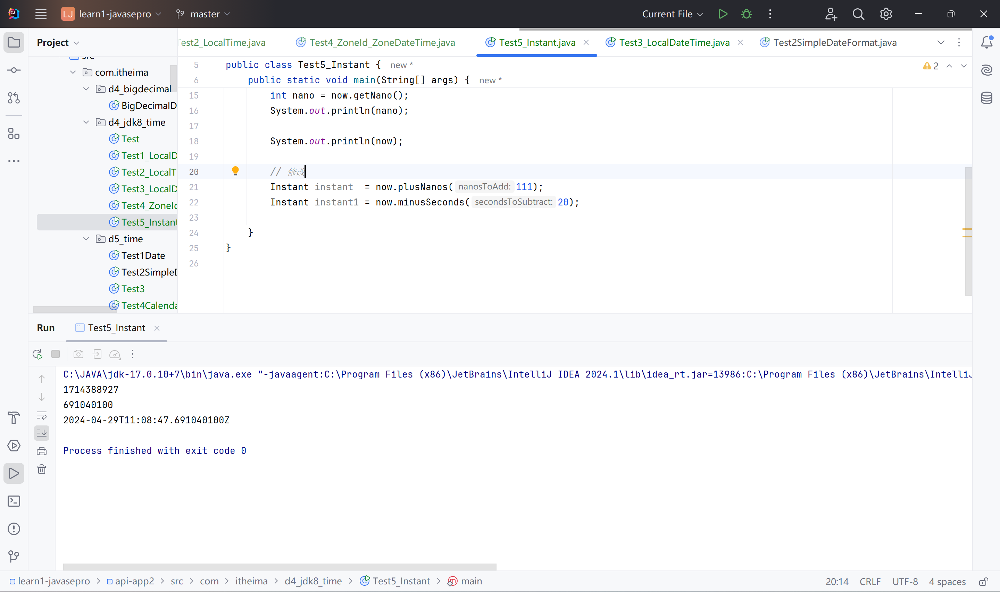

## DateTimeFormatter

线程安全

### 常用方法

```java
package com.itheima.d4_jdk8_time;

import java.time.Instant;
import java.time.LocalDateTime;
import java.time.format.DateTimeFormatter;

public class Test6_DateTimeFormatter {
    public static void main(String[] args) {
        // 1. 创建一个日期时间格式化器对象出来
        DateTimeFormatter formatter = DateTimeFormatter.ofPattern("yyyy年MM月dd日 HH:mm:ss");

        // 2. 对时间格式化
        LocalDateTime now = LocalDateTime.now();

        String rs = formatter.format(now);  // 正向格式化
        System.out.println(rs);

        // 3. 结果一致
        String rs2 = now.format(formatter); // 反向格式化
        System.out.println(rs2);

        // 4. 解析时间
        String dateStr = "2024年04月29日 19:15:29";
        LocalDateTime ldt = LocalDateTime.parse(dateStr, formatter);
        System.out.println(ldt);
    }
}

```

output:

```
2024年04月29日 19:16:58
2024年04月29日 19:16:58
2024-04-29T19:15:29
```

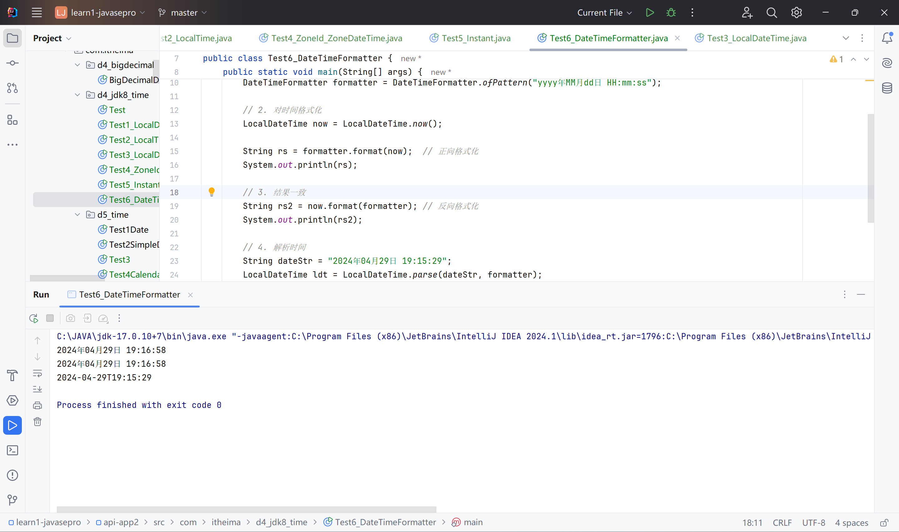

## 补充：Period

计算两个LocalDate对象 相差的年月天数

```java
package com.itheima.d4_jdk8_time;

import java.time.LocalDate;
import java.time.Period;

public class Test7_Period {
    public static void main(String[] args) {
        LocalDate start = LocalDate.of(2029, 8, 10);
        LocalDate end = LocalDate.of(2029, 12, 15);

        // 1.创建period对象封装两个日期对象
        Period period = Period.between(start, end);

        // 2.计算相差信息
        System.out.println(period.getYears());
        System.out.println(period.getMonths());
        System.out.println(period.getDays());
    }
}

```

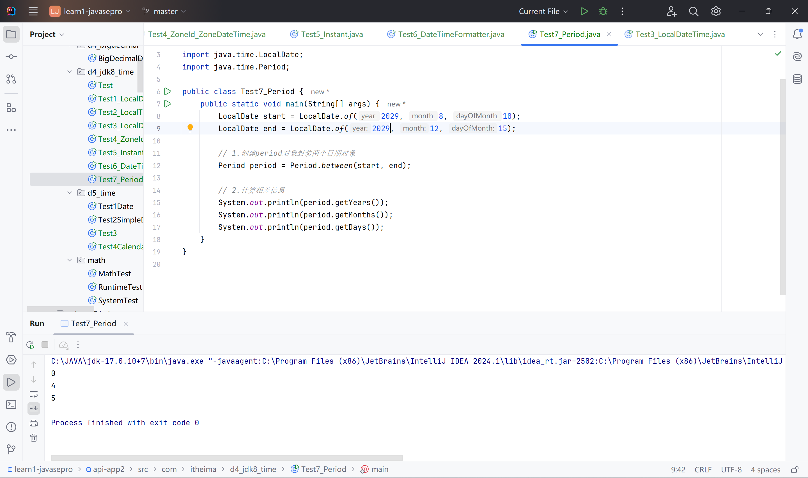

## 补充：Duration

计算两个对象相差的天、小时、分、秒、纳秒数

```java
package com.itheima.d4_jdk8_time;

import java.time.Duration;
import java.time.LocalDate;
import java.time.LocalDateTime;

public class Test8_Duration {
    public static void main(String[] args) {
        LocalDateTime start = LocalDateTime.of(2025,11,11,11,10,10);
        LocalDateTime end = LocalDateTime.of(2025,11,11,11,11,11);


        // 1.得到Duration对象
        Duration duration = Duration.between(start, end);

        // 2.获取间隔信息
        System.out.println(duration.toDays());
        System.out.println(duration.toHours());
        System.out.println(duration.toMinutes());
        System.out.println(duration.toSeconds());
        System.out.println(duration.toMillis());
        System.out.println(duration.toNanos());
    }
}

```

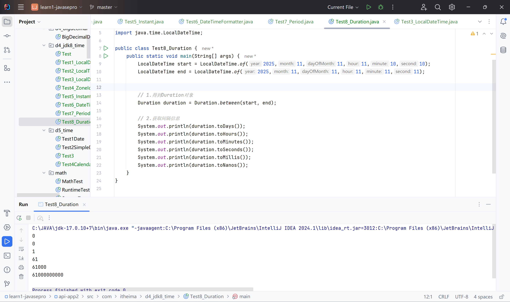

# JDK8 Lambda表达式

简化匿名内部类的代码写法

（形参） -> {	}

注意：不能简化全部，只能简化函数式接口
接口、有且仅有一个匿名方法

## 函数式接口

```java
package com.itheima.d6_lambda;

public class LambdaTest1 {
    public static void main(String[] args) {
//        Animal a = new Animal() {
//            @Override
//            public void run() {
//                System.out.println("狗跑的贼快");
//            }
//        };

        // 注意：不能简化全部，只能简化函数式接口
        // 接口、有且仅有一个匿名方法
//        Animal a = ()->{
//            System.out.println("狗跑的贼快");
//        }

//        Swimming s = new Swimming() {
//            @Override
//            public void swim() {
//                System.out.println("学生快乐的游泳");
//            }
//        };

        Swimming s = ()->{
            System.out.println("学生快乐地游泳");
        };
    }
}

interface Swimming{
    void swim();
}


abstract class Animal{
    public abstract void run();
}
```

## 省略规则

1. 参数类型可以省略不写
2. 如果只有一个参数，小括号也可以省略
3. 只有一行代码可以省略大括号不写，同时省略分号，return语句return不写。

```java
Arrays.setAll(prices, value-> prices[values] * 0.8);
```

# JDK8 方法引用

::

简化Lambda表达式

## 静态方法的引用

有一个静态的方法，参数一致

```java
package com.itheima.d7_method_references;

import com.itheima.d5_arrays.Student;

public class CompareByData {
    public static int compareByAge(Student o1, Student o2) {
        return o1.getAge() - o2.getAge();
    }
}

```

```java
//        Arrays.sort(students, (o1,o2)-> Double.compare(o1.getHeight(),o2.getHeight()));
//        Arrays.sort(students, (o1,o2)-> CompareByData.compareByAge(o1,o2));
        Arrays.sort(students, CompareByData::compareByAge);
```

## 实例方法的引用

实例方法 创建对象

```java
package com.itheima.d7_method_references;

import com.itheima.d5_arrays.Student;

public class CompareByData {
    public static int compareByAge(Student o1, Student o2) {
        return o1.getAge() - o2.getAge();
    }

    public int compareByAgeDsc(Student o1, Student o2) {
        return o2.getAge() - o1.getAge();
    }
}

```

```java
        //降序
        CompareByData compare = new CompareByData();
//        Arrays.sort(students, ((o1, o2) -> compare.compareByAgeDsc(o1,o2)));
        Arrays.sort(students, compare::compareByAgeDsc);
```

## 特定类型方法的引用

类型::方法

```java
package com.itheima.d7_method_references;

import java.util.Arrays;
import java.util.Comparator;

public class Test2 {
    public static void main(String[] args) {
        String[] names = {"boby","angle","Andy","caocao","jack","Cici","dlei"};


        // 进行排序
        Arrays.sort(names);

        //忽略首字符大小写进行排序
//        Arrays.sort(names, new Comparator<String>() {
//            @Override
//            public int compare(String o1, String o2) {
//                return o1.compareToIgnoreCase(o2);
//            }
//        });
//        Arrays.sort(names,(o1,o2)->o1.compareToIgnoreCase(o2));
        Arrays.sort(names,String::compareToIgnoreCase);


        System.out.println(Arrays.toString(names));
    }
}

```

String类的忽略大小写比较

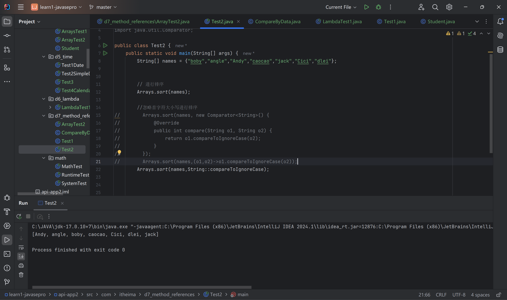

## 构造器引用

类名::new

```java
package com.itheima.d7_method_references;

public class Test3 {

//    CreateCar cc = new CreateCar() {
//        @Override
//        public Car createCar(String name, double price) {
//            return new Car(name, price);
//        }
//    };

//    CreateCar cc = (name,price) -> new Car(name,price);
    CreateCar cc = Car::new;

}

interface CreateCar{
    Car createCar(String name, double price);
}
```

