# MYSQL数据库

## 优化问题

### 定位慢查询

聚合、多表、表数据量大、深度分页查询

**方案一：开源工具**

调式工具：Arthas

运维工具：Promethus、Skywalking

**方案二：MYSQL慢日志查询**

开启MYSQL的慢日志查询（调试阶段）	

分析、优化：

1. 查询语句信息 EXPLAIN 、DESC  + 查询语句（possible keys、key、key_len）

   

   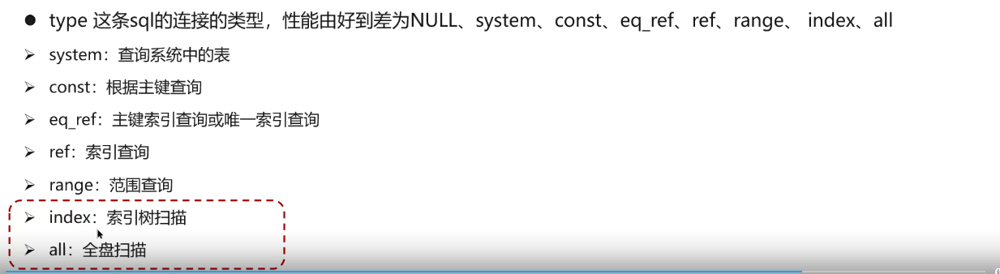

   检查：**有没有命中索引、索引失效、添加索引、检查SQL**

   

### 索引、回表

聚簇、聚集索引：数据索引放在一块、B+tree叶子存储行数据**（必须有、仅有一个）

非聚簇、二级索引：数据、索引分开存储、B+tree叶子只存主键（存在多个）

回表：通过二级索引找到主键值、然后到聚集索引中找到行数据的过程

### 覆盖索引

覆盖索引：查询使用了索引、并且需要返回的列，在该索引中已经能全部找到

非覆盖索引：需要回表查询

### 超大分页优化

limit分页查询需要排序，越往后时长越高

**使用覆盖索引+子查询解决**：先分页查询数据的id字段，然后用子查询来过滤，走覆盖索引提升效率

order by id

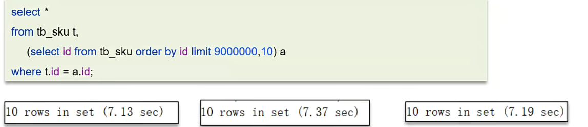

### 索引创建原则

1. 主键
2. 唯一索引
3. 复合索引

原则：

1. 数据量大、查询频繁
2. 常用查询条件适合创建索引
3. 区分度高的列使用索引
4. 字符串：前缀索引
5. 使用联合索引，减少单列索引。避免回表。
6. 控制索引数量
7. not null 约束

### 索引失效情况

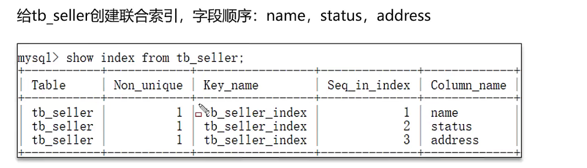

判断：执行计划explain

1. 违反**最左前缀原罪**

   如果索引了多列，需要遵守最左前缀原则。查询从索引的最左前列开始，并且不跳过索引中的列

   name->status->address

   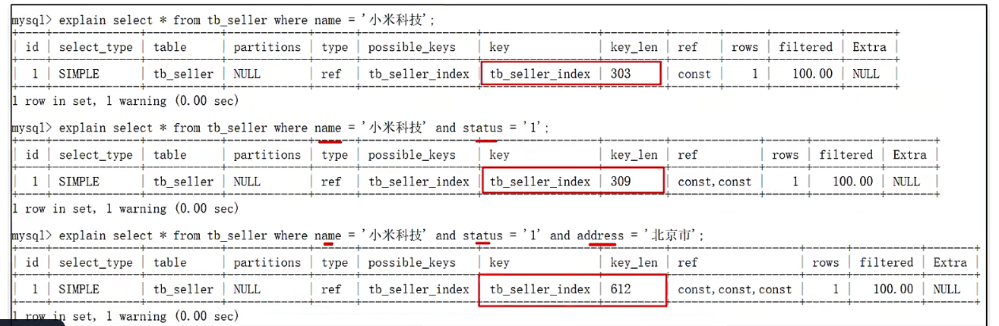

   失效：跳过了左边的一列

   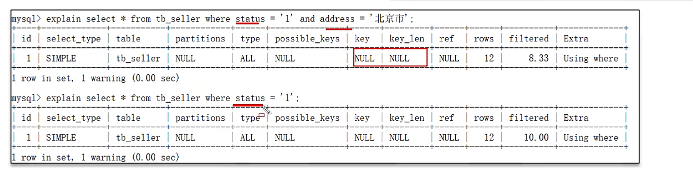

   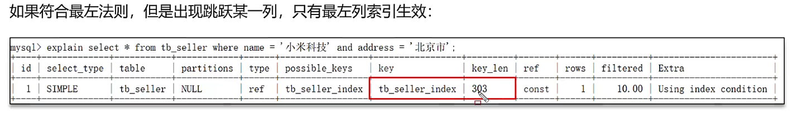

2. **范围查询右边的列**，不能使用索引

   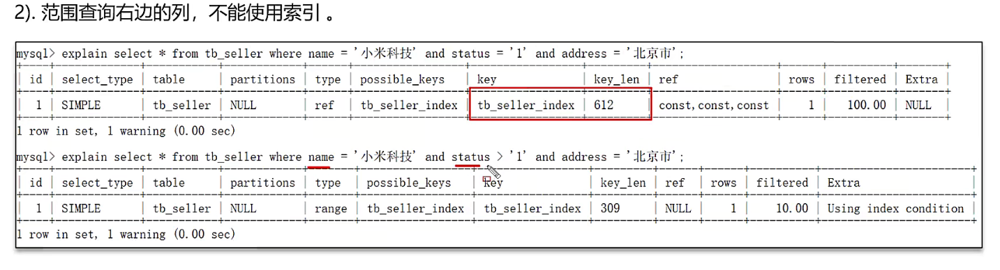

3. 在索引列上运算

   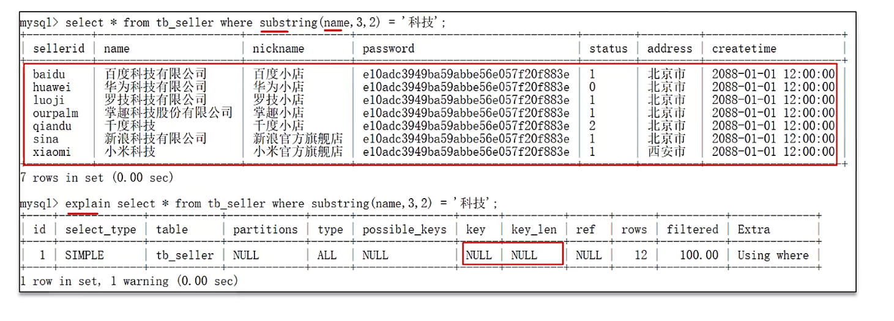

4. 字符串不加单引号，发生**类型转换**

5. 模糊查询：**头部模糊查询**

### 表设计优化

1. 选择合适数值类型int tinyint bigint
2. char、varchar

### SQL语句优化

1. select指明字段、覆盖索引、避免select*

2. 避免索引失效写法

3. 尽量用union all代替union

4. 避免where字句中对字段进行表达式操作

5. 小表放外面，大表放里面

   

### 主从复制、读写分离

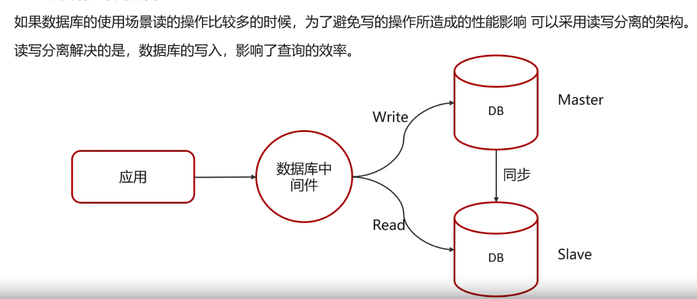

## 事务的问题

事务特性：**ACID**

一组操作的组合、不可分割的工作单位，同时成功、失败

**原子性、一致性、隔离性、持久性**

### 并发事务

脏堵、不可重复读、幻读

事物的隔离级别

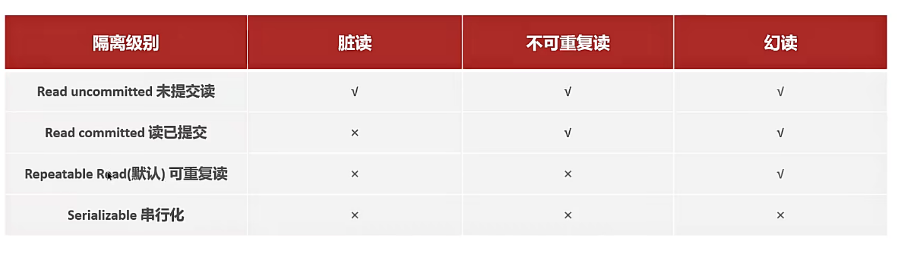

级别越高、性能越低

### UNDO\REDO 

redo log：实现事务的持久性

数据页的物理变化，脏页写入后、服务宕机，实现恢复

undo log：实现一致性、原子性

回滚、MVCC、逆操作

隔离性：

- 锁：排它锁、防止其他事务修改

- mvcc：多版本并发控制、维护一个数据多个版本，读写不冲突

MVCC实现原理：

1. 隐藏字段：

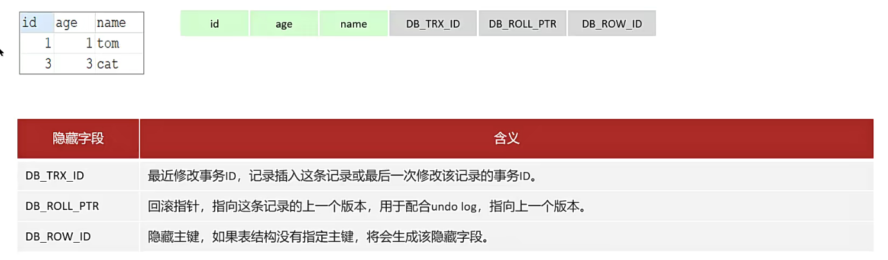

2. undo log

   

3. READ view

​	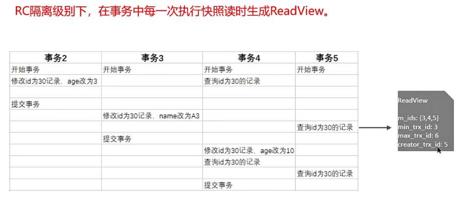

### 主从同步原理

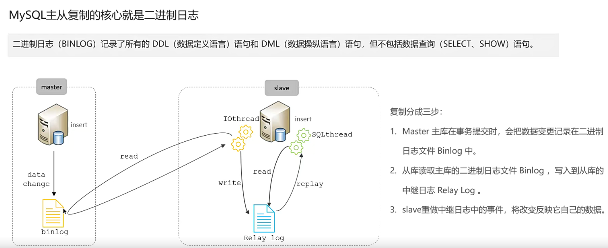

binlog日志记录ddl和dml的操作

### 分库分表

拆分策略：垂直分库、垂直分表、水平分库、水平分表

1. 垂直分库：以表为依据，根据业务，将不同的表拆到不同的库中
2. 垂直分表：以字段为依据，根据字段属性将不同字段拆分到不同表中

3. 水平分库：将一个库的数据分到多个库中 （根据id取模，范围路由）

4. 水平分表：讲一个表的数据分到多个表中

策略：分布式事务