# 框架篇

Spring

SpringMVC

Spring Boot

Mybatis

## Spring

### 单例bean是线程安全的吗

@Scope默认singleton

不是线程安全的。

成员变量需要考虑线程安全。

### 什么是AOP

面向切面编程

使用AOP的场景：

- 记录操作日志
- 缓存处理
- Spring内置的事务处理

Spring事务实现：通过aop对方法进行拦截，在执行方法之前开启事务，在执行方法之后根据执行提交或者回滚事务。

### Spring事务失效场景

三种：

1. 异常捕获处理：目标自己处理掉了异常，需要抛出异常才能处理

2. 抛出检查异常：Spring默认只会回滚非检查异常

   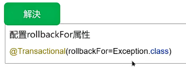

3. 非public方法：Spring为方法创建代理、添加事务通知、前提条件都是public方法

### Bean的生命周期

封装成BeanDefinition对象

构造函数->依赖注入->Aware接口->BeanPostProcessor->初始化方法

->BeanPostProcessor->AOP->动态代理

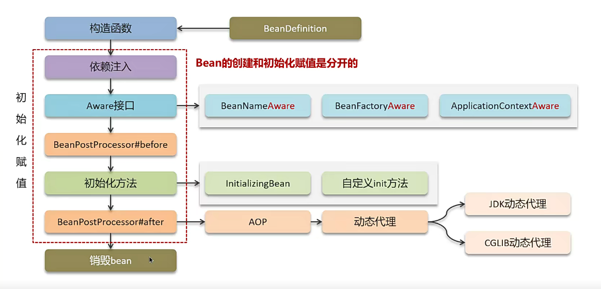

### Spring的循环引用

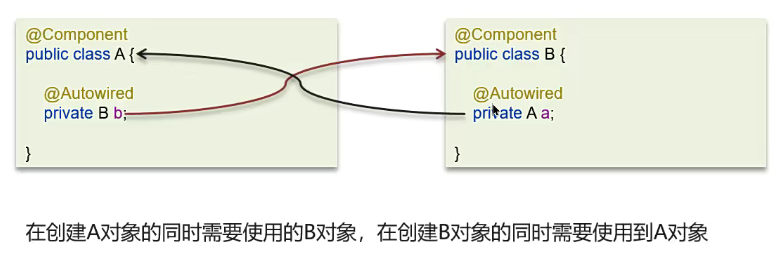

循环依赖：

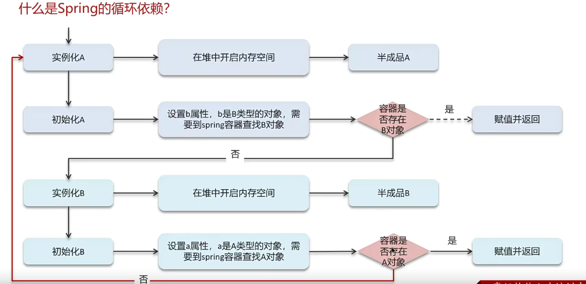

三级缓存：

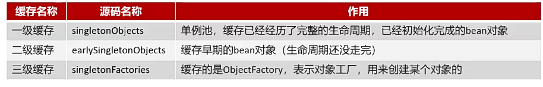

**三级缓存如何解决循环依赖？**

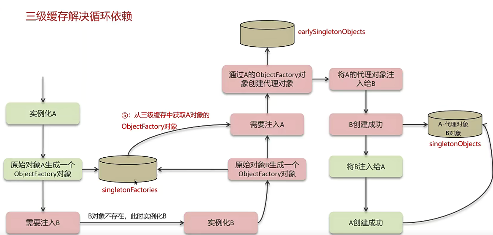

构造方法出现了循环依赖：

@Lazy

## SpringMVC

### 执行流程

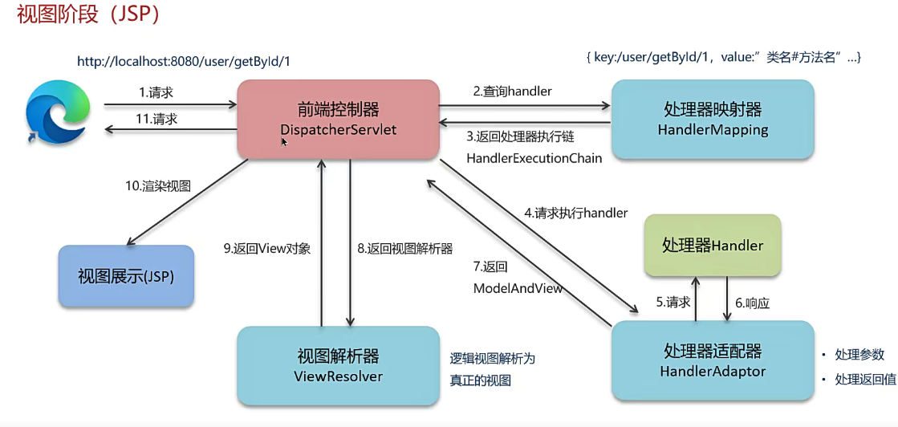

前后端分离：

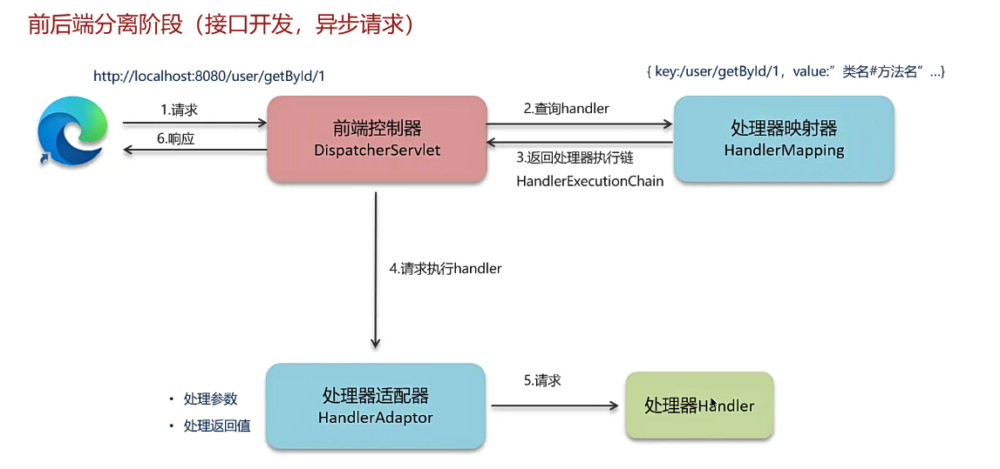

## Spring Boot

### 自动配置原理

最核心的思想，必问

@SpringBootApplication

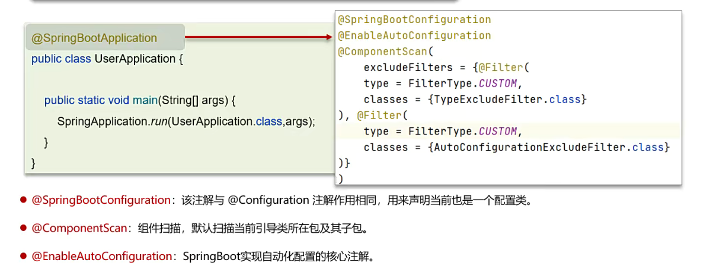

自动配置类

检测是否有起步依赖相关的类，如果有就自动配置

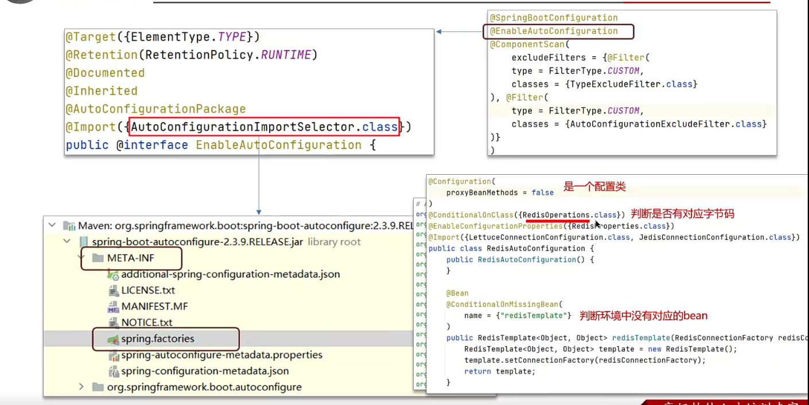

1. Spring Boot引导类上有一个注解，@SpringBootConfiguration，封装了@SpringBootConfiguration、@EnableAutoConfiguration，@ComponentScan

2. **其中@EnableAutoConfiguration是实现自动配置的核心注解**，通过@Import导入对应的配置选择器。内部就是读取了jar包classpath的spring.factories的所有配置类

3. 配置类里条件判断@ConditionalOnClass，判断是否有相应的class文件，如果有则加载该类，把这个配置累的所有Bean放入Spring容器中使用

## MyBatis

### 执行流程

配置文件 mybatis-config.xml

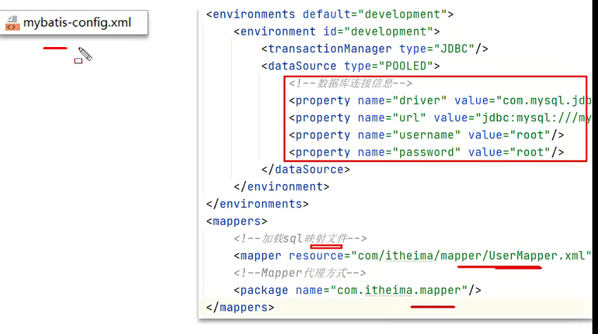

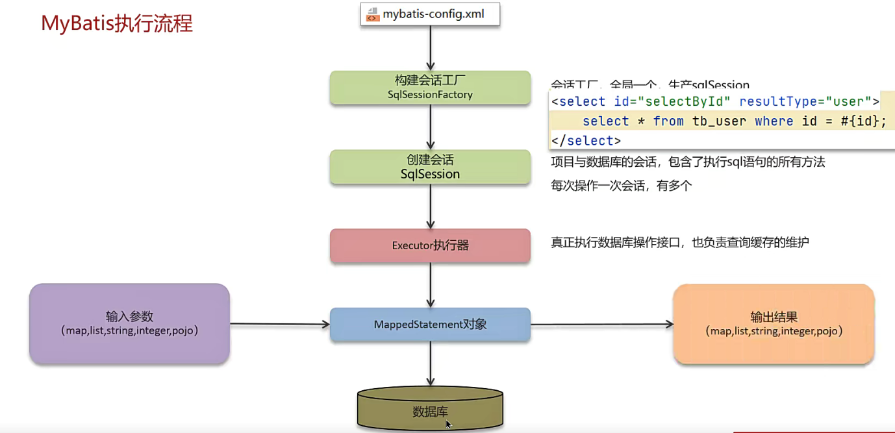

1. 读取配置文件：加载环境、映射文件
2. 构造会话工厂SqlSessionFactory
3. 会话工厂创建SqlSession对象
4. 操作数据库接口，Executor执行器，负责缓存维护
5. Executor接口的执行方法中的MappedStatement封装了映射信息
6. 输入参数映射
7. 输出结果映射

### 是否支持延迟加载

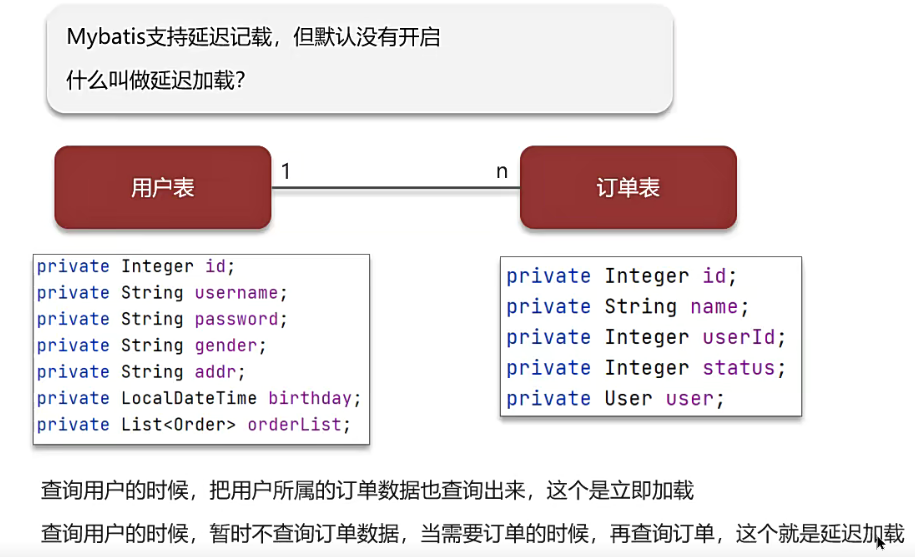

延迟加载、按需加载：一对一关联；一对多关联集合对象

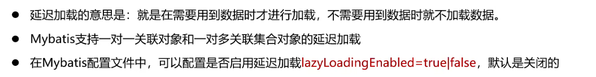

需要查询的写上： fetchtype=“lazy”

**原理：给延迟加载创建代理对象**

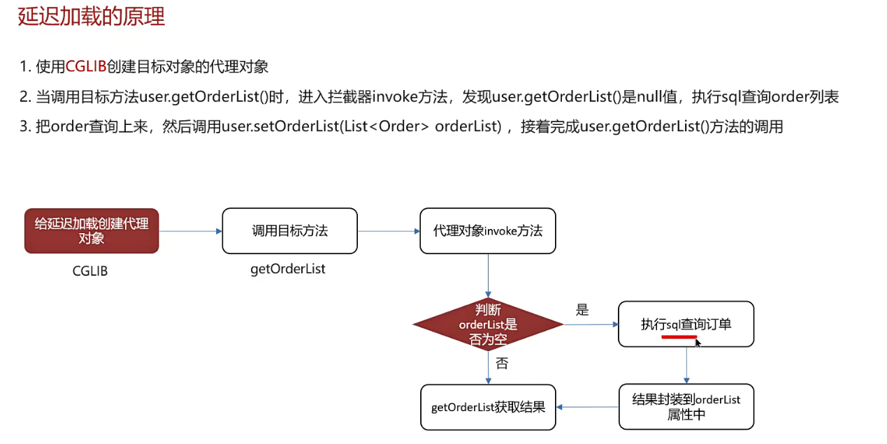

### 一级、二级缓存

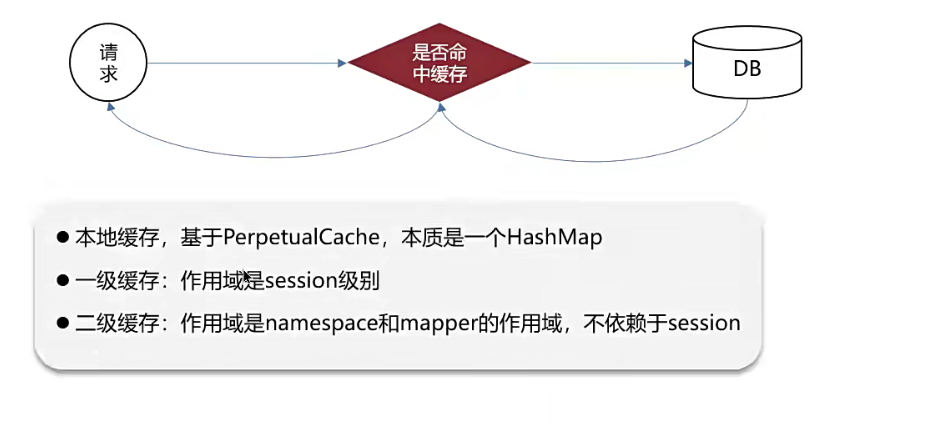

一级缓存：

在同一个会话中，查询相同的ID，不会再查询一次

​	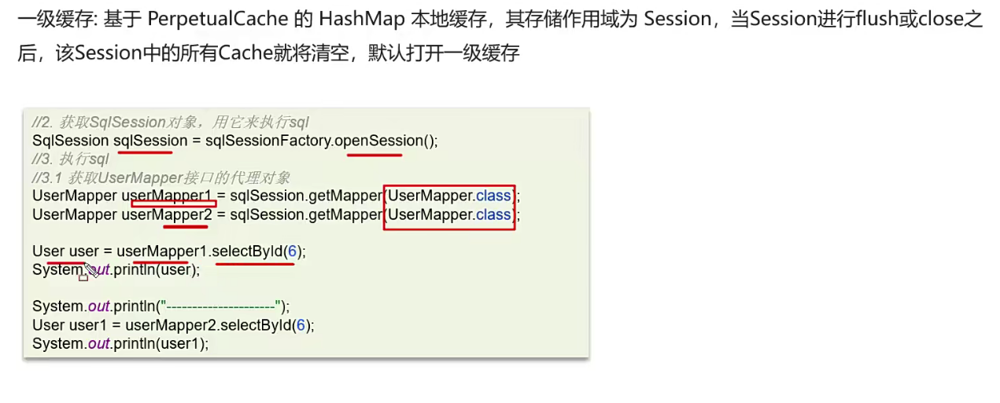

二级缓存：

不依赖会话，查询相同的ID，不会再查询一次

缓存数据必须实现Serializable接口

只有会话提交或关闭后，一级缓存中的数据才会转移到二级缓存中

默认关闭，手动打开

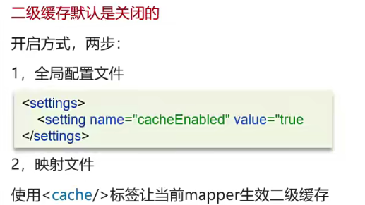

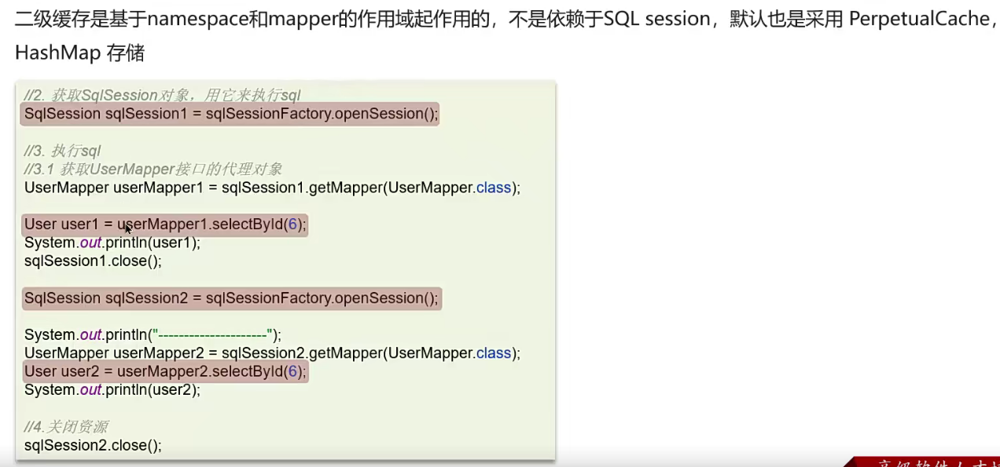