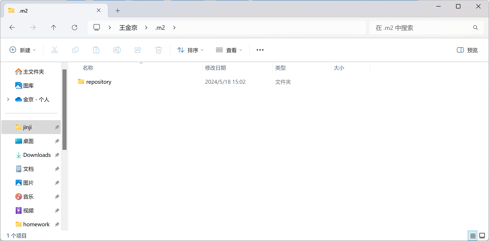

# MAVEN

传统项目管理状态分析

- jar包不统一、不兼容
- 工程升级维护操作繁琐

## 简介

项目管理工具、将项目开发和管理抽象成一个项目对象模型POM

项目对象模型 pom.xml

依赖管理 Dependency

本地仓库、私服仓库、中央仓库

构建生命周期/阶段

多个插件：Jar包、源代码

作用：项目构建、依赖管理、统一开发结构

## 下载与安装

配置MAVEN_HOME

配置PATH

## MAVEN 基础概念

### 仓库

用于存储资源、包含各种jar包

分类：

- 本地
- 远程：私服、中央仓库

私服：小范围共享

### 坐标

坐标的概念：定位仓库中资源的位置

1. groupid：项目隶属组织 org.mybatis
2. artifactid：项目名称
3. version：版本号

[mvnrepository.com](https://mvnrepository.com/)

## 仓库配置

自己配置

### 本地仓库配置

### 远程仓库配置

Settings文件的区别

全局、局部**Settings**

