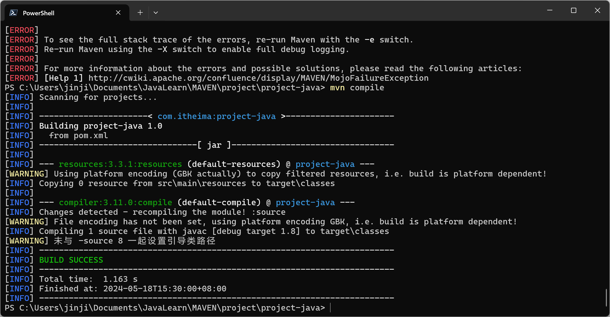

# MAVEN项目

## 手动创建

### 工程目录结构


main/java/com.itheima.Demo

```java
package com.itheima;

public class Demo{
    public String say(String name) {
        System.out.println("hello+" + name);
        return "hello " + name;
    }
}
```

test/java/com.itheima.DemoTest

```java
package com.itheima;

import org.junit.Test;
import org.junit.Assert;


public class DemoTest{
    @Test
    public void testSay(){
        Demo d = new Demo();
        String ret = d.say("maven");
        Assert.assertEquals("hello maven",ret);
    }
}
```


### 创建POM文件

```xml
<?xml version="1.0" encoding="UTF-8"?>
<project xmlns="http://maven.apache.org/POM/4.0.0" xmlns:xsi="http://www.w3.org/2001/XMLSchema-instance"
         xsi:schemaLocation="http://maven.apache.org/POM/4.0.0 https://maven.apache.org/xsd/maven-4.0.0.xsd">
    <modelVersion>4.0.0</modelVersion>
   
    <groupId>com.itheima</groupId>
    <artifactId>project-java</artifactId>
    <version>1.0</version>
    <packaging>jar</packaging>

    
    <dependencies>
        <dependency>
            <groupId>junit</groupId>
            <artifactId>junit</artifactId>
            <version>4.12</version>
        </dependency>
    </dependencies>

</project>

```

### MAVEN项目构建命令

mvn compile：编译

进行编译



mvn clean ：清空target目录


mvn test：测试


mvn package: 打包

打包jar


## 使用IDEA创建

### MAVEN工程管理目录


### 进行测试


### 运行配置


# WEB工程

## 使用Archetype创建工程


## 添加tomcat插件

```xml
<!-- https://mvnrepository.com/artifact/org.apache.tomcat.maven/tomcat7-maven-plugin -->
<dependency>
    <groupId>org.apache.tomcat.maven</groupId>
    <artifactId>tomcat7-maven-plugin</artifactId>
    <version>2.1</version>
</dependency>

```


web工程打包成war、java工程打包成jar

