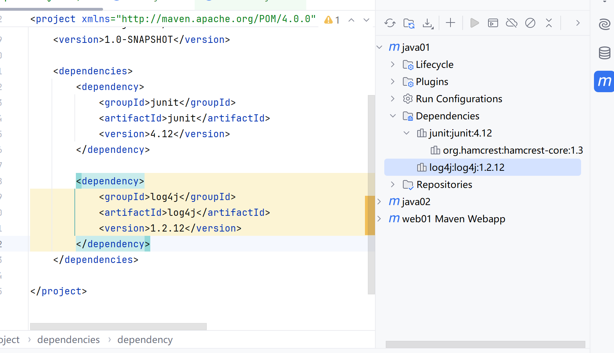
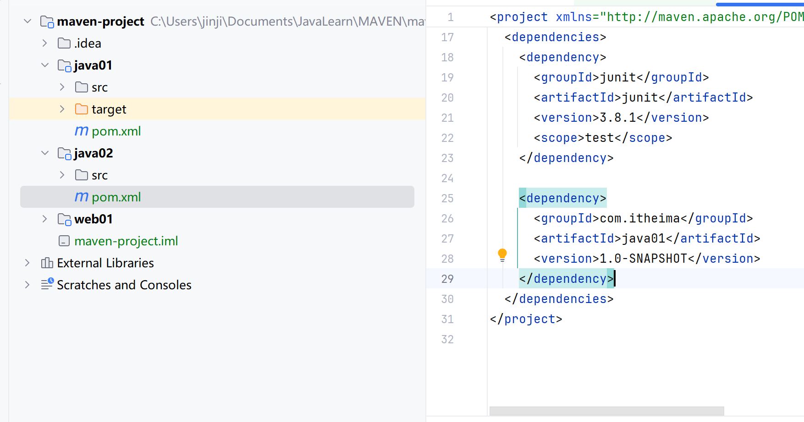
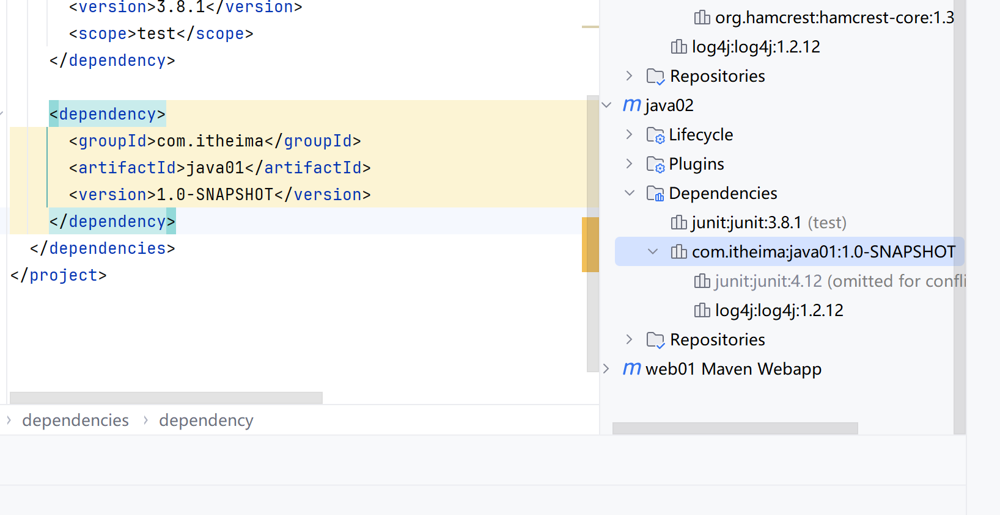
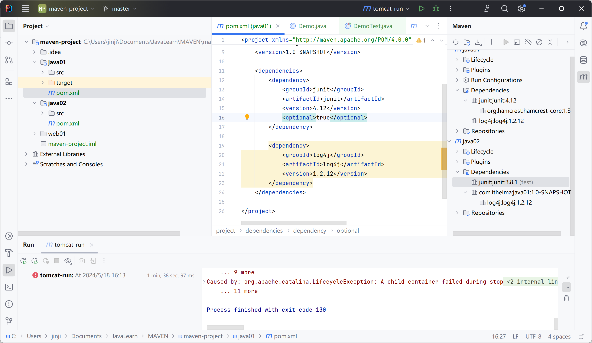
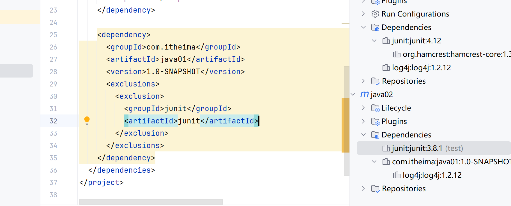
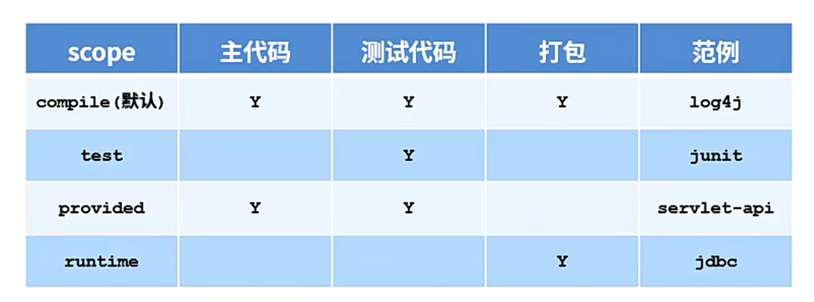
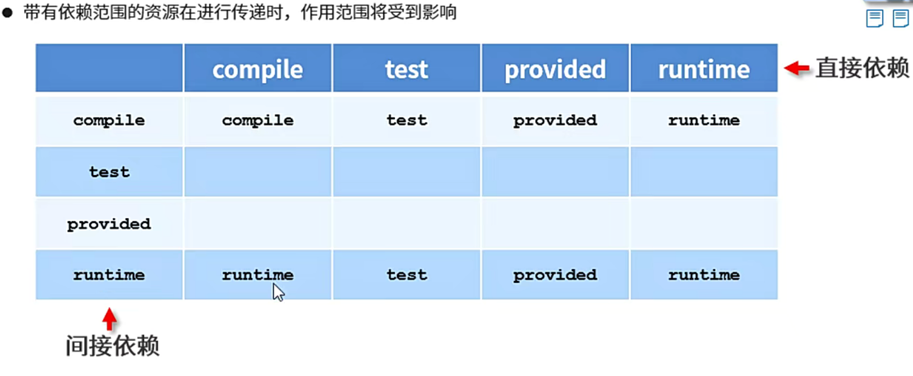

# MAVEN依赖管理

## 添加依赖

添加log4j依赖



## 依赖传递

包含java01的依赖

- 直接依赖
- 间接依赖：依赖的其他资源依赖其他资源






### 依赖传递冲突问题 

路径优先：层级越深、优先级越低

声明优先：顺序靠前的配置覆盖靠后的

同级配置：后面的覆盖前面的

## 可选依赖

看不见、不透明

```xml
<optional>true</optional>
```



## 排除依赖

主动断开依赖的资源

传递过来、不需要



不写版本号

## 依赖范围

scope

作用范围：

- 主程序范围有效
- 测试程序范围有效
- 是否参与打包



依赖范围的传递性



