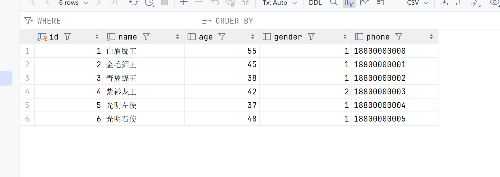

# Mybatis

优秀的持久层框架（DAO数据访问层）


controller->service->dao(mybatis\jdbc)->database

**SpringBoot整合MyBatis**

## Mybatis入门

快速入门程序

需求：使用Mybatis查询所有用户数据

```mysql
select * from user;
```



### 具体步骤

1. 准备工作（创建工程、user表、User类）
2. 引入mybatis的相关依赖、配置mybatis（数据连接信息）
3. 编写sql语句（注解/XML）

### 增加配置


### 创建POJO和Mapper


### 运行测试


## JDBC介绍

数据库连接API

操作所有关系型数据库

需要提供驱动

```java
    @Test
    public void testJdbc() throws SQLException, ClassNotFoundException {
        //1. 注册驱动
        Class.forName("com.mysql.cj.jdbc.Driver");

        //2. 获取连接对象
        String url = "jdbc:mysql://localhost:3306/db02";
        String username = "root";
        String password = "1234";
        Connection connection = DriverManager.getConnection(url, username ,password);

        //3. 获取执行SQL的对象Statement，执行SQL，返回结果
        String sql = "select * from user";
        Statement statement = connection.createStatement();
        ResultSet resultSet = statement.executeQuery(sql);

        //4. 封装结果数据
        List<User> userList = new ArrayList<>();
        while(resultSet.next()){
            int id = resultSet.getInt("id");
            String name = resultSet.getString("name");
            short age = resultSet.getShort("age");
            short gender = resultSet.getShort("gender");
            String phone = resultSet.getString("phone");
            userList.add(new User(id,name,age,gender,phone));
        }

        userList.stream().forEach(user->{
            System.out.println(user);
        });

        statement.close();
        connection.close();
    }
```


缺点：

1. 硬编码，修改配置需要重新编译

2. 多字段繁琐
3. 频繁开关数据库连接

## 数据库连接池

一个容器，存储一个个数据库连接对象Connection

允许应用程序重复使用一个现有的数据库连接，而不是重新建立

释放空闲时间超过最大空闲时间的连接，避免数据库连接泄露

### DataSource

需要实现标准接口：DataSource

常用连接池依赖：

- c3p0

- hikari (spring boot default)

- druid (alibaba)
- dbcp

切换连接池：

1. 导入依赖

```xml
<dependency>
    <groupId>com.alibaba</groupId>
    <artifactId>druid-spring-boot-starter</artifactId>
    <version>1.2.1</version>
</dependency>
```

1. 配置连接信息（略）

## LomBok

解决实体类臃肿的问题

```xml
        <dependency>
            <groupId>org.projectlombok</groupId>
            <artifactId>lombok</artifactId>
            <version>1.18.30</version>
            <scope>provided</scope>
        </dependency>
```


