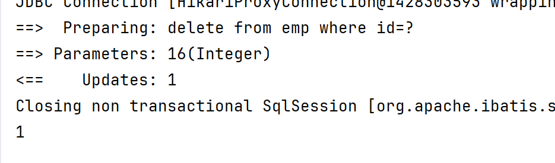

# MyBatis基础

员工信息的增删改查

## 环境准备


## 删除数据


预编译SQL：#{id}占位符

更安全、高效

防止SQL注入

拼接SQL：${id} 对表名，字段名动态设置




## 新增数据

Insert语句

写入的是属性名（驼峰）	


主键返回

数据添加后，获取插入数据库数据的主键

返回23


## 更新数据

更新操作


## 通过ID查询数据


类名与属性名不一致，不能封装

1. 给字段起别名

```mybatis
select id, username, password, name, gender, image, job, entrydate, dept_id deptId, create_time createTime, update_time updateTime from emp where id=#{id};
```

2. 手动映射封装

​	column：表中字段名；property：类属性名


3. 驼峰命名自动映射开关


## 列表条件查询

```mybatis
select * from emp where name like '%${name}%' and gender=#{gender} and entrydate between #{begin} and #{end} order by  update_time desc;
```

不用拼接字符串：使用concat

concat('%',#{name},'%')

```mybatis
select * from emp where name like concat('%',#{name},'%') and gender=#{gender} and entrydate between #{begin} and #{end} order by  update_time desc;
```


查询结果：


