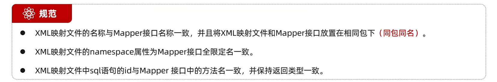
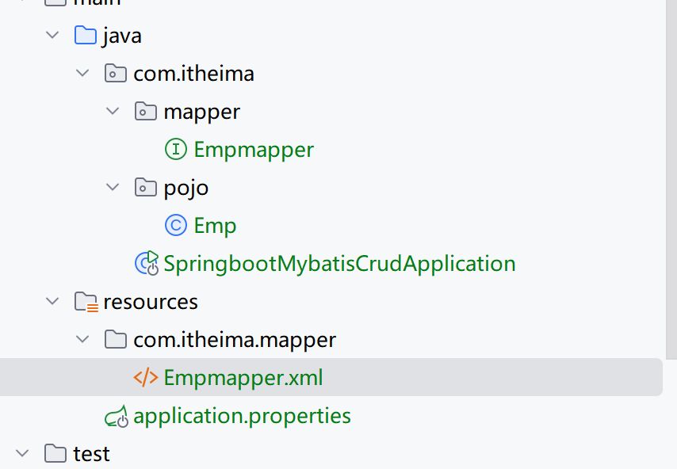
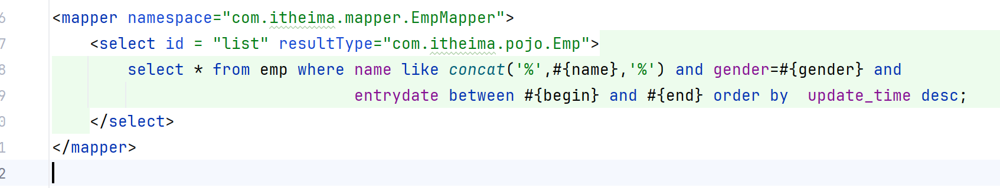
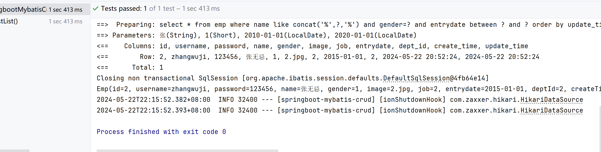

# XML 映射配置文件



## 创建XML文件

包路径、名称需要一致

所需约束：

```xml
<?xml version="1.0" encoding="UTF-8" ?>
<!DOCTYPE mapper
  PUBLIC "-//mybatis.org//DTD Mapper 3.0//EN"
  "http://mybatis.org/dtd/mybatis-3-mapper.dtd">
```




## 取消list方法注释

resultType：单条返回的类型

```xml
<mapper namespace="com.itheima.mapper.EmpMapper">
    <select id = "list" resultType="com.itheima.pojo.Emp">
        select * from emp where name like concat('%',#{name},'%') and gender=#{gender} and
                                entrydate between #{begin} and #{end} order by  update_time desc;
    </select>
</mapper>

```



可以运行



