# 动态SQL

如果查询语句中有Null

则无法查到相关数据

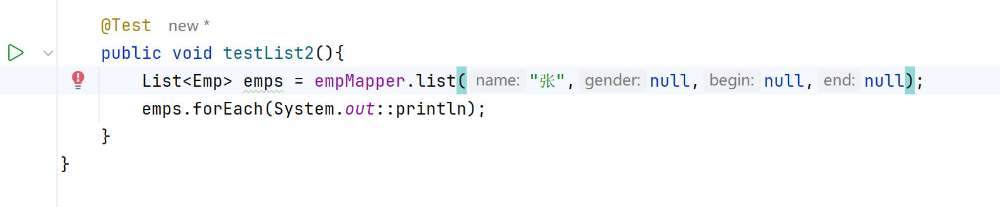

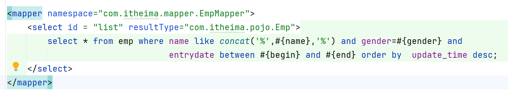

## 动态查询功能

### 添加IF标签

test 需要判断的条件

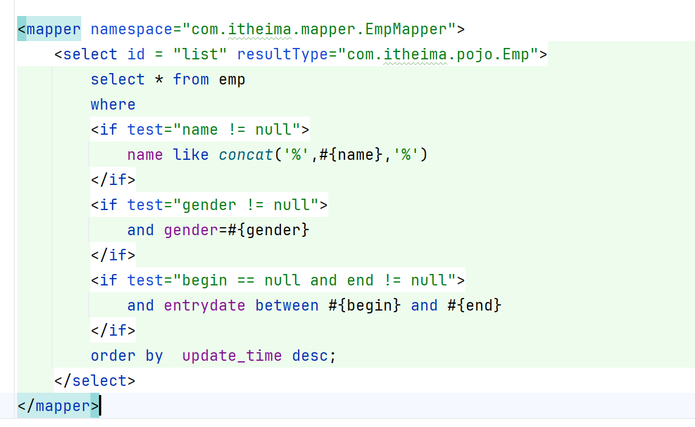

运行结果：

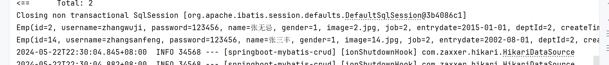

纠错：

只查询性别报错

解决方法：

### 使用where标签替代where

动态添加while，and

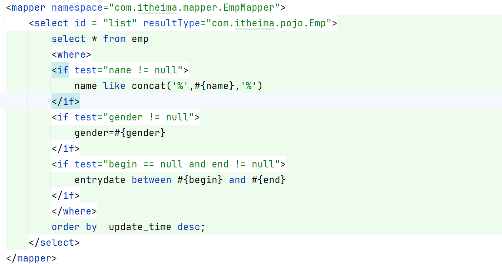

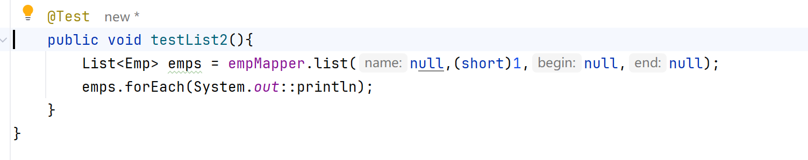

运行结果：

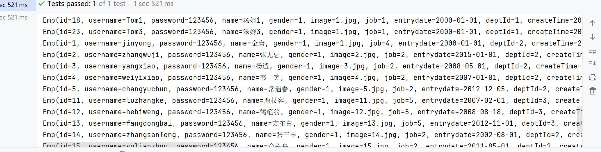

## 动态更新员工信息

只更新对应字段的值，不要更新为null

### 使用set标签

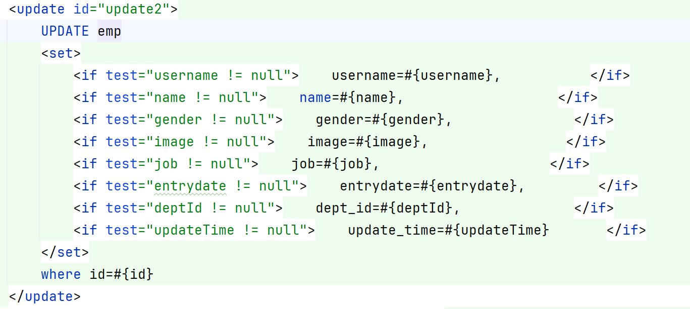

运行结果：

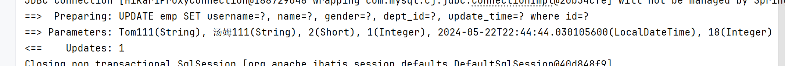

## 批量删除功能

### 使用 foreach 循环遍历

colletion：遍历的集合

item：遍历出来的元素

separator：分隔符

open：开始的SQL拼接片段

close：结束的SQL拼接片段

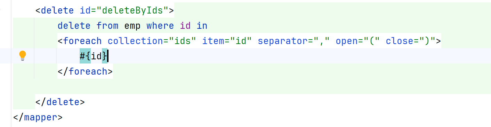

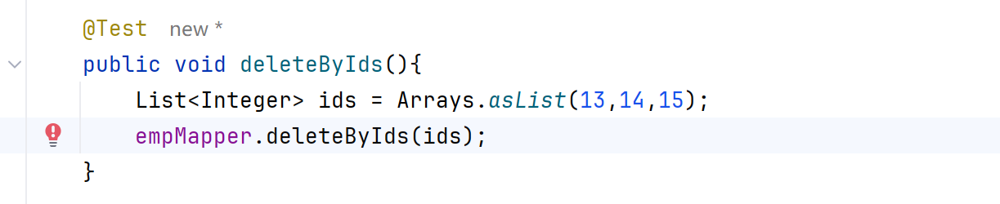

运行结果：

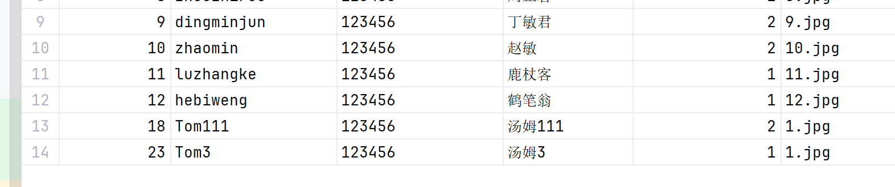

## 使用include

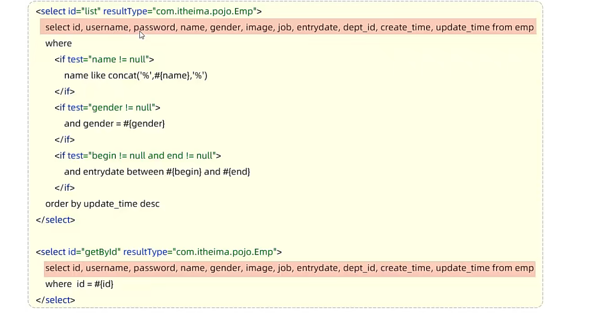

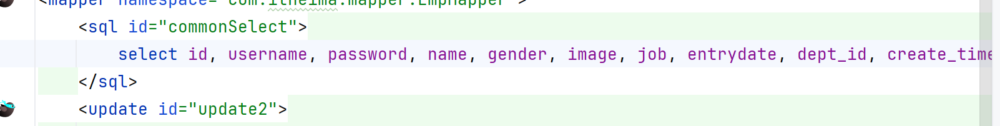

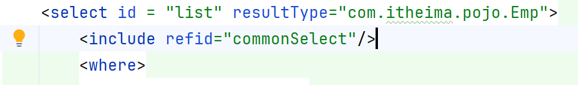

拼接上include标签下可重复使用的SQL片段