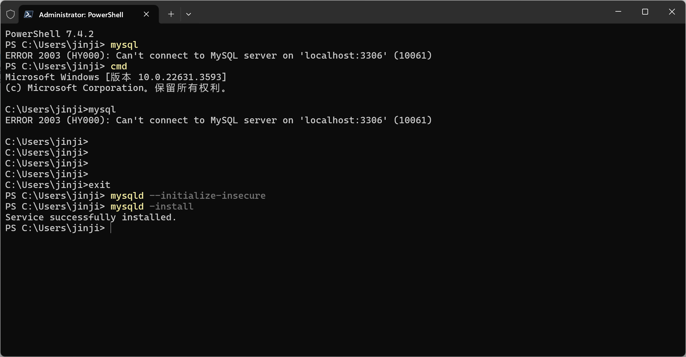
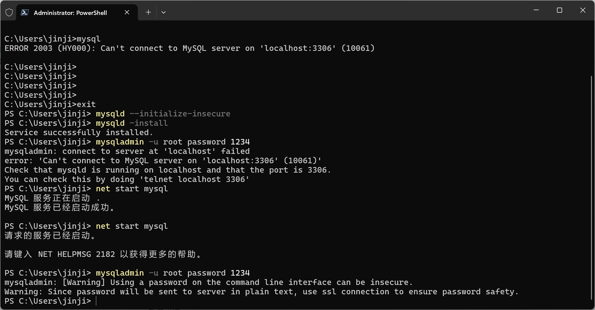
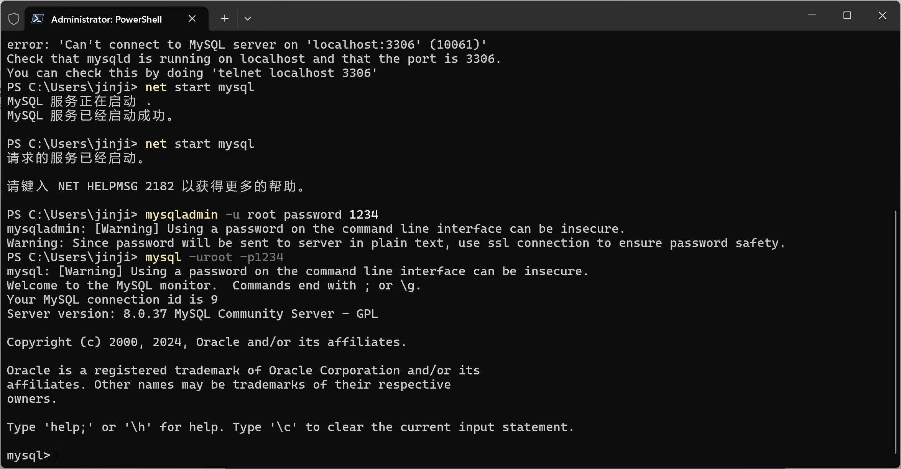
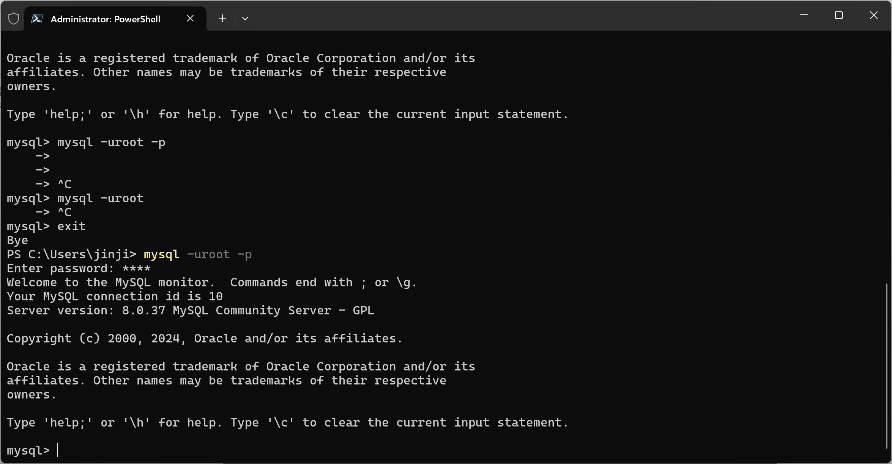

# MySQL概述

商业版本EE

社区版本Community

8.0.31版本

## 安装

https://dev.mysql.com/downloads/mysql/

配置环境变量

初始化安装



启动mysql

```
net start mysql
```

配置密码



## 连接mysql

```sh
mysql -uroot -p1234
```



```sh
mysql -uroot -p
****
```



## 远程连接

```sh
mysql -h192.168.0.1 -P3306 -uroot -p1234
```

# MySQL数据模型

二维表、关系型数据库：建立在关系模型基础上，由多张相互连接的二维表组成的数据库


## 创建数据库

```
create database db01;
craete database db02;
...
```


# SQL简介

SQL语句编写

分号结束

空格缩进

不区分大小写

单行注释 --

多行注释/**/


