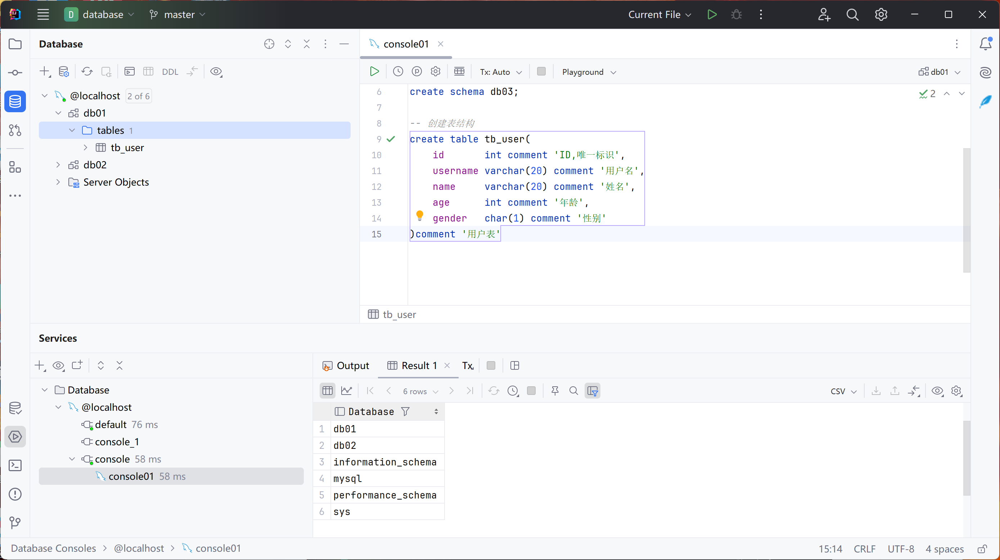

# 数据库设计 DDL语句


## 数据库

1. 查看所有数据库

```mysql
show databases;
```


2. 创建数据库

```mysql
create database db03;
create database db01 if not exists db01;
```


3. 使用数据库

```mysql
use db01;
```


3. 查看当前正在使用的数据库

```mysql
select database();
```


4. 删除数据库

```mysql
drop database db03;
```


## 表结构

1. 创建表结构

```mysql
CREATE table ()
```



2. 添加数据图形化


3. 添加约束


4. 查询数据库所有表

```mysql
show tables;
```

5. 查看指定表结构

```mysql
desc tb_uesr;
```


6. 查看数据建表语句

```mysql
show create table tb_user;
```


7. 添加字段

```mysql
alter table tb_user add qq varchar(11) comment 'QQ';
```

8. 修改字段

```mysql
alter table tb_user modify qq varchar(13) comment 'QQ';
```

```mysql
alter table tb_user change qq qq_num varchar(13) comment 'QQ';
```

9. 删除字段

```mysql
alter table tb_user drop column qq_num;
```

10. 重命名表

```mysql
rename table tb_user to tb_user2;
```


## 数据类型

1. 数值类型


2. 字符串类型

VARCHAR 变长字符串

CHAR 定长字符串

3. 日期类型


# mysql图形化管理工具

NaviCat

DataGrip

等

## 使用IDEA


