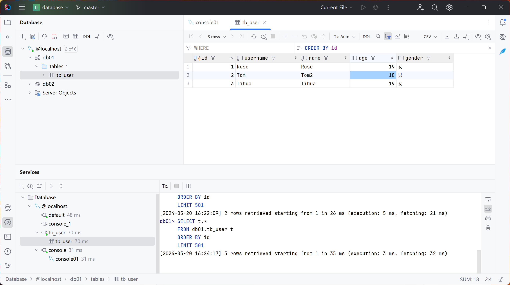
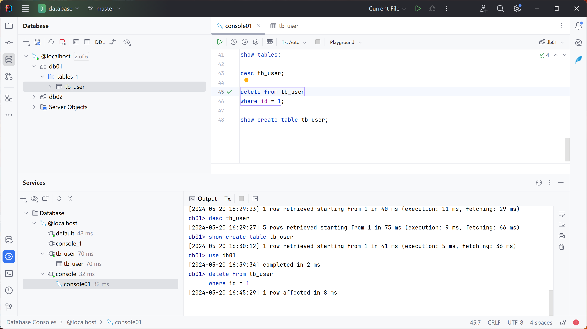

# 数据库操作 DML 语句

1. 添加数据
2. 

获取当前系统时间 now()

批量操作

```mysql
insert into tb_user()
values (4,'zhangsan','zhangsan',18,'男'),
       (5,'lisi','lisi',20,'女');
```

2. 更新数据

where限制

```mysql
update tb_emp set name = "张三", update_time = now();
where id = 1;
```

更新所有

```mysql
update tb_emp set entrydate = '2010-01-01', update_time = now();
```

3. 删除数据

```mysql
delete from tb_user
where id = 1;
```



