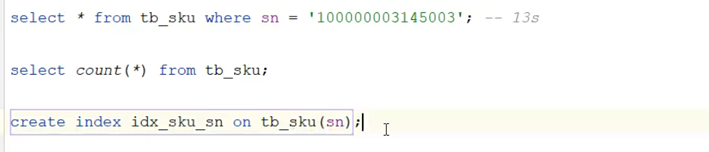
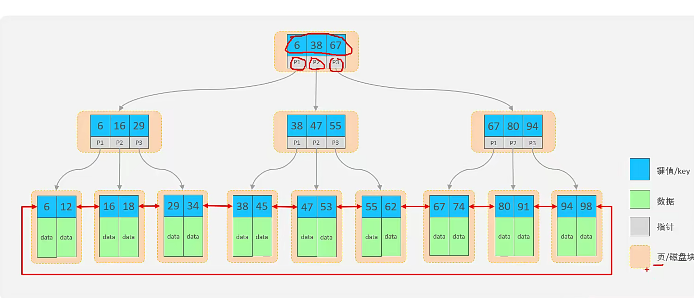

# 索引

优化查询时间

## 创建索引

```mysql
create index 索引名 on 表名(id);
```

主键字段自动添加主键索引



## 查询索引

```mysql
show index from 表名
```


## 删除索引

```mysql
drop index 索引名 on 表名;
```


## B+树

多路平衡搜索树

每一个节点存储多个key

所有数据存储在叶子结点，非叶子节点用于索引数据

叶子节点形成双向链表




