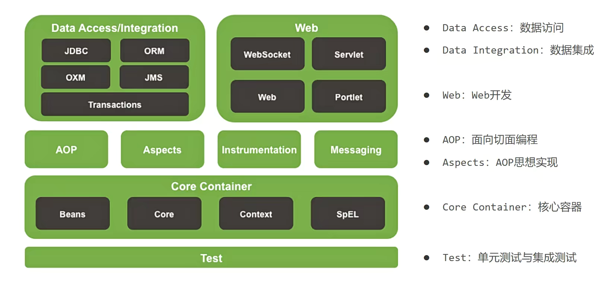

# SPRING家族

spring.io

包含：

Spring Boot

Spring Framework

Spring Data

Spring Cloud

....

# Spring Framework 系统架构

最基础的项目，其他项目的根基

## Core Contianer

核心容器

装对象

## AOP

面向切面编程

编程思想

## Aspects

AOP思想实现

## Data Access/Integration

数据访问、数据集成

支持整合其他数据（MyBatis）

Transactions：事务控制

## Web

Web开发

## Test

测试

