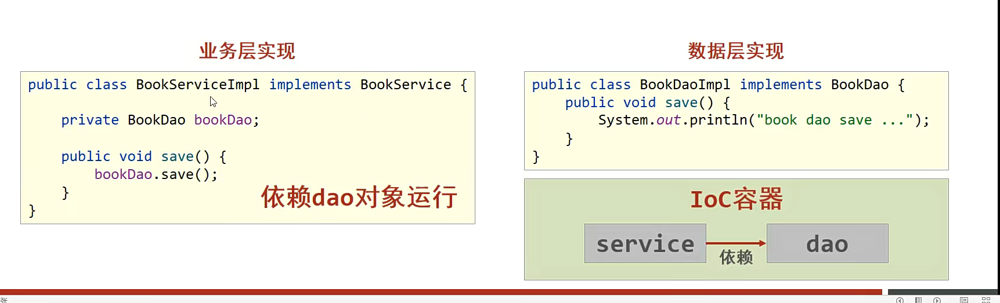
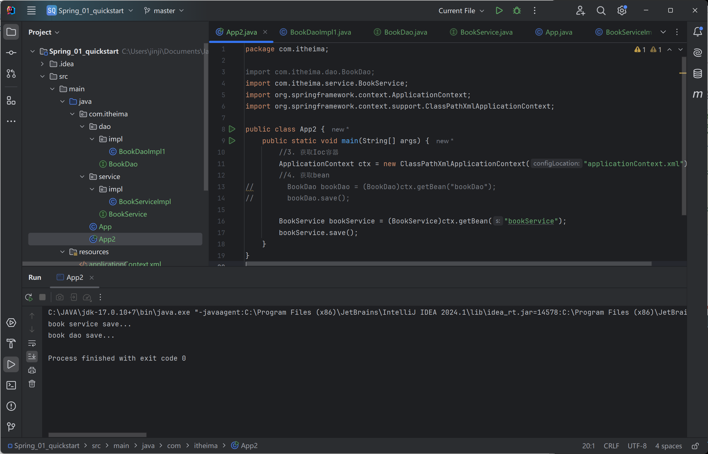

# 核心概念

## IoC/DI

Ioc：控制反转

代码耦合度高

使用对象时，不适用new，转化为由外部提供对象。

程序创建->外部创建

Spring 提供了**Ioc容器**，充当了IoC思想中的外部，由Ioc容器提供对象。

被创建或管理的对象在容器中称为**Bean**

DI：依赖注入

绑定依赖关系 建立Bean与bean之间的依赖关系

##  Ioc\DI 入门案例

