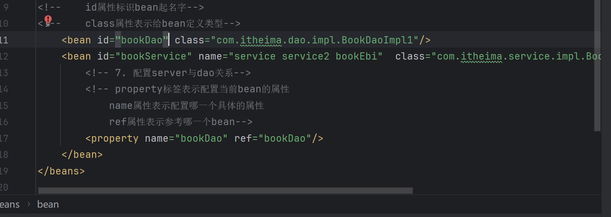
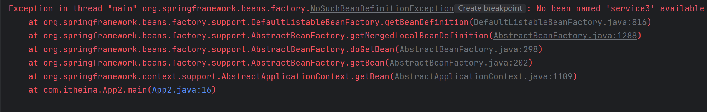
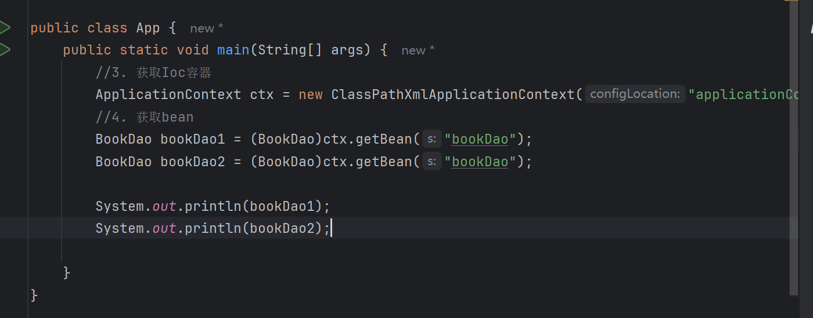
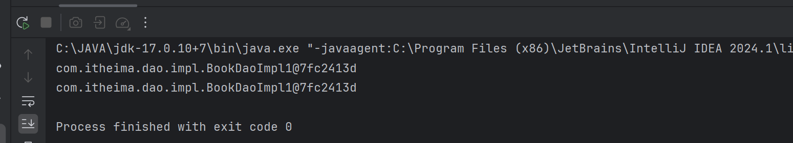
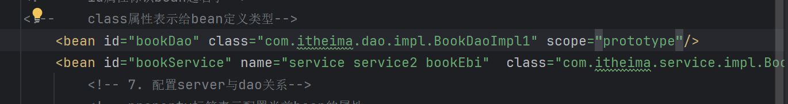
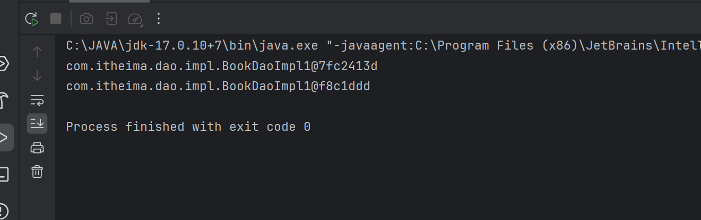

# Spring Bean的配置

## 别名 name

name = "name1 name2"

如果无法通过id或name获取bean，抛出异常

## 作用范围 Scope

Spring默认给的是单例类

默认：singleton 单例

添加：scope = "prototype" 非单例

### bean作用范围说明

适合交给容器管理的bean：

- 表现层对象、业务层对象、数据层对象、工具对象

不适合：

- 封装实体的域对象

