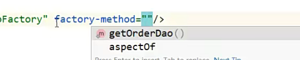
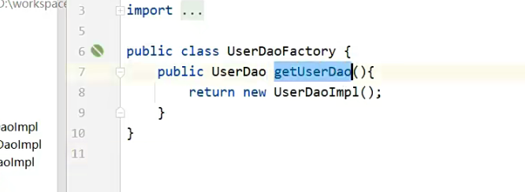
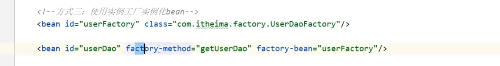
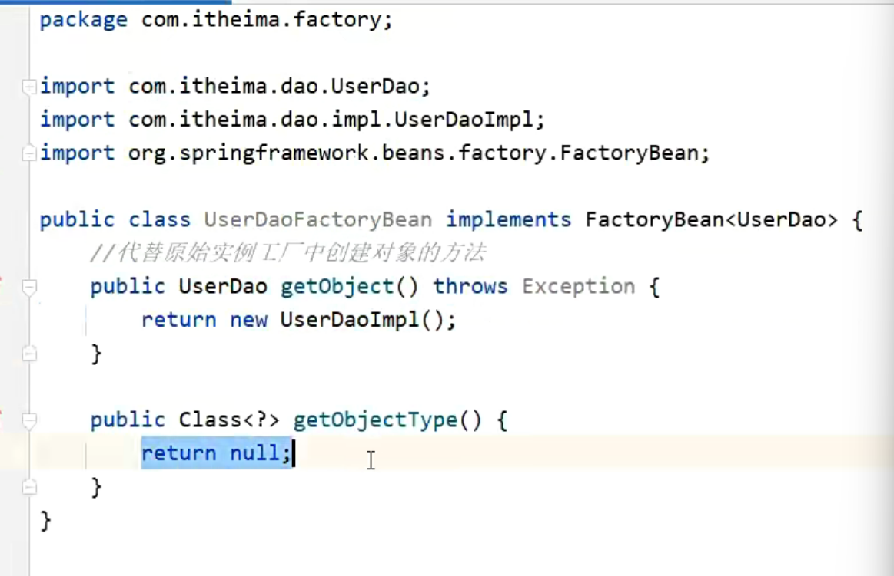
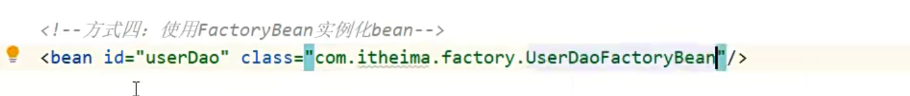
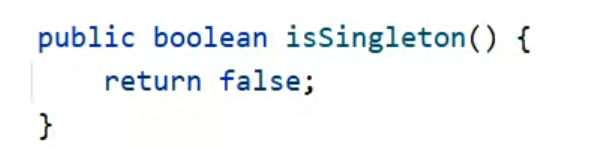

# Bean实例化

Bean本质上是对象吗，创建bean使用构造方法完成

## 调用无参构造方法

private、public都能调用

## 通过静态工厂

兼容早期遗留

bean 配置中 

class="factory"

factory-method="getOrderDao"

## 通过实例工厂

通过工厂的对象调用对象

1. 先造一个工厂对象bean

2. 再造对象bean，配置factory-bean\factory-method

## 改良：使用FactoryBean实例化bean

1. 在工厂同包下建一个FactoryBean类的继承类
2. 创建对象bean

改为非单例：

