# 依赖注入方式

方式：

- 普通方法 Setter方法
- 构造器方法

注入类型：

- 引用类型
- 简单类型（基本数据、String）

## Setter注入UserDao

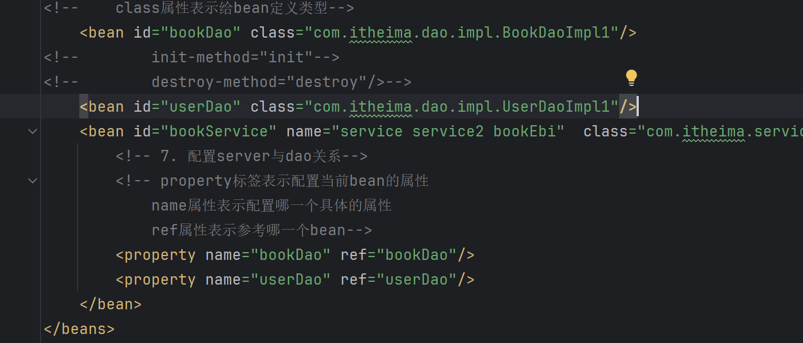

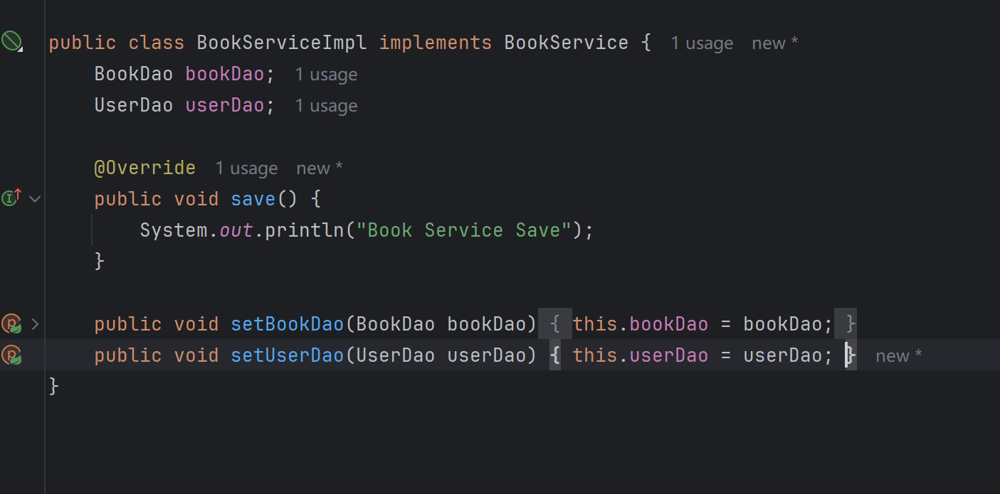

## Setter注入int、String

直接在xml文件中写入value

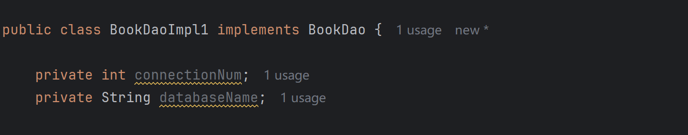

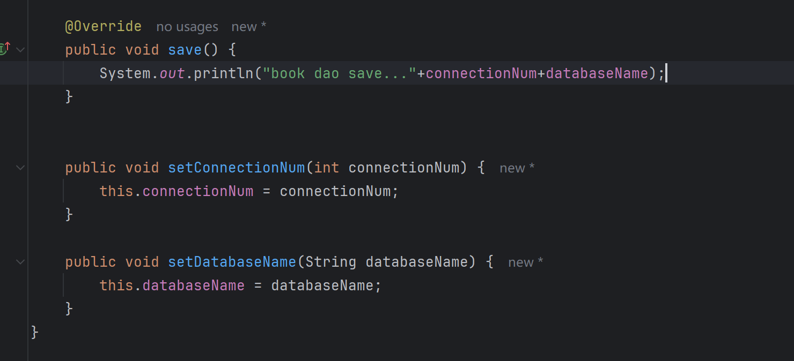

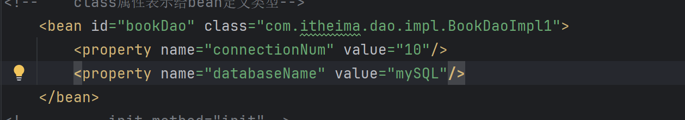

## 构造器注入BookDao

使用配置中的constructor-arg

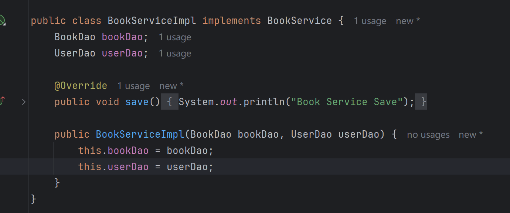

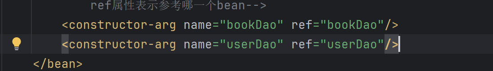

## 构造器注入int、String

使用配置中的constructor-arg name、value

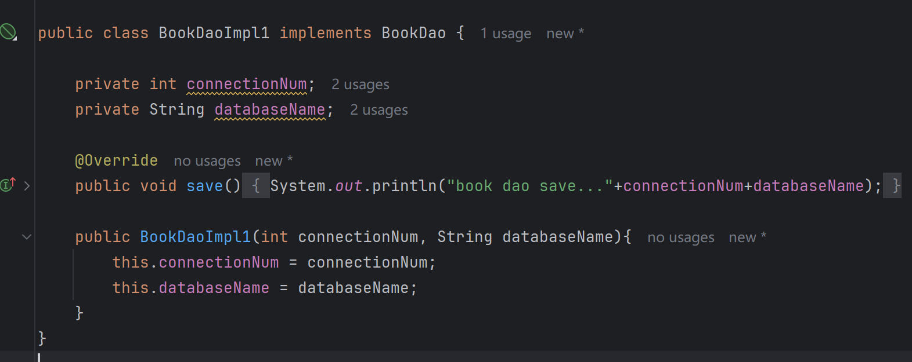

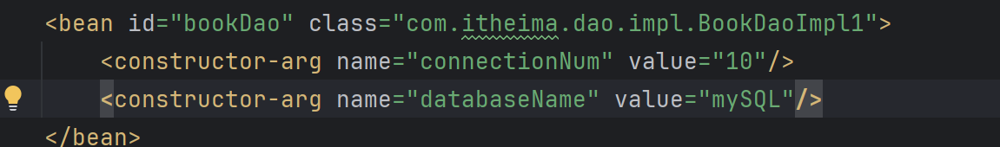

解耦合：

1. 使用type来赋值

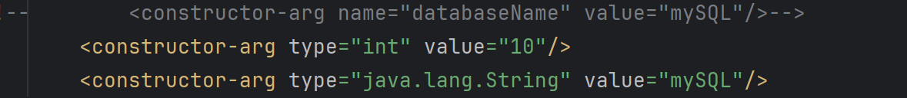

2. 使用index给构造器形参赋值

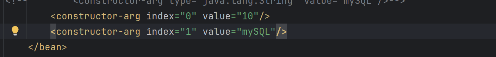

## 选择

强制依赖使用构造器注入

使用setter注入有概率导致null对象

可选依赖选择setter注入

Spring框架倡导使用构造器

**自己开发推荐使用setter注入**