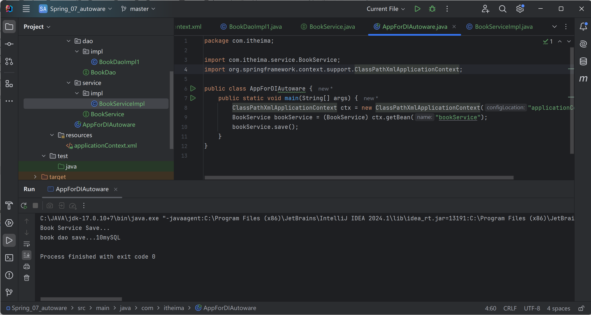

# 自动装配

Ioc容器更具bean所依赖的资源，在容器中自动查找并注入到bean中的过程

- 按类型
- 按名称

需要保留setter方法

在xml中添加AutoWare

## 按类型

容器中该类型必须唯一

执行：

## 按名称

## 特征

只能引用类型，不能简单类型

byType必须保证bean唯一

byName必须保证有指定名称的bean，耦合，**不推荐**

自动装配优先级低于setter、构造器

