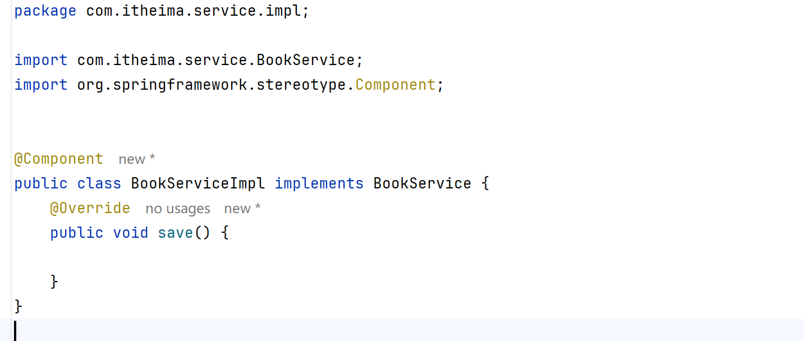
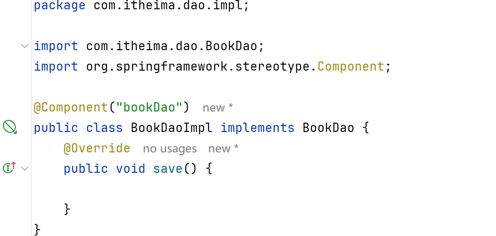
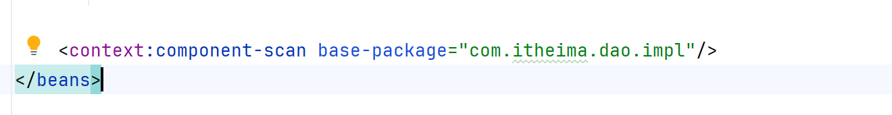
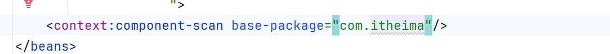
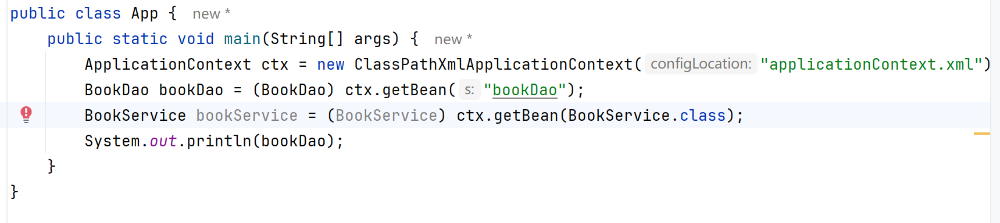
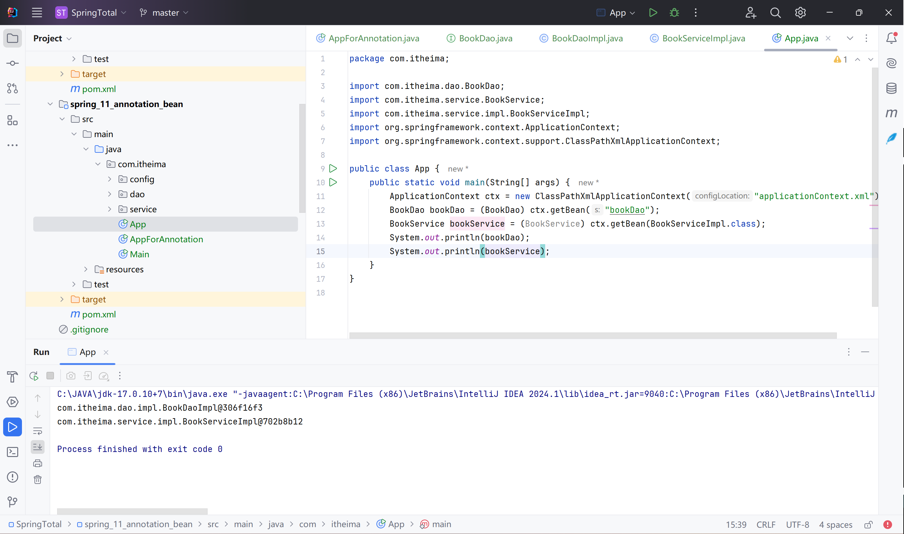
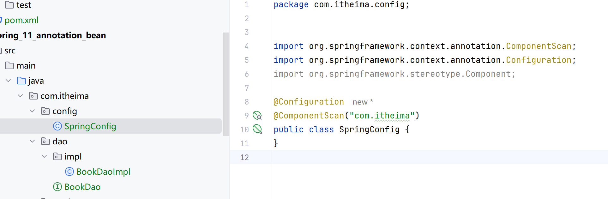
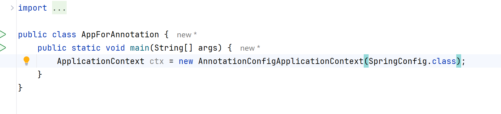
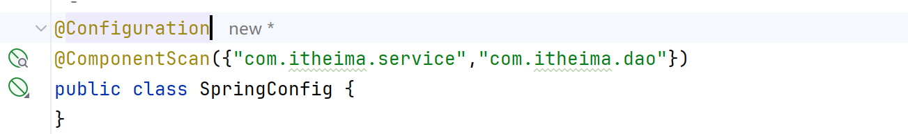

# Spring注解开发

使用注释开发，简化

## 添加组件注释

@Component

@Component("name")

## 在xml配置文件中添加组件扫描器

指定扫描所在包

## 运行

## 衍生注解

功能与@Component一致

业务层：@Service

数据层：@Repository 数据仓库

表现层：@Controller 控制器

# 纯注解开发模式

不用xml

## 使用配置类

使用Java类代替了配置文件

@Configuration 用于设定当前类为主食类

@ComponentScan("") 扫描路径

@ComponentScan 多路径，数组形式：

