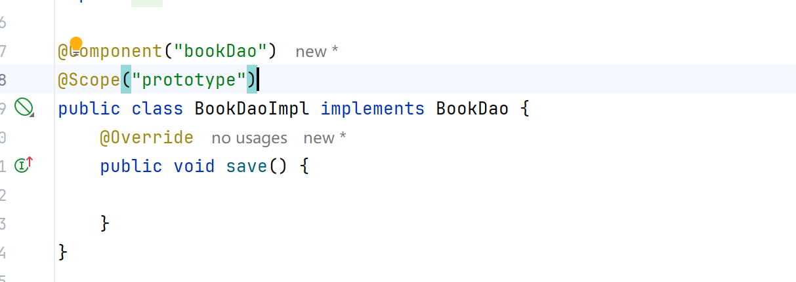
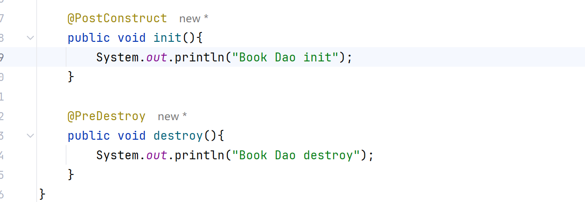
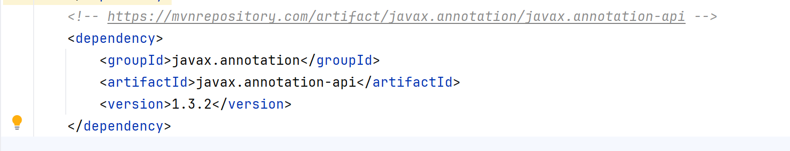
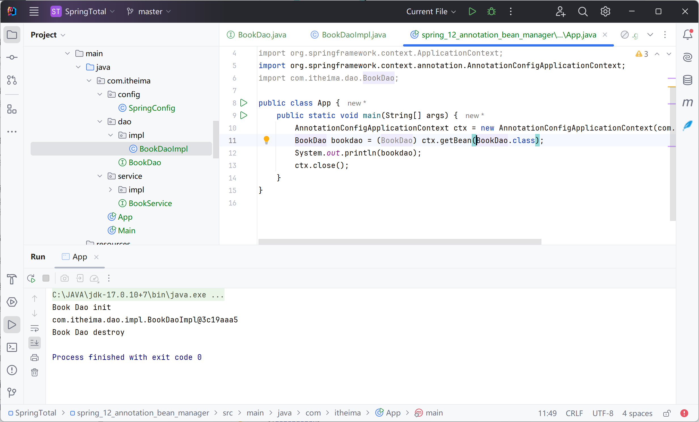
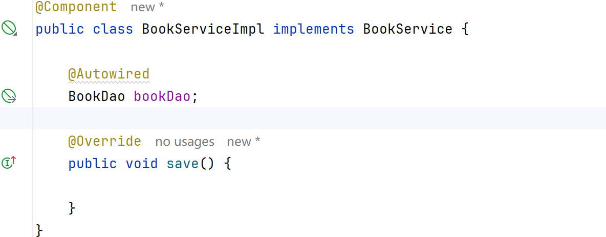
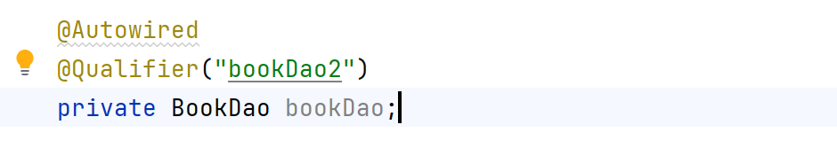
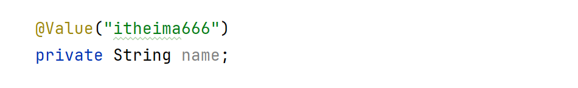
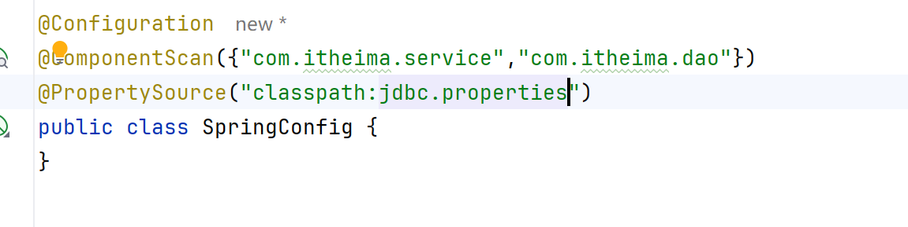
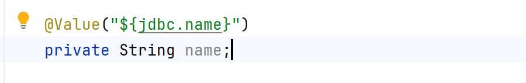

# Bean管理

## 配置Scope

## 配置生命周期方法

需要依赖：

运行结果：

## 自动装配

#### 引用类型

使用@AutoWired 类型装配

不需要setter方法

按名称装配

指定加载的bean名称 @Qualifier

#### 简单类型

@Value("itheima")

在SpringConfig加载外部properties文件

**多文件可以使用数组，但不支持使用通配符**

在Value中更改为引用

