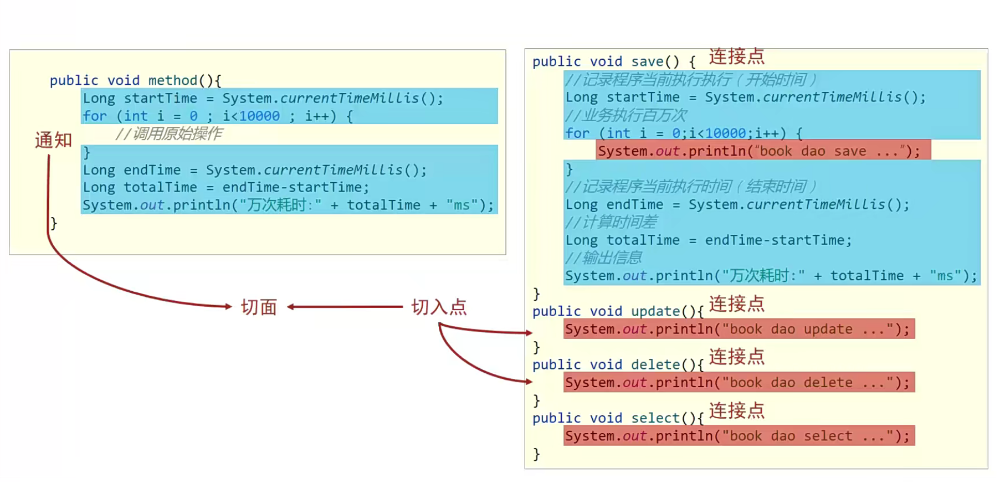
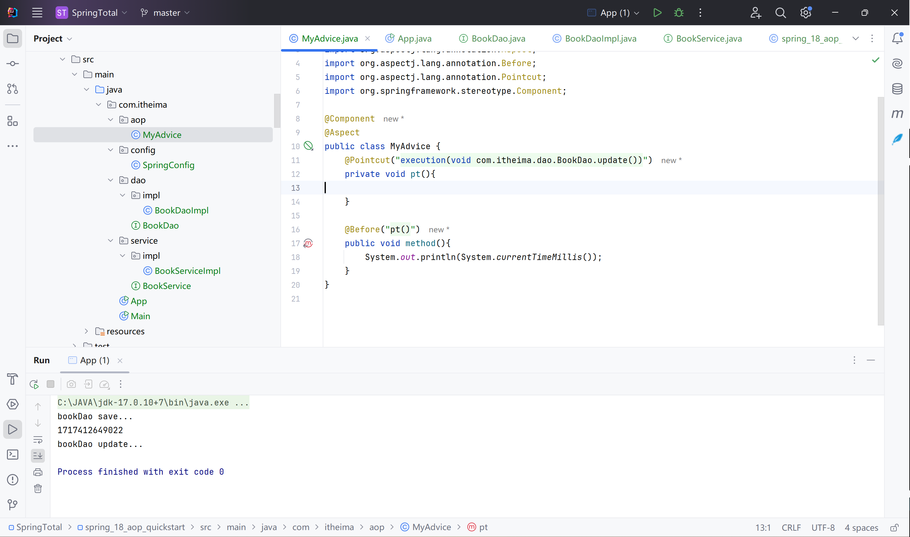

# AOP

AOP：面向切面编程

OOP：面向对象编程

## AOP核心概念

在不惊动原始设计的基础上为其进行功能增强

Spring理念：无入侵式编程

通知：共性的功能

连接点：对应一个个方法

切入点：需要追加功能的方法

切面：绑定通知和切入点

通知类：封装通知

## AOP入门案例

案例设定：测定接口执行效率

简化设定：在接口执行前输出当前系统时间

开发模式：XML or 注解

思路分析：

1. 导入坐标（pom.xml）
2. 制作连接点方法（原始操作，Dao接口与实现类）
3. 制作共性功能（通知类与通知）
4. 定义切入点
5. 绑定切入点与通知关系

