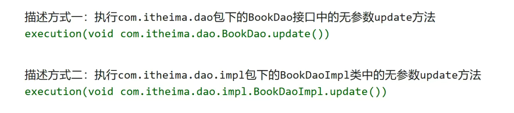

# AOP切入点表达式

- 切入点：要增强的方法
- 切入点表达式：要进行增强的方法的描述方式

描述方式一：接口

描述方法二：实现类

## 切入点表达式标准格式

动作关键字：execution

访问修饰符（public、private）可省略

返回值类型

包名

类、接口名

方法名

参数

抛出异常（省略）

## 使用通配符

\*：任意名称，匹配前缀后缀

..：多个连续的任意符号，简化包名参数

\+：匹配子类类型

