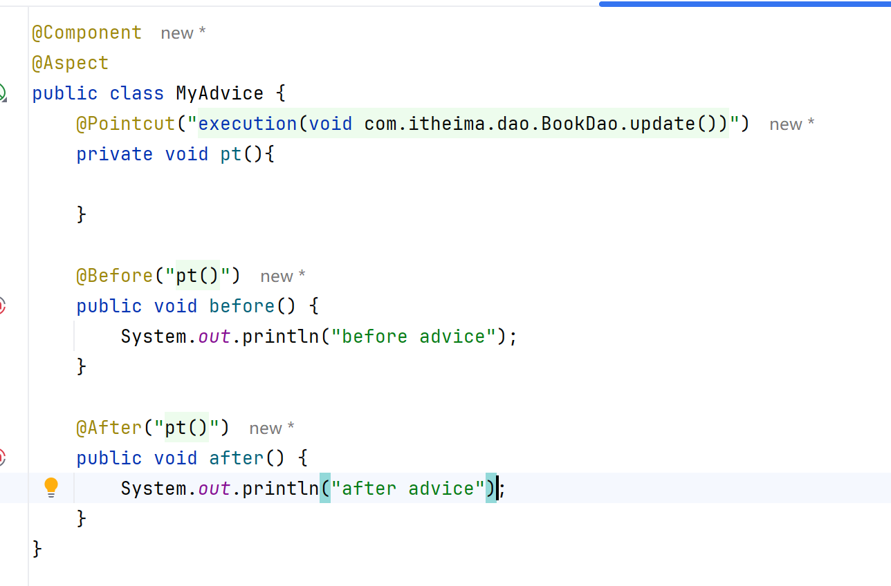
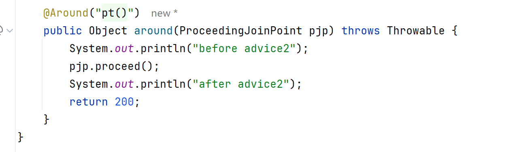
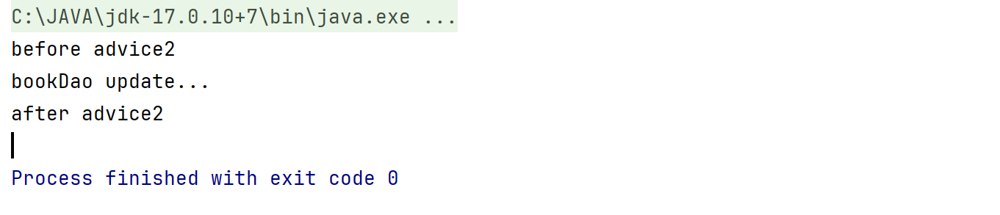
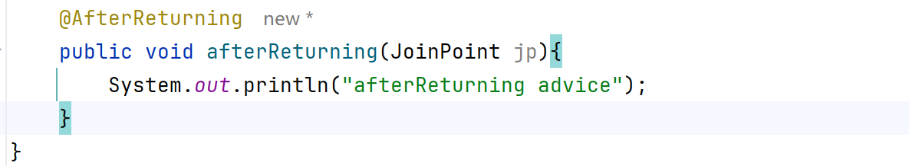
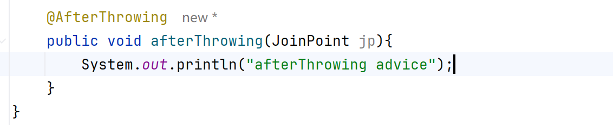
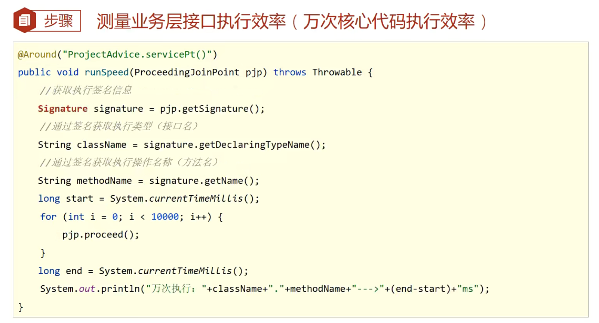

# AOP通知类型

AOP五个通知类型

1. 前置通知
2. 后置通知
3. 环绕通知（重点）
4. 返回后通知
5. 抛出异常通知

## Before和After

## 环绕通知Around

需要返回值，可以修改返回值

默认Object类型的返回值

注意事项：

1. 必须依赖形参ProceedingJoinPoint来实现对原方法的调用
2. 未调用原方法调用会导致隔离
3. 如果接受返回值，必须设定为Object类型

## AfterReturning

需要返回后，不抛异常才运行

## AfterThrowing

抛出异常后运行

## 案例：测量业务接口层万次执行效率

