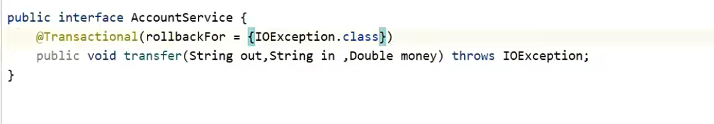
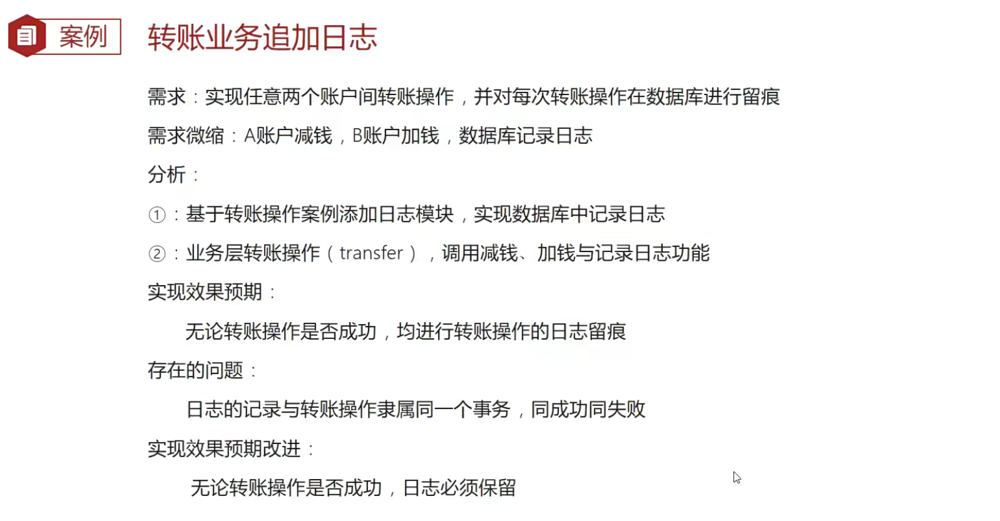
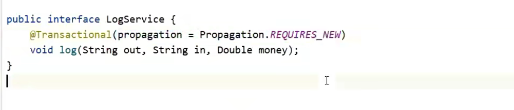
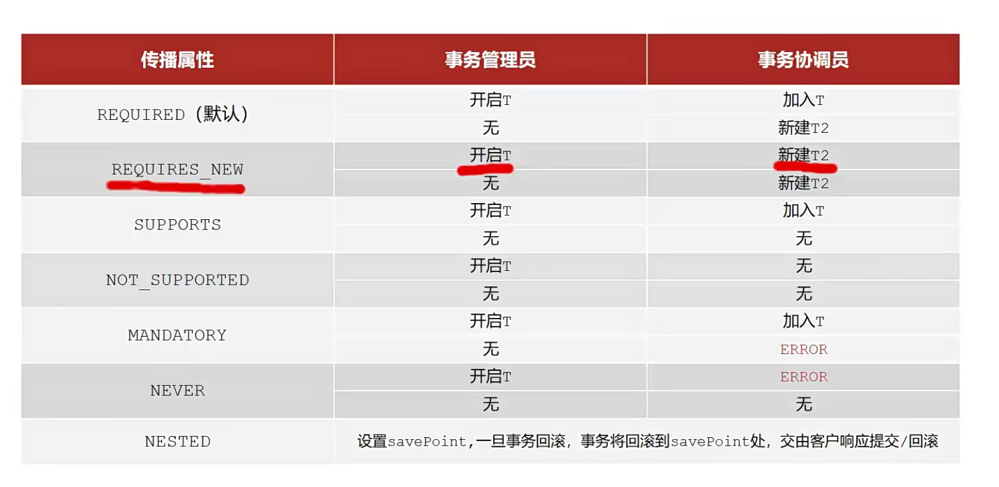

# Spring 事务

事务作用：保证数据层操作一致性

Spring事务作用：在数据层或数据层保障一些列数据库操作同成功同失败

## 案例：模拟银行账户转账业务

### 在业务层接口上添加Spring事务管理

## 设置事务管理器

## 开启注解式事务驱动

## Spring事务角色

事务管理员：发起事务方，开启事务的方法

事务协调员：加入事务方，数据层方法、业务层方法

## 事务属性

- readOnly
- TimeOut
- rollbackFor

如下两种异常，进行回滚：Error、RuntimeException（运行时异常）

设置rollbackFor

## 案例：转账业务追加日志

解决方案：

## 事务传播行为

propagation = Propagation.REQUIRES_NEW

1. 标志REQUIRES_NEW会新开启事务，外层事务不会影响内部事务的提交/回滚

2. 标志REQUIRES_NEW的内部事务的异常，会影响外部事务的回滚

